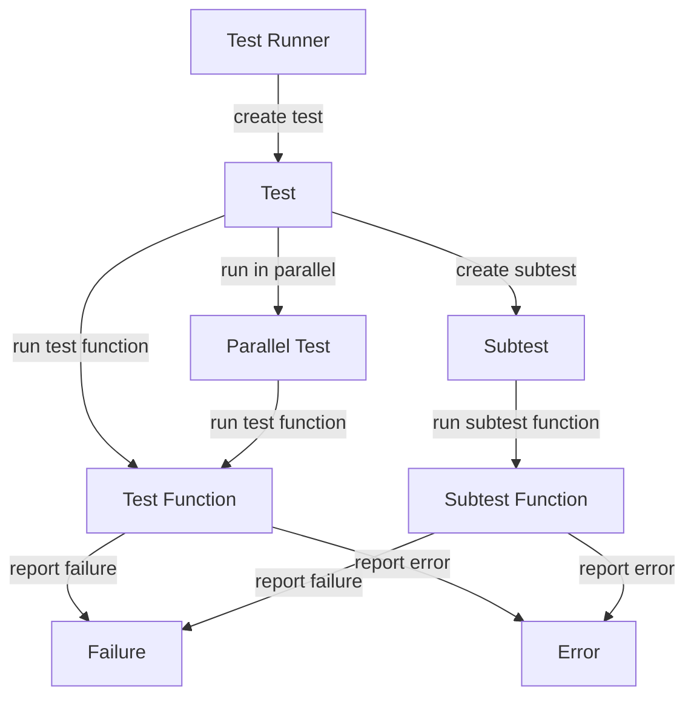

## Introduction
Unit testing is a crucial aspect of software development, allowing developers to verify that individual components of their codebase function as expected. In the context of Go, the `testing` package provides a rich set of tools for writing and running unit tests. The `testing.T` type, along with `t.Run()` and `t.Parallel()`, are essential components of this package. In this section, we will explore the importance of unit testing, its relevance in real-world applications, and why every engineer should understand these concepts.

> **Note:** Unit testing is not just about catching bugs, but also about ensuring that the code is maintainable, flexible, and easy to understand. By writing comprehensive unit tests, developers can ensure that their codebase is robust and reliable.

## Core Concepts
To understand how unit testing works in Go, it's essential to grasp the core concepts of the `testing` package. The `testing.T` type represents a single test, and it provides methods for reporting failures, errors, and other test-related events. `t.Run()` is used to run a subtest, which allows developers to organize their tests in a hierarchical manner. `t.Parallel()` is used to run a test in parallel with other tests, which can significantly speed up the testing process.

*   **Test**: A test is a single execution of a test function, which is a function that takes a `testing.T` argument.
*   **Subtest**: A subtest is a test that is run as part of another test. Subtests are used to organize tests in a hierarchical manner.
*   **Parallel testing**: Parallel testing is a technique where multiple tests are run concurrently, which can significantly speed up the testing process.

> **Warning:** When using `t.Parallel()`, developers should be aware that the test function should not have any side effects, as this can lead to unpredictable behavior.

## How It Works Internally
When a test is run using the `testing` package, the following steps occur:

1.  The test function is executed, and the `testing.T` object is passed as an argument.
2.  The test function can use methods on the `testing.T` object to report failures, errors, and other test-related events.
3.  If the test function calls `t.Run()`, a new subtest is created, and the test function is executed again with the new subtest as the argument.
4.  If the test function calls `t.Parallel()`, the test is run in parallel with other tests.

The `testing` package uses a combination of goroutines and channels to manage the execution of tests. When a test is run, a new goroutine is created to execute the test function. The test function can use channels to communicate with the test runner and report any failures or errors.

> **Tip:** To write efficient unit tests, developers should aim to minimize the number of external dependencies and focus on testing the business logic of their code.

## Code Examples
Here are three complete and runnable code examples that demonstrate the use of `testing.T`, `t.Run()`, and `t.Parallel()`:

### Example 1: Basic Unit Test
```go
package main

import (
	"testing"
)

func add(x, y int) int {
	return x + y
}

func TestAdd(t *testing.T) {
	if add(2, 3) != 5 {
		t.Errorf("expected add(2, 3) to return 5, but got %d", add(2, 3))
	}
}
```
This example demonstrates a basic unit test for the `add` function. The test function takes a `testing.T` object as an argument and uses the `t.Errorf` method to report any failures.

### Example 2: Subtest
```go
package main

import (
	"testing"
)

func add(x, y int) int {
	return x + y
}

func TestAdd(t *testing.T) {
	t.Run("add two positive numbers", func(t *testing.T) {
		if add(2, 3) != 5 {
			t.Errorf("expected add(2, 3) to return 5, but got %d", add(2, 3))
		}
	})

	t.Run("add two negative numbers", func(t *testing.T) {
		if add(-2, -3) != -5 {
			t.Errorf("expected add(-2, -3) to return -5, but got %d", add(-2, -3))
		}
	})
}
```
This example demonstrates the use of subtests to organize tests in a hierarchical manner. The `t.Run` method is used to create a new subtest, and the test function is executed again with the new subtest as the argument.

### Example 3: Parallel Testing
```go
package main

import (
	"testing"
)

func add(x, y int) int {
	return x + y
}

func TestAdd(t *testing.T) {
	t.Run("add two positive numbers", func(t *testing.T) {
		t.Parallel()
		if add(2, 3) != 5 {
			t.Errorf("expected add(2, 3) to return 5, but got %d", add(2, 3))
		}
	})

	t.Run("add two negative numbers", func(t *testing.T) {
		t.Parallel()
		if add(-2, -3) != -5 {
			t.Errorf("expected add(-2, -3) to return -5, but got %d", add(-2, -3))
		}
	})
}
```
This example demonstrates the use of parallel testing to speed up the testing process. The `t.Parallel` method is used to run the test in parallel with other tests.

## Visual Diagram

This diagram illustrates the flow of a test execution. The test runner creates a test, which runs the test function. The test function can report failures or errors, and it can also create subtests or run in parallel.

> **Interview:** Can you explain the difference between a test and a subtest? How do you use `t.Run` and `t.Parallel` in your tests?

## Comparison
Here is a comparison of different testing approaches:

| Approach | Time Complexity | Space Complexity | Pros | Cons | Best For |
| --- | --- | --- | --- | --- | --- |
| Unit Testing | O(1) | O(1) | Fast, isolated tests | Limited scope | Small to medium-sized projects |
| Integration Testing | O(n) | O(n) | Tests interactions between components | Slow, complex setup | Large-scale projects |
| End-to-End Testing | O(n^2) | O(n^2) | Tests entire system | Slow, brittle tests | Critical systems |
| Parallel Testing | O(1) | O(1) | Fast, concurrent tests | Requires careful synchronization | Large-scale projects |

> **Note:** The time and space complexity of testing approaches can vary depending on the specific use case and implementation.

## Real-world Use Cases
Here are some real-world examples of unit testing in production:

*   **Google**: Google uses a combination of unit testing, integration testing, and end-to-end testing to ensure the quality of their software products.
*   **Amazon**: Amazon uses a test-driven development approach, where developers write unit tests before writing the actual code.
*   **Netflix**: Netflix uses a combination of unit testing, integration testing, and end-to-end testing to ensure the quality of their software products.

> **Tip:** When writing unit tests, it's essential to focus on the business logic of your code and minimize the number of external dependencies.

## Common Pitfalls
Here are some common mistakes that developers make when writing unit tests:

*   **Not testing for edge cases**: Developers often forget to test for edge cases, such as null or empty inputs.
*   **Not testing for error handling**: Developers often forget to test for error handling, such as exceptions or error codes.
*   **Not using mocking**: Developers often forget to use mocking to isolate dependencies and make tests more efficient.
*   **Not using parallel testing**: Developers often forget to use parallel testing to speed up the testing process.

> **Warning:** Not testing for edge cases or error handling can lead to brittle tests that fail unexpectedly.

## Interview Tips
Here are some common interview questions related to unit testing:

*   **What is the difference between a unit test and an integration test?**: A unit test is a test that focuses on a single unit of code, while an integration test focuses on the interactions between multiple units of code.
*   **How do you use mocking in your tests?**: Mocking is used to isolate dependencies and make tests more efficient. It involves creating a mock object that mimics the behavior of a real object.
*   **What is the benefit of using parallel testing?**: Parallel testing speeds up the testing process by running multiple tests concurrently.

> **Interview:** Can you explain the concept of test-driven development? How does it differ from traditional testing approaches?

## Key Takeaways
Here are some key takeaways from this section:

*   **Unit testing is essential for ensuring the quality of software products**.
*   **The `testing` package in Go provides a rich set of tools for writing and running unit tests**.
*   **`t.Run` and `t.Parallel` are used to organize tests in a hierarchical manner and speed up the testing process**.
*   **Mocking is used to isolate dependencies and make tests more efficient**.
*   **Parallel testing speeds up the testing process by running multiple tests concurrently**.
*   **Test-driven development is a approach where developers write unit tests before writing the actual code**.
*   **Unit testing should focus on the business logic of the code and minimize the number of external dependencies**.
*   **Not testing for edge cases or error handling can lead to brittle tests that fail unexpectedly**.
*   **Using parallel testing requires careful synchronization to avoid conflicts between tests**.