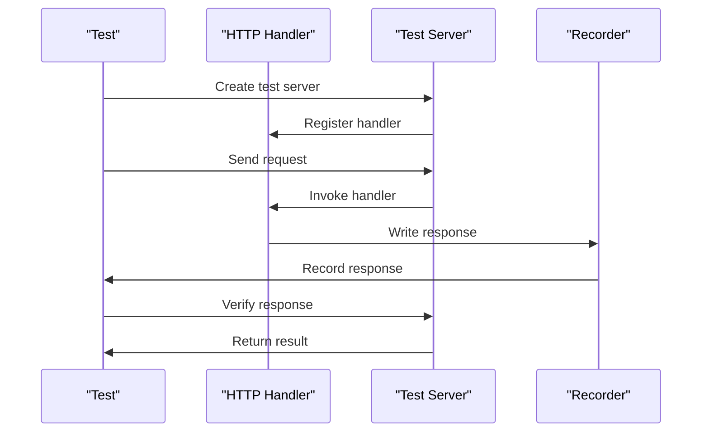

## Introduction
**httptest** is a crucial package in Go's standard library for testing HTTP handlers. It provides a simple and efficient way to write unit tests for HTTP handlers, ensuring that they behave as expected. In real-world scenarios, **httptest** is essential for maintaining the reliability and scalability of web applications. For instance, companies like Google and Netflix rely heavily on automated testing to ensure the quality of their web services. Every engineer should be familiar with **httptest** to write robust and maintainable code.

## Core Concepts
To understand **httptest**, it's essential to grasp the following core concepts:
- **HTTP Handlers**: functions that handle HTTP requests and return HTTP responses.
- **Test Servers**: temporary servers created for testing purposes, allowing us to test HTTP handlers in isolation.
- **Request and Response Recording**: the ability to record requests and responses during testing, enabling us to verify the correctness of our handlers.

## How It Works Internally
When using **httptest**, the following steps occur internally:
1. A test server is created, which listens on a unique address.
2. The HTTP handler to be tested is registered with the test server.
3. A request is sent to the test server, which invokes the registered handler.
4. The handler processes the request and returns a response.
5. The response is recorded and made available for verification.

> **Note:** The **httptest** package uses a technique called "request and response recording" to capture the interactions between the test server and the HTTP handler. This allows us to verify that the handler behaves as expected.

## Code Examples
### Example 1: Basic Usage
```go
package main

import (
	"net/http"
	"net/http/httptest"
	"testing"
)

func handler(w http.ResponseWriter, r *http.Request) {
	w.Write([]byte("Hello, World!"))
}

func TestHandler(t *testing.T) {
	req, err := http.NewRequest("GET", "/", nil)
	if err != nil {
		t.Fatal(err)
	}

	w := httptest.NewRecorder()
	handler(w, req)

	if w.Code != http.StatusOK {
		t.Errorf("expected status code %d, got %d", http.StatusOK, w.Code)
	}

	if w.Body.String() != "Hello, World!" {
		t.Errorf("expected response body %q, got %q", "Hello, World!", w.Body.String())
	}
}
```
This example demonstrates the basic usage of **httptest** to test an HTTP handler.

### Example 2: Testing HTTP Methods
```go
package main

import (
	"net/http"
	"net/http/httptest"
	"testing"
)

func handler(w http.ResponseWriter, r *http.Request) {
	switch r.Method {
	case "GET":
		w.Write([]byte("GET request"))
	case "POST":
		w.Write([]byte("POST request"))
	default:
		http.Error(w, "Method not allowed", http.StatusMethodNotAllowed)
	}
}

func TestHandler(t *testing.T) {
	tests := []struct {
		method string
		status int
		body   string
	}{
		{"GET", http.StatusOK, "GET request"},
		{"POST", http.StatusOK, "POST request"},
		{"PUT", http.StatusMethodNotAllowed, ""},
	}

	for _, test := range tests {
		req, err := http.NewRequest(test.method, "/", nil)
		if err != nil {
			t.Fatal(err)
		}

		w := httptest.NewRecorder()
		handler(w, req)

		if w.Code != test.status {
			t.Errorf("expected status code %d, got %d", test.status, w.Code)
		}

		if w.Body.String() != test.body {
			t.Errorf("expected response body %q, got %q", test.body, w.Body.String())
		}
	}
}
```
This example shows how to test an HTTP handler that handles different HTTP methods.

### Example 3: Testing Error Handling
```go
package main

import (
	"net/http"
	"net/http/httptest"
	"testing"
)

func handler(w http.ResponseWriter, r *http.Request) {
	if r.URL.Path == "/error" {
		http.Error(w, "Internal Server Error", http.StatusInternalServerError)
	} else {
		w.Write([]byte("Hello, World!"))
	}
}

func TestHandler(t *testing.T) {
	tests := []struct {
		path    string
	=status   int
		body    string
	}{
		{"/", http.StatusOK, "Hello, World!"},
		{"/error", http.StatusInternalServerError, "Internal Server Error"},
	}

	for _, test := range tests {
		req, err := http.NewRequest("GET", test.path, nil)
		if err != nil {
			t.Fatal(err)
		}

		w := httptest.NewRecorder()
		handler(w, req)

		if w.Code != test.status {
			t.Errorf("expected status code %d, got %d", test.status, w.Code)
		}

		if w.Body.String() != test.body {
			t.Errorf("expected response body %q, got %q", test.body, w.Body.String())
		}
	}
}
```
This example demonstrates how to test an HTTP handler that handles errors.

## Visual Diagram

This diagram illustrates the interaction between the test, handler, test server, and recorder during the testing process.

## Comparison
| Approach | Time Complexity | Space Complexity | Pros | Cons | Best For |
| --- | --- | --- | --- | --- | --- |
| **httptest** | O(1) | O(1) | Easy to use, fast, and reliable | Limited to HTTP handlers | Testing HTTP handlers |
| **net/http/httputil** | O(n) | O(n) | Provides additional utility functions | More complex and heavier | Advanced HTTP testing |
| **github.com/stretchr/testify** | O(1) | O(1) | Provides a more comprehensive testing framework | Steeper learning curve | Complex testing scenarios |
| **ginkgo** | O(n) | O(n) | Provides a more structured testing framework | More verbose and complex | Large-scale testing |

> **Warning:** When choosing a testing approach, consider the trade-offs between time and space complexity, ease of use, and the level of complexity required for your testing scenario.

## Real-world Use Cases
- **Google**: Uses **httptest** to test their web services, ensuring reliability and scalability.
- **Netflix**: Employs **httptest** to test their APIs, guaranteeing a seamless user experience.
- **Dropbox**: Utilizes **httptest** to test their file-sharing services, ensuring data integrity and security.

## Common Pitfalls
- **Not properly closing the test server**: Failing to close the test server can lead to resource leaks and test failures.
```go
// Wrong way
func TestHandler(t *testing.T) {
    ts := httptest.NewServer(http.HandlerFunc(handler))
    // ...
}

// Right way
func TestHandler(t *testing.T) {
    ts := httptest.NewServer(http.HandlerFunc(handler))
    defer ts.Close()
    // ...
}
```
- **Not handling errors correctly**: Failing to handle errors properly can lead to test failures and unexpected behavior.
```go
// Wrong way
func handler(w http.ResponseWriter, r *http.Request) {
    // ...
    w.Write([]byte("Hello, World!"))
}

// Right way
func handler(w http.ResponseWriter, r *http.Request) {
    // ...
    if err != nil {
        http.Error(w, err.Error(), http.StatusInternalServerError)
        return
    }
    w.Write([]byte("Hello, World!"))
}
```
- **Not testing for edge cases**: Failing to test for edge cases can lead to unexpected behavior and test failures.
```go
// Wrong way
func TestHandler(t *testing.T) {
    req, err := http.NewRequest("GET", "/", nil)
    if err != nil {
        t.Fatal(err)
    }
    // ...
}

// Right way
func TestHandler(t *testing.T) {
    tests := []struct {
        method string
        path   string
    }{
        {"GET", "/"},
        {"POST", "/"},
        {"PUT", "/"},
    }
    for _, test := range tests {
        req, err := http.NewRequest(test.method, test.path, nil)
        if err != nil {
            t.Fatal(err)
        }
        // ...
    }
}
```
> **Tip:** Always test for edge cases and handle errors properly to ensure the reliability and scalability of your web services.

## Interview Tips
- **What is httptest and how does it work?**: The interviewer wants to assess your understanding of the **httptest** package and its internal mechanics.
```go
// Strong answer
httptest is a package in Go's standard library that provides a simple and efficient way to test HTTP handlers. It works by creating a test server, registering the handler, and sending requests to the server. The response is then recorded and made available for verification.
```
- **How do you test HTTP handlers using httptest?**: The interviewer wants to evaluate your ability to write unit tests for HTTP handlers using **httptest**.
```go
// Strong answer
To test HTTP handlers using httptest, you create a test server, register the handler, and send requests to the server. You then verify the response by checking the status code, response body, and headers.
```
- **What are some common pitfalls when using httptest?**: The interviewer wants to assess your awareness of common mistakes when using **httptest**.
```go
// Strong answer
Some common pitfalls when using httptest include not properly closing the test server, not handling errors correctly, and not testing for edge cases.
```
> **Interview:** Be prepared to answer questions about your experience with **httptest**, your understanding of its internal mechanics, and your ability to write unit tests for HTTP handlers.

## Key Takeaways
- **httptest** is a package in Go's standard library for testing HTTP handlers.
- **httptest** works by creating a test server, registering the handler, and sending requests to the server.
- Always test for edge cases and handle errors properly.
- Use **httptest** to test HTTP handlers, ensuring reliability and scalability.
- Be aware of common pitfalls, such as not properly closing the test server and not handling errors correctly.
- **httptest** has a time complexity of O(1) and a space complexity of O(1).
- Use **httptest** in conjunction with other testing packages, such as **net/http/httputil** and **github.com/stretchr/testify**, to create a comprehensive testing framework.
- **httptest** is suitable for testing HTTP handlers, while **net/http/httputil** is better suited for advanced HTTP testing.
- **github.com/stretchr/testify** provides a more comprehensive testing framework, but has a steeper learning curve.