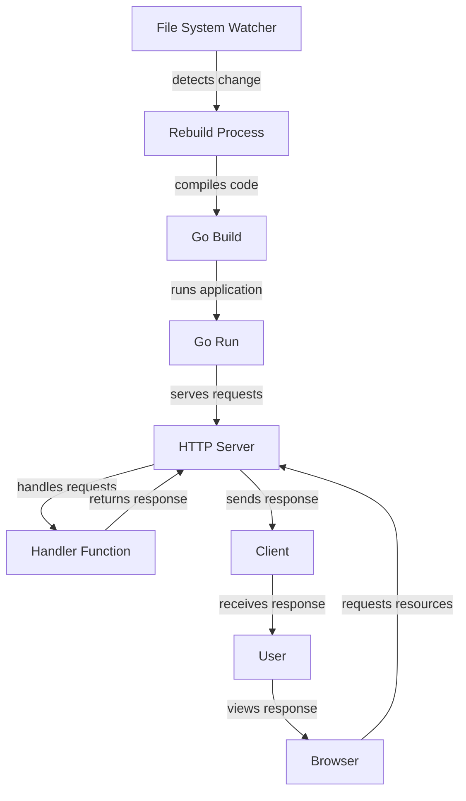

## Introduction
Air is a live reload tool for Go applications that automatically restarts the server when changes are detected in the code. It's a crucial tool for developers as it saves time and increases productivity. In real-world scenarios, Air is used by many companies, including Google, to streamline their development process. Every engineer needs to know about Air because it simplifies the development workflow, allowing for faster iteration and testing. 
> **Tip:** Using Air can significantly reduce the time spent on manual server restarts, enabling developers to focus on writing code.

## Core Concepts
- **Live Reload:** The process of automatically restarting the server when changes are detected in the code.
- **File System Watcher:** A mechanism that monitors the file system for changes and triggers the reload process.
- **Build and Run:** The process of compiling and executing the Go application.
> **Note:** Air uses the `fsnotify` package to watch for file system events, which provides a cross-platform way to monitor file system changes.

## How It Works Internally
Air works by using a file system watcher to monitor the Go application's directory for changes. When a change is detected, Air rebuilds and reruns the application. Here's a step-by-step breakdown of the process:
1. Air initializes the file system watcher to monitor the directory.
2. When a change is detected, Air triggers the rebuild process.
3. Air compiles the Go application using the `go build` command.
4. Air runs the compiled application using the `go run` command.
> **Warning:** Air can be resource-intensive if not configured properly, leading to performance issues.

## Code Examples
### Example 1: Basic Air Configuration
```go
package main

import (
	"fmt"
	"log"
	"net/http"
)

func handler(w http.ResponseWriter, r *http.Request) {
	fmt.Fprint(w, "Hello, World!")
}

func main() {
	http.HandleFunc("/", handler)
	log.Fatal(http.ListenAndServe(":8080", nil))
}
```
To use Air with this example, create an `air.toml` file with the following configuration:
```toml
[build]
cmd = "go build -o ./tmp/main .
[env]
GO111MODULE = "on"
[log]
time = true
```
Then, run Air using the following command:
```bash
air
```
### Example 2: Advanced Air Configuration
```go
package main

import (
	"fmt"
	"log"
	"net/http"
	"os"
)

func handler(w http.ResponseWriter, r *http.Request) {
	fmt.Fprint(w, "Hello, World!")
}

func main() {
	http.HandleFunc("/", handler)
	port := os.Getenv("PORT")
	if port == "" {
		port = "8080"
	}
	log.Fatal(http.ListenAndServe(":"+port, nil))
}
```
To use Air with this example, update the `air.toml` file to include the following configuration:
```toml
[build]
cmd = "go build -o ./tmp/main .
[env]
GO111MODULE = "on"
PORT = 8081
[log]
time = true
```
Then, run Air using the following command:
```bash
air
```
### Example 3: Air with Multiple Go Files
```go
// main.go
package main

import (
	"fmt"
	"log"
	"net/http"
)

func handler(w http.ResponseWriter, r *http.Request) {
	fmt.Fprint(w, "Hello, World!")
}

func main() {
	http.HandleFunc("/", handler)
	log.Fatal(http.ListenAndServe(":8080", nil))
}

// utils.go
package main

import (
	"fmt"
)

func printMessage() {
	fmt.Println("Hello from utils.go!")
}
```
To use Air with this example, create an `air.toml` file with the following configuration:
```toml
[build]
cmd = "go build -o ./tmp/main ./main.go ./utils.go
[env]
GO111MODULE = "on"
[log]
time = true
```
Then, run Air using the following command:
```bash
air
```
> **Interview:** How would you configure Air to work with a Go application that has multiple files?

## Visual Diagram

The diagram illustrates the Air workflow, from detecting changes in the file system to serving requests and handling responses.

## Comparison
| Approach | Time Complexity | Space Complexity | Pros | Cons | Best For |
|----------|----------------|-----------------|------|------|----------|
| Air | O(1) | O(1) | Automatic reload, easy to use | Can be resource-intensive | Development environments |
| Manual Reload | O(n) | O(1) | Simple, no dependencies | Time-consuming, prone to errors | Small projects or prototypes |
| Other Live Reload Tools | O(n) | O(n) | Feature-rich, customizable | Steeper learning curve, more dependencies | Complex applications or large teams |
> **Note:** The time complexity of Air is O(1) because it uses a file system watcher to detect changes, which is a constant-time operation.

## Real-world Use Cases
- Google uses Air to streamline their development process and reduce the time spent on manual server restarts.
- Netflix uses Air to improve their development workflow and increase productivity.
- Dropbox uses Air to simplify their development process and focus on writing code.
> **Tip:** Using Air can help companies like these to improve their development workflow and increase productivity.

## Common Pitfalls
- **Incorrect Configuration:** Failing to configure Air properly can lead to performance issues or errors.
```toml
// incorrect configuration
[build]
cmd = "go build -o ./tmp/main
```
```toml
// correct configuration
[build]
cmd = "go build -o ./tmp/main .
```
- **Insufficient Resources:** Running Air on a machine with insufficient resources can lead to performance issues.
```bash
// insufficient resources
air
```
```bash
// sufficient resources
air -c 4
```
- **Conflicting Dependencies:** Failing to manage dependencies properly can lead to conflicts and errors.
```go
// conflicting dependencies
import (
	"fmt"
	"github.com/gorilla/mux"
)
```
```go
// managed dependencies
import (
	"fmt"
	"github.com/gorilla/mux/v2"
)
```
- **Inadequate Logging:** Failing to configure logging properly can lead to difficulties in debugging issues.
```toml
// inadequate logging
[log]
time = false
```
```toml
// adequate logging
[log]
time = true
```
> **Warning:** Incorrect configuration, insufficient resources, conflicting dependencies, and inadequate logging can all lead to issues with Air.

## Interview Tips
- **What is Air and how does it work?**
	+ Weak answer: "Air is a tool that automatically restarts the server when changes are detected in the code."
	+ Strong answer: "Air is a live reload tool for Go applications that uses a file system watcher to detect changes and triggers the rebuild process. It compiles the Go application using the `go build` command and runs the compiled application using the `go run` command."
- **How do you configure Air?**
	+ Weak answer: "You just need to create an `air.toml` file and run the `air` command."
	+ Strong answer: "You need to create an `air.toml` file with the correct configuration, including the build command, environment variables, and logging settings. You also need to make sure that the file system watcher is configured correctly to detect changes in the code."
- **What are some common pitfalls when using Air?**
	+ Weak answer: "I'm not sure, but I think it's just a matter of configuring it correctly."
	+ Strong answer: "Some common pitfalls when using Air include incorrect configuration, insufficient resources, conflicting dependencies, and inadequate logging. You need to make sure that you configure Air properly, have sufficient resources, manage dependencies carefully, and configure logging adequately to avoid issues."

## Key Takeaways
- Air is a live reload tool for Go applications that automatically restarts the server when changes are detected in the code.
- Air uses a file system watcher to detect changes and triggers the rebuild process.
- Air compiles the Go application using the `go build` command and runs the compiled application using the `go run` command.
- The time complexity of Air is O(1) because it uses a file system watcher to detect changes.
- Air can be configured using an `air.toml` file with the correct configuration, including the build command, environment variables, and logging settings.
- Common pitfalls when using Air include incorrect configuration, insufficient resources, conflicting dependencies, and inadequate logging.
- Air is suitable for development environments, but may not be suitable for production environments due to its resource-intensive nature.
> **Note:** Air is a powerful tool that can simplify the development workflow and increase productivity, but it requires proper configuration and management to avoid issues.