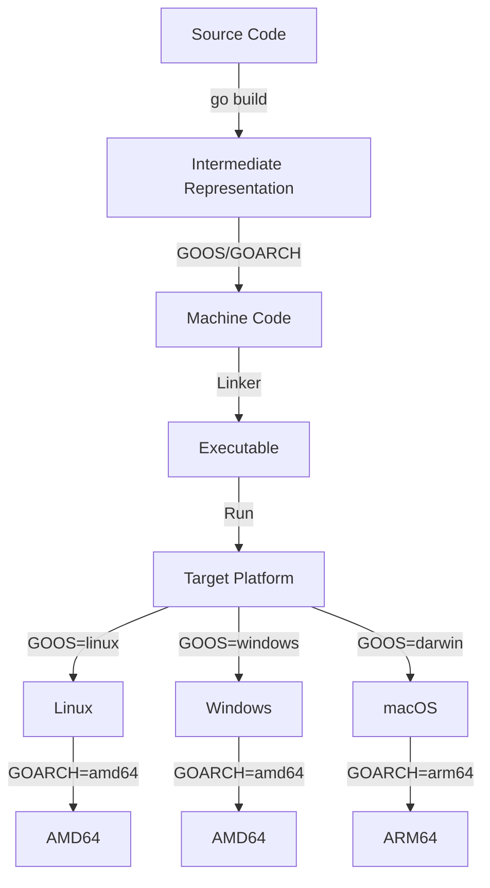

## Introduction
Cross-compilation is the process of compiling code for a different **target platform** than the one you're currently using. In the context of Go programming, this is achieved using the `GOOS` and `GOARCH` environment variables. These variables allow you to specify the target operating system and architecture, respectively, for your compiled binary. Cross-compilation is essential for developing software that needs to run on multiple platforms, such as Linux, Windows, and macOS. 
> **Note:** Understanding cross-compilation is crucial for building Go applications that can be deployed across different environments.

## Core Concepts
To grasp cross-compilation in Go, you need to understand the following key concepts:
- **GOOS**: This variable specifies the target operating system. Common values include `linux`, `windows`, `darwin` (for macOS), and `freebsd`.
- **GOARCH**: This variable specifies the target CPU architecture. Common values include `amd64`, `arm64`, `386`, and `arm`.
- **Build Constraints**: These are used to conditionally include or exclude files from the build process based on the target platform.

## How It Works Internally
When you compile a Go program, the `go build` command uses the `GOOS` and `GOARCH` variables to determine the target platform. Here's a step-by-step breakdown:
1. The Go compiler reads the source code and generates an intermediate representation.
2. The compiler applies build constraints to filter out files that are not applicable to the target platform.
3. The compiler generates machine code for the target architecture.
4. The linker combines the object files and libraries to create the final executable.

## Code Examples
### Example 1: Basic Cross-Compilation
```go
// hello.go
package main

import "fmt"

func main() {
    fmt.Println("Hello, World!")
}
```
To compile this program for Linux on AMD64, you would run:
```bash
GOOS=linux GOARCH=amd64 go build hello.go
```
This generates a `hello` executable that can be run on a Linux system with an AMD64 CPU.

### Example 2: Using Build Constraints
```go
// main.go
package main

import (
    "fmt"
    "runtime"
)

func main() {
    if runtime.GOOS == "windows" {
        fmt.Println("Running on Windows")
    } else {
        fmt.Println("Running on non-Windows")
    }
}
```
To compile this program for Windows on AMD64, you would run:
```bash
GOOS=windows GOARCH=amd64 go build main.go
```
This generates a `main.exe` executable that can be run on a Windows system with an AMD64 CPU.

### Example 3: Advanced Cross-Compilation with CGO
```go
// main.go
package main

/*
#cgo CFLAGS: -g -Wall
#cgo LDFLAGS: -lfoo
#include <foo.h>
*/
import "C"
import "fmt"

func main() {
    C.foo()
    fmt.Println("Hello, World!")
}
```
To compile this program for macOS on ARM64 using CGO, you would run:
```bash
GOOS=darwin GOARCH=arm64 CGO_ENABLED=1 go build main.go
```
This generates a `main` executable that can be run on a macOS system with an ARM64 CPU.

## Visual Diagram

This diagram illustrates the cross-compilation process, from source code to executable, and the different target platforms and architectures.

## Comparison
| Approach | Time Complexity | Space Complexity | Pros | Cons | Best For |
|----------|----------------|-----------------|------|------|----------|
| Native Compilation | O(1) | O(1) | Fast, efficient | Limited to same platform | Development, testing |
| Cross-Compilation | O(n) | O(n) | Flexible, portable | Slower, more complex | Deployment, distribution |
| CGO | O(n) | O(n) | Allows C code integration | More complex, slower | Performance-critical code |
| Docker | O(1) | O(1) | Easy, portable | Heavyweight, slow | Development, testing, deployment |

## Real-world Use Cases
1. **Google Cloud**: Google Cloud uses cross-compilation to build and deploy Go applications across different platforms, including Linux, Windows, and macOS.
2. **Kubernetes**: Kubernetes uses cross-compilation to build and deploy Go applications across different platforms, including Linux, Windows, and macOS.
3. **Docker**: Docker uses cross-compilation to build and deploy Go applications across different platforms, including Linux, Windows, and macOS.

## Common Pitfalls
1. **Incorrect GOOS/GOARCH**: Using the wrong `GOOS` or `GOARCH` values can result in executables that don't run on the target platform.
```go
// Wrong
GOOS=linux GOARCH=arm64 go build hello.go
// Right
GOOS=linux GOARCH=amd64 go build hello.go
```
2. **Missing Build Constraints**: Failing to apply build constraints can result in executables that include unnecessary code.
```go
// Wrong
// file1.go
package main

import "fmt"

func main() {
    fmt.Println("Hello, World!")
}
// file2.go
package main

import "fmt"

func main() {
    fmt.Println("Goodbye, World!")
}
// Right
// file1.go
// +build linux
package main

import "fmt"

func main() {
    fmt.Println("Hello, World!")
}
// file2.go
// +build windows
package main

import "fmt"

func main() {
    fmt.Println("Goodbye, World!")
}
```
3. **CGO Issues**: Using CGO can introduce complexity and slow down the build process.
```go
// Wrong
/*
#cgo CFLAGS: -g -Wall
#cgo LDFLAGS: -lfoo
#include <foo.h>
*/
import "C"
import "fmt"

func main() {
    C.foo()
    fmt.Println("Hello, World!")
}
// Right
/*
#cgo CFLAGS: -g -Wall
#cgo LDFLAGS: -lfoo
#include <foo.h>
*/
import "C"
import "fmt"

func main() {
    C.foo()
    fmt.Println("Hello, World!")
}
CGO_ENABLED=1 go build main.go
```
4. **Docker Issues**: Using Docker can introduce overhead and slow down the build process.
```go
// Wrong
docker build -t myimage .
// Right
docker build -t myimage . --no-cache
```

## Interview Tips
1. **What is cross-compilation?**: A weak answer would be "it's a way to compile code for a different platform." A strong answer would be "cross-compilation is the process of compiling code for a different target platform than the one you're currently using, using environment variables like `GOOS` and `GOARCH`."
2. **How does CGO work?**: A weak answer would be "it's a way to call C code from Go." A strong answer would be "CGO is a mechanism that allows Go code to call C code and vice versa, using the `#cgo` directive and the `CGO_ENABLED` environment variable."
3. **What are some common pitfalls when using cross-compilation?**: A weak answer would be "I'm not sure." A strong answer would be "some common pitfalls include using the wrong `GOOS` or `GOARCH` values, missing build constraints, and introducing complexity with CGO or Docker."

## Key Takeaways
* **GOOS** and **GOARCH** are environment variables used to specify the target platform for cross-compilation.
* Cross-compilation allows you to build Go applications for different platforms, including Linux, Windows, and macOS.
* Build constraints can be used to conditionally include or exclude files from the build process.
* CGO allows Go code to call C code and vice versa.
* Docker can be used to build and deploy Go applications across different platforms.
* Common pitfalls include using the wrong `GOOS` or `GOARCH` values, missing build constraints, and introducing complexity with CGO or Docker.
* Time complexity for cross-compilation is O(n), while space complexity is also O(n).
* The best approach depends on the specific use case, including development, testing, deployment, and distribution.