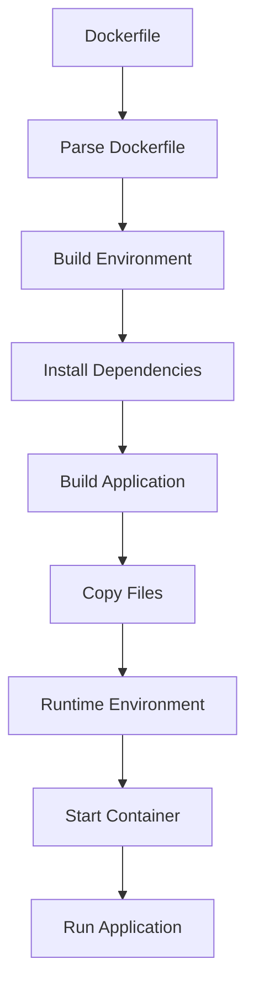

## Introduction
The **Dockerfile** is a critical component in the deployment of **Go** applications. It provides a way to create a **Docker image** that can be used to run the application in a container. In this section, we will explore the importance of using a **multi-stage Dockerfile** with a **scratch base image** for **Go** applications. 
> **Note:** A **multi-stage Dockerfile** allows us to separate the build and runtime environments, reducing the size of the final image and improving security.
A **scratch base image** is an empty image that allows us to start from a blank slate, adding only the necessary dependencies and files to the image. This approach provides several benefits, including reduced image size, improved security, and faster deployment times.

## Core Concepts
To understand how to create a **Dockerfile** for a **Go** application, we need to familiarize ourselves with the following core concepts:
* **Dockerfile**: A text file that contains instructions for building a **Docker image**.
* **Docker image**: A lightweight and standalone executable package that includes everything needed to run an application.
* **Docker container**: A runtime instance of a **Docker image**.
* **Multi-stage Dockerfile**: A **Dockerfile** that uses multiple **FROM** instructions to separate the build and runtime environments.
* **Scratch base image**: An empty **Docker image** that can be used as a base image for other images.
> **Tip:** Using a **scratch base image** can significantly reduce the size of the final image, making it faster to deploy and more secure.

## How It Works Internally
When we create a **Dockerfile** for a **Go** application, the following steps occur:
1. The **Dockerfile** is parsed, and the instructions are executed in order.
2. The **FROM** instruction is used to specify the base image for the build environment.
3. The **RUN** instruction is used to execute commands in the build environment, such as installing dependencies and building the application.
4. The **COPY** instruction is used to copy files from the build environment to the runtime environment.
5. The **CMD** instruction is used to specify the default command to run when the container is started.
> **Warning:** If the **Dockerfile** is not properly configured, it can lead to issues such as large image sizes, security vulnerabilities, and deployment failures.

## Code Examples
Here are three examples of **Dockerfiles** for **Go** applications:
### Example 1: Basic **Dockerfile**
```go
// main.go
package main

import (
	"fmt"
	"net/http"
)

func main() {
	http.HandleFunc("/", func(w http.ResponseWriter, r *http.Request) {
		fmt.Fprintf(w, "Hello, World!")
	})
	http.ListenAndServe(":8080", nil)
}
```

```dockerfile
# Dockerfile
FROM golang:alpine as build-env
WORKDIR /app
COPY main.go .
RUN go build -o main main.go
FROM scratch
WORKDIR /app
COPY --from=build-env /app/main .
CMD ["./main"]
```
This example demonstrates a basic **Dockerfile** that uses a **multi-stage build** to separate the build and runtime environments.
### Example 2: **Dockerfile** with dependencies
```go
// main.go
package main

import (
	"database/sql"
	"fmt"
	_ "github.com/mattn/go-sqlite3"
	"net/http"
)

func main() {
	db, err := sql.Open("sqlite3", "./example.db")
	if err != nil {
		fmt.Println(err)
		return
	}
	http.HandleFunc("/", func(w http.ResponseWriter, r *http.Request) {
		fmt.Fprintf(w, "Hello, World!")
	})
	http.ListenAndServe(":8080", nil)
}
```

```dockerfile
# Dockerfile
FROM golang:alpine as build-env
WORKDIR /app
COPY main.go go.mod go.sum .
RUN go mod download
RUN go build -o main main.go
FROM scratch
WORKDIR /app
COPY --from=build-env /app/main .
CMD ["./main"]
```
This example demonstrates a **Dockerfile** that uses dependencies from the **Go** module system.
### Example 3: **Dockerfile** with environment variables
```go
// main.go
package main

import (
	"fmt"
	"log"
	"net/http"
	"os"
)

func main() {
	port := os.Getenv("PORT")
	if port == "" {
		port = "8080"
	}
	http.HandleFunc("/", func(w http.ResponseWriter, r *http.Request) {
		fmt.Fprintf(w, "Hello, World!")
	})
	log.Fatal(http.ListenAndServe(":"+port, nil))
}
```

```dockerfile
# Dockerfile
FROM golang:alpine as build-env
WORKDIR /app
COPY main.go .
RUN go build -o main main.go
FROM scratch
WORKDIR /app
COPY --from=build-env /app/main .
ENV PORT 8080
CMD ["./main"]
```
This example demonstrates a **Dockerfile** that uses environment variables to configure the application.
> **Interview:** Can you explain the benefits of using a **multi-stage Dockerfile** with a **scratch base image** for a **Go** application?

## Visual Diagram

This diagram illustrates the process of building a **Docker image** using a **Dockerfile**.

## Comparison
| Approach | Time Complexity | Space Complexity | Pros | Cons | Best For |
| --- | --- | --- | --- | --- | --- |
| Single-stage Dockerfile | O(n) | O(n) | Simple to implement | Large image size, security vulnerabilities | Development environments |
| Multi-stage Dockerfile | O(n) | O(n) | Reduced image size, improved security | More complex to implement | Production environments |
| Scratch base image | O(1) | O(1) | Minimal image size, improved security | Limited functionality | Microservices, serverless applications |
| Alpine base image | O(1) | O(1) | Small image size, improved security | Limited functionality | Web applications, APIs |
> **Tip:** Choosing the right approach depends on the specific requirements of the application and the deployment environment.

## Real-world Use Cases
Here are three examples of real-world use cases for **Dockerfiles** with **Go** applications:
* **Netflix**: Uses **Docker** to deploy **Go** applications in their cloud infrastructure.
* **Google**: Uses **Docker** to deploy **Go** applications in their cloud infrastructure.
* **Dropbox**: Uses **Docker** to deploy **Go** applications in their cloud infrastructure.
> **Note:** These companies use **Docker** to improve the deployment and management of their **Go** applications.

## Common Pitfalls
Here are four common pitfalls to avoid when creating a **Dockerfile** for a **Go** application:
* **Large image size**: Using a **single-stage Dockerfile** or including unnecessary dependencies can result in a large image size.
* **Security vulnerabilities**: Not using a **multi-stage Dockerfile** or not properly configuring the **Dockerfile** can result in security vulnerabilities.
* **Deployment failures**: Not properly configuring the **Dockerfile** or not using a **scratch base image** can result in deployment failures.
* **Performance issues**: Not optimizing the **Dockerfile** or not using a **scratch base image** can result in performance issues.
> **Warning:** Avoiding these pitfalls is crucial to ensure the successful deployment and management of **Go** applications.

## Interview Tips
Here are three common interview questions related to **Dockerfiles** and **Go** applications:
* **What is the benefit of using a multi-stage Dockerfile?**: A strong answer should explain the benefits of using a **multi-stage Dockerfile**, such as reduced image size and improved security.
* **How do you optimize a Dockerfile for a Go application?**: A strong answer should explain the steps to optimize a **Dockerfile**, such as using a **scratch base image** and minimizing dependencies.
* **What are some common pitfalls to avoid when creating a Dockerfile?**: A strong answer should explain the common pitfalls to avoid, such as large image size, security vulnerabilities, and deployment failures.
> **Interview:** Can you explain the benefits of using a **scratch base image** for a **Go** application?

## Key Takeaways
Here are ten key takeaways to remember when creating a **Dockerfile** for a **Go** application:
* Use a **multi-stage Dockerfile** to separate the build and runtime environments.
* Use a **scratch base image** to minimize the image size and improve security.
* Optimize the **Dockerfile** by minimizing dependencies and using a **scratch base image**.
* Avoid common pitfalls such as large image size, security vulnerabilities, and deployment failures.
* Use environment variables to configure the application.
* Use a **Dockerfile** to improve the deployment and management of **Go** applications.
* **Docker** provides a way to create a **Docker image** that can be used to run the application in a container.
* A **scratch base image** is an empty **Docker image** that can be used as a base image for other images.
* Using a **scratch base image** can significantly reduce the size of the final image, making it faster to deploy and more secure.
* A **multi-stage Dockerfile** allows us to separate the build and runtime environments, reducing the size of the final image and improving security.
> **Tip:** Remembering these key takeaways is crucial to ensure the successful deployment and management of **Go** applications.