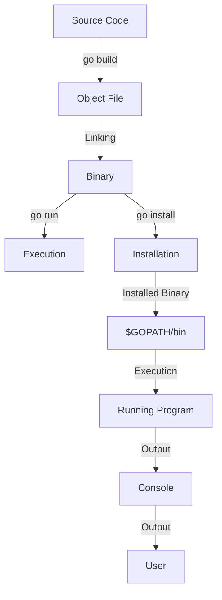

## Introduction
The Go programming language provides several commands for building, running, and installing Go programs. **go build**, **go run**, and **go install** are three essential commands that every Go developer should understand. These commands are used to compile, execute, and manage Go packages and binaries. In this section, we will explore the importance of these commands, their real-world relevance, and why every engineer needs to know how to use them effectively.

In real-world scenarios, Go developers use these commands to build and deploy their applications. For example, a developer might use **go build** to create a binary for their web application, and then use **go install** to install the binary in a specific location. Understanding how these commands work and how to use them efficiently is crucial for any Go developer.

> **Note:** The **go build**, **go run**, and **go install** commands are part of the Go toolchain, which provides a set of tools for building, testing, and managing Go programs.

## Core Concepts
To understand how **go build**, **go run**, and **go install** work, we need to grasp some core concepts:

*   **Packages**: In Go, a package is a collection of related source files that can be compiled together. Packages are the basic building blocks of Go programs.
*   **Modules**: Go modules are a way to manage dependencies between packages. A module is a collection of related packages that can be versioned and distributed together.
*   **Binaries**: A binary is the compiled version of a Go program. Binaries can be executed directly on the target machine.

> **Warning:** When using **go build**, **go run**, and **go install**, it's essential to understand the differences between packages, modules, and binaries to avoid common pitfalls.

## How It Works Internally
Let's dive deeper into the under-the-hood mechanics of **go build**, **go run**, and **go install**:

*   **go build**: When you run **go build**, the Go compiler compiles the source code into an object file. The object file is then linked into a binary. The binary is stored in the current working directory.
*   **go run**: **go run** is similar to **go build**, but it also executes the binary after compiling it. The binary is stored in a temporary directory and is deleted after execution.
*   **go install**: **go install** compiles the source code into a binary and installs it in the **$GOPATH/bin** directory. The binary is also installed in the **$GOROOT/bin** directory if the **-i** flag is used.

Here's a step-by-step breakdown of the process:

1.  The Go compiler reads the source code and compiles it into an object file.
2.  The object file is linked into a binary.
3.  The binary is stored in the current working directory (**go build**) or a temporary directory (**go run**).
4.  If **go install** is used, the binary is installed in the **$GOPATH/bin** directory.

> **Tip:** Use the **-o** flag with **go build** to specify the output file name. For example, **go build -o myapp** will create a binary named **myapp**.

## Code Examples
Here are three complete and runnable examples of using **go build**, **go run**, and **go install**:

### Example 1: Basic Usage
```go
// main.go
package main

import "fmt"

func main() {
    fmt.Println("Hello, World!")
}
```

To compile and run this program using **go run**, use the following command:
```bash
go run main.go
```

### Example 2: Building a Binary
```go
// main.go
package main

import "fmt"

func main() {
    fmt.Println("Hello, World!")
}
```

To build a binary using **go build**, use the following command:
```bash
go build main.go
```

This will create a binary named **main** in the current working directory.

### Example 3: Installing a Binary
```go
// main.go
package main

import "fmt"

func main() {
    fmt.Println("Hello, World!")
}
```

To install a binary using **go install**, use the following command:
```bash
go install main.go
```

This will install the binary in the **$GOPATH/bin** directory.

## Visual Diagram


The above diagram illustrates the process of compiling, linking, and executing a Go program using **go build**, **go run**, and **go install**.

## Comparison
Here's a comparison of **go build**, **go run**, and **go install**:

| Command | Description | Time Complexity | Space Complexity | Pros | Cons |
| --- | --- | --- | --- | --- | --- |
| **go build** | Compiles source code into a binary | O(n) | O(n) | Fast, flexible | Does not execute the binary |
| **go run** | Compiles source code into a binary and executes it | O(n) | O(n) | Convenient, fast | Temporary binary is deleted after execution |
| **go install** | Compiles source code into a binary and installs it | O(n) | O(n) | Convenient, persistent | Installs binary in **$GOPATH/bin** directory |

> **Interview:** Can you explain the differences between **go build**, **go run**, and **go install**? How would you use each command in a real-world scenario?

## Real-world Use Cases
Here are three real-world use cases for **go build**, **go run**, and **go install**:

*   **Building a Web Application**: A developer uses **go build** to create a binary for their web application. They then use **go install** to install the binary in the **$GOPATH/bin** directory.
*   **Testing a Package**: A developer uses **go run** to test a package they are working on. They can quickly execute the package and see the output without having to install it.
*   **Deploying a Service**: A developer uses **go build** to create a binary for their service. They then use **go install** to install the binary on a remote server.

## Common Pitfalls
Here are four common pitfalls to watch out for when using **go build**, **go run**, and **go install**:

*   **Incorrect Package Path**: Using an incorrect package path can lead to compilation errors. Make sure to use the correct package path when using **go build** or **go run**.
*   **Missing Dependencies**: Missing dependencies can cause compilation errors. Make sure to install all required dependencies before using **go build** or **go run**.
*   **Incorrect Binary Name**: Using an incorrect binary name can lead to execution errors. Make sure to use the correct binary name when using **go run** or **go install**.
*   **Overwriting Existing Binaries**: Overwriting existing binaries can cause unexpected behavior. Make sure to use a unique binary name when using **go build** or **go install**.

> **Warning:** Be careful when using **go install** to avoid overwriting existing binaries.

## Interview Tips
Here are three common interview questions related to **go build**, **go run**, and **go install**:

*   **What is the difference between **go build** and **go run**?**: A strong answer would explain the differences between **go build** and **go run**, including the fact that **go run** executes the binary after compiling it.
*   **How do you use **go install** to install a binary?**: A strong answer would explain how to use **go install** to install a binary, including the fact that it installs the binary in the **$GOPATH/bin** directory.
*   **What are some common pitfalls to watch out for when using **go build**, **go run**, and **go install**?**: A strong answer would explain some common pitfalls, including incorrect package paths, missing dependencies, and overwriting existing binaries.

> **Tip:** Practice explaining the differences between **go build**, **go run**, and **go install** to improve your interview skills.

## Key Takeaways
Here are ten key takeaways to remember:

*   **go build** compiles source code into a binary.
*   **go run** compiles source code into a binary and executes it.
*   **go install** compiles source code into a binary and installs it in the **$GOPATH/bin** directory.
*   Use the **-o** flag with **go build** to specify the output file name.
*   Use the **-i** flag with **go install** to install the binary in the **$GOROOT/bin** directory.
*   Be careful when using **go install** to avoid overwriting existing binaries.
*   Use a unique binary name when using **go build** or **go install**.
*   Make sure to use the correct package path when using **go build** or **go run**.
*   Install all required dependencies before using **go build** or **go run**.
*   Practice explaining the differences between **go build**, **go run**, and **go install** to improve your interview skills.

> **Note:** Remember to practice using **go build**, **go run**, and **go install** to become proficient in using these commands.