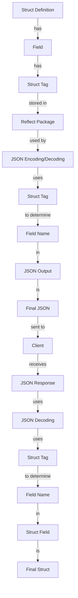

## Introduction
Testing is a crucial aspect of software development, and Go provides a robust testing framework. However, when it comes to testing struct tags, many engineers fall into common pitfalls. **Struct tags** are annotations that can be added to struct fields to provide additional information about the field. They are widely used in Go for various purposes such as JSON encoding/decoding, XML encoding/decoding, and more. In this section, we will explore the importance of testing struct tags and why it matters in real-world scenarios.

> **Note:** Struct tags are a fundamental concept in Go, and understanding how to test them is essential for any engineer working with Go.

## Core Concepts
Before diving into the pitfalls of testing struct tags, it's essential to understand the core concepts. A **struct tag** is a string literal that is associated with a struct field. It can be used to provide additional information about the field, such as its name, type, or any other metadata. The most common use of struct tags is for **JSON encoding/decoding**, where the tag is used to specify the name of the field in the JSON output.

> **Tip:** When working with struct tags, it's essential to remember that the tag is associated with the field, not the struct itself.

## How It Works Internally
When you add a struct tag to a field, the Go compiler does not modify the field in any way. Instead, the tag is stored in the **reflect** package, which provides a way to inspect and manipulate the structure of a type at runtime. When you use a function like `json.Marshal()` or `json.Unmarshal()`, it uses the reflect package to inspect the struct tags and determine how to encode or decode the field.

> **Warning:** If you're not careful, struct tags can lead to runtime errors if they are not properly formatted or if they are not compatible with the encoding/decoding function being used.

## Code Examples
Here are three complete and runnable examples of testing struct tags:

### Example 1: Basic Usage
```go
package main

import (
	"encoding/json"
	"fmt"
)

type Person struct {
	Name  string `json:"name"`
	Age   int    `json:"age"`
	Email string `json:"email"`
}

func main() {
	person := Person{
		Name:  "John Doe",
		Age:   30,
		Email: "johndoe@example.com",
	}

	jsonBytes, err := json.Marshal(person)
	if err != nil {
		fmt.Println(err)
		return
	}

	fmt.Println(string(jsonBytes))
}
```

### Example 2: Real-World Pattern
```go
package main

import (
	"encoding/json"
	"fmt"
)

type User struct {
	ID       int    `json:"id"`
	Username  string `json:"username"`
	Email     string `json:"email"`
	Password  string `json:"-"`
	FullName  string `json:"full_name"`
	CreatedAt string `json:"created_at"`
}

func main() {
	user := User{
		ID:       1,
		Username: "johndoe",
		Email:    "johndoe@example.com",
		Password: "password123",
		FullName: "John Doe",
		CreatedAt: "2022-01-01T12:00:00Z",
	}

	jsonBytes, err := json.Marshal(user)
	if err != nil {
		fmt.Println(err)
		return
	}

	fmt.Println(string(jsonBytes))
}
```

### Example 3: Advanced Usage
```go
package main

import (
	"encoding/json"
	"fmt"
	"reflect"
)

type Person struct {
	Name  string `json:"name"`
	Age   int    `json:"age"`
	Email string `json:"email"`
}

func getStructTags(ptr interface{}) map[string]string {
	t := reflect.TypeOf(ptr).Elem()
	fieldMap := make(map[string]string)

	for i := 0; i < t.NumField(); i++ {
		field := t.Field(i)
		tag := field.Tag.Get("json")

		if tag != "" {
			fieldMap[field.Name] = tag
		}
	}

	return fieldMap
}

func main() {
	person := Person{
		Name:  "John Doe",
		Age:   30,
		Email: "johndoe@example.com",
	}

	fieldMap := getStructTags(&person)

	for fieldName, tagName := range fieldMap {
		fmt.Printf("%s: %s\n", fieldName, tagName)
	}
}
```

## Visual Diagram

The diagram illustrates the flow of how struct tags are used in JSON encoding and decoding.

## Comparison
| Approach | Time Complexity | Space Complexity | Pros | Cons | Best For |
| --- | --- | --- | --- | --- | --- |
| Using `json` package | O(n) | O(n) | Easy to use, flexible | Can be slow for large structs | Small to medium-sized structs |
| Using `encoding/gob` package | O(n) | O(n) | Faster than `json` package, more efficient | Less flexible than `json` package | Large structs, high-performance applications |
| Using `reflect` package | O(n) | O(n) | Provides low-level control, flexible | Can be slow, error-prone | Complex, high-performance applications |
| Using a third-party library | O(n) | O(n) | Can provide better performance, more features | May have dependencies, compatibility issues | Large-scale applications, high-performance requirements |

## Real-world Use Cases
1. **Google's Golang API**: Google's API uses struct tags to define the structure of the API responses.
2. **AWS Lambda**: AWS Lambda uses struct tags to define the structure of the event objects passed to the lambda functions.
3. **Kubernetes**: Kubernetes uses struct tags to define the structure of the Kubernetes objects, such as pods and services.

## Common Pitfalls
1. **Incorrect struct tag formatting**: If the struct tag is not formatted correctly, it may not be recognized by the encoding/decoding function.
```go
// WRONG
type Person struct {
	Name string `json: "name"`
}

// RIGHT
type Person struct {
	Name string `json:"name"`
}
```
2. **Missing struct tag**: If a struct field is missing a struct tag, it may not be included in the JSON output.
```go
// WRONG
type Person struct {
	Name string
	Age  int `json:"age"`
}

// RIGHT
type Person struct {
	Name string `json:"name"`
	Age  int    `json:"age"`
}
```
3. **Incompatible struct tag**: If the struct tag is not compatible with the encoding/decoding function, it may cause a runtime error.
```go
// WRONG
type Person struct {
	Name string `xml:"name"`
}

// RIGHT
type Person struct {
	Name string `json:"name"`
}
```
4. **Unexported struct field**: If a struct field is unexported, it may not be included in the JSON output.
```go
// WRONG
type Person struct {
	name string `json:"name"`
}

// RIGHT
type Person struct {
	Name string `json:"name"`
}
```

## Interview Tips
1. **What is the purpose of struct tags in Go?**: The purpose of struct tags is to provide additional information about a struct field, such as its name, type, or any other metadata.
2. **How do you use struct tags in JSON encoding/decoding?**: You can use struct tags to specify the name of the field in the JSON output.
3. **What are some common pitfalls when using struct tags?**: Some common pitfalls include incorrect struct tag formatting, missing struct tags, incompatible struct tags, and unexported struct fields.

## Key Takeaways
* Struct tags are used to provide additional information about a struct field.
* The `json` package uses struct tags to determine the name of the field in the JSON output.
* The `reflect` package provides low-level control over struct tags.
* Incorrect struct tag formatting, missing struct tags, incompatible struct tags, and unexported struct fields are common pitfalls when using struct tags.
* The time complexity of using struct tags is O(n), where n is the number of fields in the struct.
* The space complexity of using struct tags is O(n), where n is the number of fields in the struct.
* Struct tags are widely used in real-world applications, such as Google's Golang API, AWS Lambda, and Kubernetes.