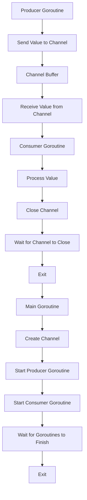

## Introduction
Designing garbage-free systems with channels is a crucial aspect of building efficient and scalable concurrent systems in Go. **Channels** are a fundamental concept in Go, providing a safe and efficient way for goroutines to communicate with each other. By using channels, developers can avoid the overhead of garbage collection, which can significantly improve the performance of their applications. In this section, we will explore the importance of designing garbage-free systems with channels and their real-world relevance.

> **Note:** Garbage collection is a mechanism used by programming languages to automatically manage memory and eliminate the need for manual memory management. However, garbage collection can introduce pause times, which can be detrimental to real-time systems.

In real-world applications, designing garbage-free systems with channels is essential for building high-performance concurrent systems. For example, in a web server, using channels to handle requests and responses can help avoid the overhead of garbage collection, resulting in improved response times and increased throughput.

## Core Concepts
To design garbage-free systems with channels, it is essential to understand the core concepts of channels and how they work. A **channel** is a built-in concurrency construct in Go that allows goroutines to communicate with each other. Channels are typed, meaning that they can only send and receive values of a specific type.

The key terminology related to channels includes:

* **Buffered channels**: Channels with a buffer, which allows them to store a specified number of values.
* **Unbuffered channels**: Channels without a buffer, which means that a send operation will block until a receive operation is performed.
* **Channel capacity**: The maximum number of values that a channel can store.

> **Tip:** When designing garbage-free systems with channels, it is essential to choose the correct type of channel and capacity to avoid blocking and improve performance.

## How It Works Internally
To understand how channels work internally, it is essential to explore the under-the-hood mechanics of channels. When a channel is created, Go allocates a small amount of memory to store the channel's metadata, including the channel's type, capacity, and the number of values stored in the channel.

When a value is sent to a channel, Go checks if the channel has available capacity. If the channel is buffered and has available capacity, the value is stored in the channel's buffer. If the channel is unbuffered or does not have available capacity, the send operation will block until a receive operation is performed.

> **Warning:** Using channels with a large capacity can lead to memory issues, as the channel will store all the values in memory until they are received.

## Code Examples
Here are three complete and runnable examples of using channels to design garbage-free systems:

### Example 1: Basic Channel Usage
```go
package main

import (
	"fmt"
	"time"
)

func producer(ch chan int) {
	for i := 0; i < 10; i++ {
		ch <- i
		time.Sleep(100 * time.Millisecond)
	}
	close(ch)
}

func consumer(ch chan int) {
	for v := range ch {
		fmt.Println(v)
	}
}

func main() {
	ch := make(chan int)
	go producer(ch)
	consumer(ch)
}
```
This example demonstrates the basic usage of channels, where a producer goroutine sends values to a channel, and a consumer goroutine receives values from the channel.

### Example 2: Buffered Channel Usage
```go
package main

import (
	"fmt"
	"time"
)

func producer(ch chan int) {
	for i := 0; i < 10; i++ {
		ch <- i
		time.Sleep(100 * time.Millisecond)
	}
	close(ch)
}

func consumer(ch chan int) {
	for v := range ch {
		fmt.Println(v)
	}
}

func main() {
	ch := make(chan int, 5) // buffered channel with capacity 5
	go producer(ch)
	consumer(ch)
}
```
This example demonstrates the usage of buffered channels, where the producer goroutine sends values to a channel with a capacity of 5.

### Example 3: Advanced Channel Usage with Select Statement
```go
package main

import (
	"fmt"
	"time"
)

func producer(ch1 chan int, ch2 chan string) {
	for i := 0; i < 10; i++ {
		ch1 <- i
		time.Sleep(100 * time.Millisecond)
	}
	close(ch1)
	for i := 0; i < 10; i++ {
		ch2 <- fmt.Sprintf("Hello %d", i)
		time.Sleep(100 * time.Millisecond)
	}
	close(ch2)
}

func consumer(ch1 chan int, ch2 chan string) {
	for {
		select {
		case v, ok := <-ch1:
			if !ok {
				fmt.Println("Channel 1 closed")
				ch1 = nil
			} else {
				fmt.Println(v)
			}
		case v, ok := <-ch2:
			if !ok {
				fmt.Println("Channel 2 closed")
				ch2 = nil
			} else {
				fmt.Println(v)
			}
		}
		if ch1 == nil && ch2 == nil {
			break
		}
	}
}

func main() {
	ch1 := make(chan int)
	ch2 := make(chan string)
	go producer(ch1, ch2)
	consumer(ch1, ch2)
}
```
This example demonstrates the advanced usage of channels with a select statement, where the consumer goroutine receives values from two channels.

## Visual Diagram

This diagram illustrates the flow of a producer goroutine sending values to a channel and a consumer goroutine receiving values from the channel.

## Comparison
| Approach | Time Complexity | Space Complexity | Pros | Cons | Best For |
| --- | --- | --- | --- | --- | --- |
| Unbuffered Channels | O(1) | O(1) | Low overhead, simple to use | Blocking send and receive operations | Real-time systems, low-latency applications |
| Buffered Channels | O(1) | O(n) | Non-blocking send and receive operations, improved performance | Higher overhead, more complex to use | High-throughput applications, concurrent systems |
| Select Statement | O(1) | O(1) | Flexible, non-blocking receive operations | More complex to use, higher overhead | Concurrent systems, real-time applications |
| Mutexes | O(1) | O(1) | Simple to use, low overhead | Blocking operations, more complex to use | Low-concurrency applications, simple synchronization |

## Real-world Use Cases
1. **Google's Go Runtime**: The Go runtime uses channels to manage goroutine scheduling and communication.
2. **Netflix's API Gateway**: Netflix's API gateway uses channels to handle incoming requests and outgoing responses.
3. **Redis**: Redis uses channels to handle client requests and responses.

## Common Pitfalls
1. **Incorrect Channel Capacity**: Using a channel with an incorrect capacity can lead to blocking or performance issues.
```go
// WRONG
ch := make(chan int)
// RIGHT
ch := make(chan int, 5)
```
2. **Not Closing Channels**: Not closing channels can lead to resource leaks and performance issues.
```go
// WRONG
ch := make(chan int)
// RIGHT
ch := make(chan int)
defer close(ch)
```
3. **Using Channels with Large Capacity**: Using channels with a large capacity can lead to memory issues.
```go
// WRONG
ch := make(chan int, 1000000)
// RIGHT
ch := make(chan int, 100)
```
4. **Not Handling Channel Errors**: Not handling channel errors can lead to crashes and performance issues.
```go
// WRONG
v, ok := <-ch
// RIGHT
v, ok := <-ch
if !ok {
    // handle error
}
```

## Interview Tips
1. **What is the difference between unbuffered and buffered channels?**
	* Weak answer: "Unbuffered channels are faster, while buffered channels are slower."
	* Strong answer: "Unbuffered channels have a lower overhead and are suitable for real-time systems, while buffered channels have a higher overhead but provide non-blocking send and receive operations."
2. **How do you handle channel errors?**
	* Weak answer: "I just ignore them."
	* Strong answer: "I use a select statement to handle channel errors and close the channel when an error occurs."
3. **What is the purpose of the select statement in Go?**
	* Weak answer: "It's used for synchronization."
	* Strong answer: "It's used for non-blocking receive operations and handling channel errors."

## Key Takeaways
* Channels are a fundamental concept in Go for concurrent programming.
* Unbuffered channels have a lower overhead but can block send and receive operations.
* Buffered channels provide non-blocking send and receive operations but have a higher overhead.
* The select statement is used for non-blocking receive operations and handling channel errors.
* Channels should be closed to avoid resource leaks and performance issues.
* The capacity of a channel should be chosen carefully to avoid blocking or performance issues.
* Channel errors should be handled properly to avoid crashes and performance issues.
* The Go runtime uses channels to manage goroutine scheduling and communication.
* Channels are used in real-world applications such as Google's Go Runtime, Netflix's API Gateway, and Redis.