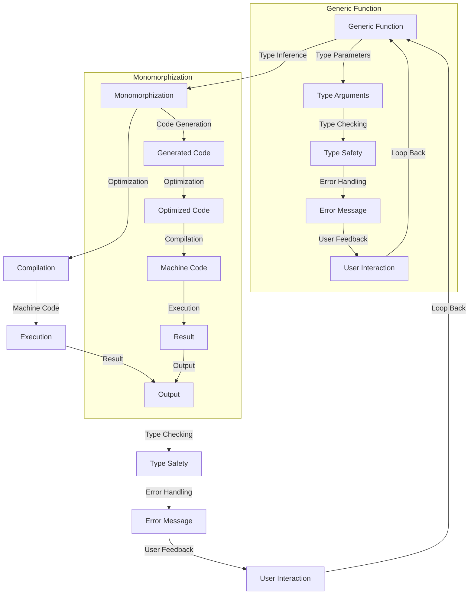

## Introduction
Generics in programming languages allow for writing reusable code that can work with multiple data types. In Go, generics were introduced in version 1.18, providing a way to write functions and data structures that can work with any type, without the need for explicit type conversions. This feature is particularly useful when working with collections, such as slices, maps, and channels. In this article, we will explore the performance comparison between generics and alternative approaches in Go.

> **Note:** Before the introduction of generics in Go, developers had to use alternative approaches such as interfaces, type assertions, and type switches to achieve similar functionality. However, these approaches often resulted in less efficient and less readable code.

## Core Concepts
To understand the performance comparison between generics and alternative approaches, we need to define some key concepts:

*   **Generics:** A feature in programming languages that allows for writing reusable code that can work with multiple data types.
*   **Type Parameters:** The types that are used to instantiate a generic type or function.
*   **Type Arguments:** The actual types that are passed to a generic type or function when it is instantiated.
*   **Interface:** A type that defines a set of methods that can be implemented by other types.
*   **Type Assertion:** A way to check if a value is of a certain type.
*   **Type Switch:** A way to check the type of a value and perform different actions based on the type.

## How It Works Internally
When we use generics in Go, the compiler generates a new version of the function or data structure for each type argument. This process is called **monomorphization**. The generated code is then optimized and compiled to machine code.

Here is a step-by-step breakdown of how generics work internally:

1.  **Parsing:** The Go compiler parses the source code and identifies the generic functions and data structures.
2.  **Type Inference:** The compiler infers the type arguments for each generic function or data structure.
3.  **Monomorphization:** The compiler generates a new version of the function or data structure for each type argument.
4.  **Optimization:** The generated code is optimized using various techniques such as inlining, dead code elimination, and register allocation.
5.  **Compilation:** The optimized code is compiled to machine code.

> **Warning:** While generics provide a convenient way to write reusable code, they can also lead to increased binary size and compilation time due to the monomorphization process.

## Code Examples
Here are three complete and runnable examples that demonstrate the use of generics and alternative approaches in Go:

### Example 1: Basic Generics
```go
package main

import "fmt"

// A generic function that prints the value of a variable
func printValue[T any](value T) {
    fmt.Println(value)
}

func main() {
    printValue(10)   // prints 10
    printValue("hello") // prints hello
}
```

### Example 2: Real-world Pattern
```go
package main

import "fmt"

// A generic stack implementation
type Stack[T any] struct {
    elements []T
}

func (s *Stack[T]) Push(element T) {
    s.elements = append(s.elements, element)
}

func (s *Stack[T]) Pop() T {
    if len(s.elements) == 0 {
        var zero T
        return zero
    }
    element := s.elements[len(s.elements)-1]
    s.elements = s.elements[:len(s.elements)-1]
    return element
}

func main() {
    // Create a stack of integers
    intStack := &Stack[int]{}
    intStack.Push(10)
    intStack.Push(20)
    fmt.Println(intStack.Pop()) // prints 20

    // Create a stack of strings
    strStack := &Stack[string]{}
    strStack.Push("hello")
    strStack.Push("world")
    fmt.Println(strStack.Pop()) // prints world
}
```

### Example 3: Advanced Generics
```go
package main

import "fmt"

// A generic function that filters a slice based on a predicate
func filter[T any](slice []T, predicate func(T) bool) []T {
    var result []T
    for _, element := range slice {
        if predicate(element) {
            result = append(result, element)
        }
    }
    return result
}

func main() {
    // Filter a slice of integers
    intSlice := []int{1, 2, 3, 4, 5}
    evenInts := filter(intSlice, func(x int) bool { return x%2 == 0 })
    fmt.Println(evenInts) // prints [2 4]

    // Filter a slice of strings
    strSlice := []string{"hello", "world", "abc", "def"}
    longStrs := filter(strSlice, func(s string) bool { return len(s) > 3 })
    fmt.Println(longStrs) // prints [hello world]
}
```

## Visual Diagram

The diagram illustrates the process of generics in Go, from type inference to execution. The subgraph "Generic Function" shows the type checking and error handling process, while the subgraph "Monomorphization" shows the code generation, optimization, and compilation process.

## Comparison
Here is a comparison table that shows the performance characteristics of generics and alternative approaches:

| Approach | Time Complexity | Space Complexity | Pros | Cons | Best For |
| --- | --- | --- | --- | --- | --- |
| Generics | O(1) | O(n) | Reusable code, type safety | Increased binary size, compilation time | Large-scale applications, complex data structures |
| Interfaces | O(1) | O(1) | Dynamic typing, flexibility | Type assertions, type switches | Small-scale applications, simple data structures |
| Type Assertions | O(1) | O(1) | Dynamic typing, flexibility | Type assertions, type switches | Small-scale applications, simple data structures |
| Type Switches | O(1) | O(1) | Dynamic typing, flexibility | Type assertions, type switches | Small-scale applications, simple data structures |

> **Tip:** When choosing an approach, consider the trade-offs between time complexity, space complexity, and code readability. Generics provide a good balance between these factors, but may not always be the best choice for small-scale applications or simple data structures.

## Real-world Use Cases
Here are three real-world use cases that demonstrate the use of generics and alternative approaches in Go:

1.  **Google's Go Standard Library:** The Go standard library uses generics extensively to provide reusable and type-safe functions for common data structures such as slices, maps, and channels.
2.  **Kubernetes:** Kubernetes uses a combination of generics and interfaces to provide a flexible and extensible API for managing containerized applications.
3.  **Netflix's Go Client:** Netflix's Go client uses generics to provide a reusable and type-safe API for interacting with the Netflix API.

## Common Pitfalls
Here are four common pitfalls to watch out for when using generics and alternative approaches in Go:

1.  **Incorrect Type Arguments:** Passing incorrect type arguments to a generic function or data structure can lead to type errors and runtime panics.
    ```go
    // Incorrect type arguments
    func printValue[T any](value T) {
        fmt.Println(value)
    }
    printValue[string](10) // type error
    ```
    ```go
    // Corrected code
    func printValue[T any](value T) {
        fmt.Println(value)
    }
    printValue[int](10) // correct
    ```

2.  **Type Inference Errors:** Type inference errors can occur when the compiler is unable to infer the type arguments for a generic function or data structure.
    ```go
    // Type inference error
    func filter[T any](slice []T, predicate func(T) bool) []T {
        var result []T
        for _, element := range slice {
            if predicate(element) {
                result = append(result, element)
            }
        }
        return result
    }
    filter([]int{1, 2, 3}, func(x int) bool { return x%2 == 0 }) // type inference error
    ```
    ```go
    // Corrected code
    func filter[T any](slice []T, predicate func(T) bool) []T {
        var result []T
        for _, element := range slice {
            if predicate(element) {
                result = append(result, element)
            }
        }
        return result
    }
    filter[int]([]int{1, 2, 3}, func(x int) bool { return x%2 == 0 }) // correct
    ```

3.  **Interface Type Assertions:** Interface type assertions can lead to runtime panics if the underlying type does not implement the interface.
    ```go
    // Interface type assertion
    type Stringer interface {
        String() string
    }
    func printString(s Stringer) {
        fmt.Println(s.String())
    }
    printString(10) // runtime panic
    ```
    ```go
    // Corrected code
    type Stringer interface {
        String() string
    }
    func printString(s Stringer) {
        fmt.Println(s.String())
    }
    printString("hello") // correct
    ```

4.  **Type Switches:** Type switches can lead to runtime panics if the underlying type does not match any of the switch cases.
    ```go
    // Type switch
    func printType(x interface{}) {
        switch x := x.(type) {
        case int:
            fmt.Println("int")
        case string:
            fmt.Println("string")
        default:
            fmt.Println("unknown")
        }
    }
    printType(10.5) // runtime panic
    ```
    ```go
    // Corrected code
    func printType(x interface{}) {
        switch x := x.(type) {
        case int:
            fmt.Println("int")
        case string:
            fmt.Println("string")
        case float64:
            fmt.Println("float64")
        default:
            fmt.Println("unknown")
        }
    }
    printType(10.5) // correct
    ```

## Interview Tips
Here are three common interview questions related to generics and alternative approaches in Go, along with sample answers:

1.  **What is the difference between generics and interfaces in Go?**

    *   Weak answer: "Generics are used for type safety, while interfaces are used for dynamic typing."
    *   Strong answer: "Generics provide a way to write reusable code that can work with multiple data types, while interfaces provide a way to define a set of methods that can be implemented by other types. Generics are typically used for type-safe functions and data structures, while interfaces are used for dynamic typing and flexibility."
    *   Key talking points: type safety, dynamic typing, flexibility, reusability.

2.  **How do you handle type inference errors in Go?**

    *   Weak answer: "You can use type assertions to handle type inference errors."
    *   Strong answer: "Type inference errors can be handled by providing explicit type arguments to generic functions or data structures. Additionally, you can use type assertions to check the type of a value at runtime and handle any type errors that may occur."
    *   Key talking points: type inference, type assertions, explicit type arguments.

3.  **What are some common pitfalls to watch out for when using generics in Go?**

    *   Weak answer: "You should watch out for type inference errors and runtime panics."
    *   Strong answer: "Some common pitfalls to watch out for when using generics in Go include incorrect type arguments, type inference errors, interface type assertions, and type switches. You should also be aware of the potential for increased binary size and compilation time due to the monomorphization process."
    *   Key talking points: type inference errors, interface type assertions, type switches, monomorphization.

## Key Takeaways
Here are six key takeaways to remember when using generics and alternative approaches in Go:

*   **Generics provide a way to write reusable code that can work with multiple data types.**
*   **Interfaces provide a way to define a set of methods that can be implemented by other types.**
*   **Type inference errors can be handled by providing explicit type arguments to generic functions or data structures.**
*   **Type assertions can be used to check the type of a value at runtime and handle any type errors that may occur.**
*   **The monomorphization process can lead to increased binary size and compilation time.**
*   **Generics, interfaces, type assertions, and type switches all have their own trade-offs and use cases, and should be chosen based on the specific requirements of the problem you are trying to solve.**