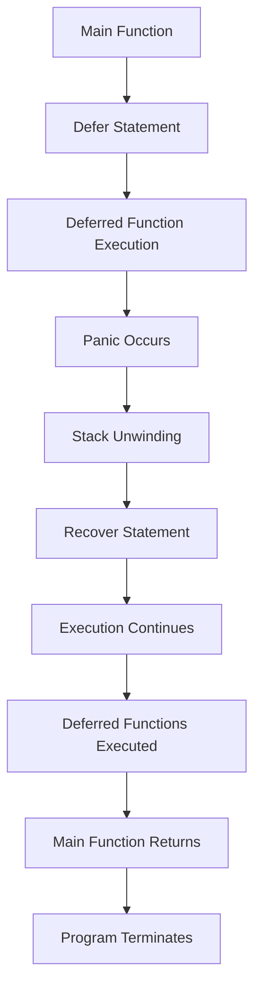

## Introduction
**Error handling** is a crucial aspect of building high-performance applications. In Go, the `defer`, `panic`, and `recover` keywords provide a powerful mechanism for handling errors and exceptions. Understanding how to scale these concepts is essential for writing robust and efficient code. In this section, we will delve into the world of `defer`, `panic`, and `recover`, exploring their usage, internal mechanics, and best practices for high-performance applications.
> **Note:** The `defer`, `panic`, and `recover` keywords are not unique to Go, but their implementation and usage are distinct in the Go language.

## Core Concepts
- **Defer**: A statement that postpones the execution of a function until the surrounding function returns. This is useful for releasing resources, closing files, or unlocking mutexes.
- **Panic**: A built-in function that stops the normal execution of a goroutine and begins unwinding its stack. This is typically used to handle unexpected errors or exceptions.
- **Recover**: A built-in function that regains control of a panicking goroutine and returns the value that was passed to `panic`.
> **Warning:** Improper use of `defer`, `panic`, and `recover` can lead to performance issues, crashes, or unexpected behavior.

## How It Works Internally
When a `defer` statement is encountered, the function is added to a stack of deferred functions. When the surrounding function returns, the deferred functions are executed in reverse order. This process is known as **deferred function execution**.
> **Tip:** Using `defer` to release resources can improve performance by reducing the likelihood of resource leaks.

When a `panic` occurs, the goroutine's stack is unwound, and the deferred functions are executed. If a `recover` statement is encountered during the unwinding process, the panicking goroutine is recovered, and execution continues normally.
> **Interview:** Can you explain the difference between `panic` and `recover` in Go? How would you use them in a high-performance application?

## Code Examples
### Example 1: Basic Defer Usage
```go
package main

import "fmt"

func main() {
    defer fmt.Println("Deferred function executed")
    fmt.Println("Main function executed")
}
```
This example demonstrates the basic usage of `defer`. The deferred function is executed after the `main` function returns.

### Example 2: Panic and Recover
```go
package main

import "fmt"

func main() {
    defer func() {
        if r := recover(); r != nil {
            fmt.Println("Recovered from panic:", r)
        }
    }()

    panic("Something went wrong")
}
```
This example shows how to use `panic` and `recover` to handle unexpected errors.

### Example 3: Advanced Defer Usage
```go
package main

import "fmt"

func main() {
    defer func() {
        if r := recover(); r != nil {
            fmt.Println("Recovered from panic:", r)
        }
    }()

    defer fmt.Println("Deferred function 1 executed")
    defer fmt.Println("Deferred function 2 executed")

    fmt.Println("Main function executed")
    panic("Something went wrong")
}
```
This example demonstrates the usage of multiple deferred functions and how they are executed in reverse order.

## Visual Diagram

This diagram illustrates the flow of execution when using `defer`, `panic`, and `recover`.

## Comparison
| Approach | Time Complexity | Space Complexity | Pros | Cons | Best For |
| --- | --- | --- | --- | --- | --- |
| Defer | O(1) | O(1) | Easy to use, improves performance | Limited control over execution order | Releasing resources, closing files |
| Panic | O(1) | O(1) | Simple to use, handles unexpected errors | Can lead to crashes or unexpected behavior | Handling unexpected errors or exceptions |
| Recover | O(1) | O(1) | Regains control of panicking goroutine | Can be complex to use, may mask errors | Recovering from panics, handling errors |

## Real-world Use Cases
- **Google's Go Runtime**: The Go runtime uses `defer` to manage goroutine scheduling and `panic` to handle unexpected errors.
- **Netflix's Go Client**: The Netflix Go client uses `recover` to handle panics and improve error handling.
- **Dropbox's Go SDK**: The Dropbox Go SDK uses `defer` to manage file uploads and downloads.

## Common Pitfalls
- **Incorrect Defer Order**: Using `defer` statements in the wrong order can lead to unexpected behavior or resource leaks.
- **Uncaught Panics**: Failing to catch panics can lead to crashes or unexpected behavior.
- **Overuse of Recover**: Using `recover` excessively can mask errors and make debugging more difficult.
- **Inadequate Error Handling**: Failing to handle errors properly can lead to crashes or unexpected behavior.

## Interview Tips
- **What is the difference between `panic` and `recover`?**: Be prepared to explain the difference between these two concepts and how to use them effectively.
- **How do you handle errors in Go?**: Show that you understand how to use `defer`, `panic`, and `recover` to handle errors and exceptions.
- **Can you explain the concept of deferred function execution?**: Demonstrate your understanding of how `defer` works and how to use it effectively.

## Key Takeaways
* **Use `defer` to release resources**: Improves performance and reduces the likelihood of resource leaks.
* **Use `panic` to handle unexpected errors**: Simple to use, but can lead to crashes or unexpected behavior if not handled properly.
* **Use `recover` to regain control of panicking goroutines**: Regains control, but can be complex to use and may mask errors.
* **Understand the concept of deferred function execution**: Essential for using `defer` effectively.
* **Handle errors properly**: Failing to do so can lead to crashes or unexpected behavior.
* **Use `defer`, `panic`, and `recover` judiciously**: Improper use can lead to performance issues, crashes, or unexpected behavior.