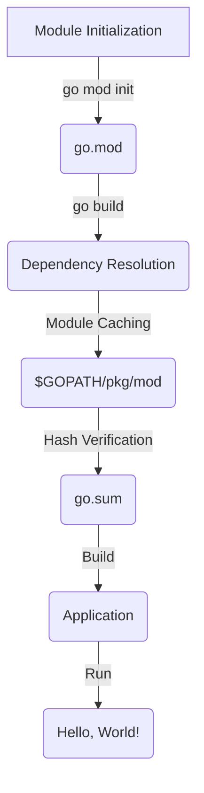

## Introduction
**Go Modules** is a dependency management system for the Go programming language, introduced in Go 1.11. It allows developers to manage dependencies for their Go projects in a declarative way, making it easier to build and maintain large-scale applications. Go Modules is a crucial component of the Go ecosystem, and understanding how it works internally is essential for every Go developer. In this article, we will delve into the internals of Go Modules, exploring its core concepts, under-the-hood mechanics, and best practices for using it effectively.

## Core Concepts
To understand how Go Modules works, we need to familiarize ourselves with some key terminology:
* **Module**: A module is a collection of related Go packages that are versioned together.
* **Module path**: A module path is a string that identifies a module, typically in the form of a URL.
* **Go.mod**: The `go.mod` file is a text file that declares the dependencies of a module.
* **Go.sum**: The `go.sum` file is a text file that contains the expected hashes of the dependencies declared in `go.mod`.

> **Note:** A module can be thought of as a single unit of versioning, where all packages within the module are versioned together.

## How It Works Internally
Here's a step-by-step overview of how Go Modules works internally:
1. **Module initialization**: When you run `go mod init` in a directory, Go creates a new `go.mod` file that declares the module path and its dependencies.
2. **Dependency resolution**: When you run `go build` or `go test`, Go resolves the dependencies declared in `go.mod` by fetching the required modules from the module cache or by downloading them from the module proxy.
3. **Module caching**: Go caches the dependencies in the `$GOPATH/pkg/mod` directory, which allows for faster build times and reduces the number of network requests.
4. **Hash verification**: When a dependency is fetched, Go verifies its integrity by checking the hash of the dependency against the expected hash stored in `go.sum`.

> **Warning:** Failing to verify the hashes of dependencies can lead to security vulnerabilities, as an attacker could tamper with the dependencies.

## Code Examples
Here are three complete and runnable examples that demonstrate how to use Go Modules:
### Example 1: Basic Module Initialization
```go
// main.go
package main

import "fmt"

func main() {
    fmt.Println("Hello, World!")
}
```
To initialize a new module, run the following command:
```bash
go mod init example.com/mymodule
```
This will create a new `go.mod` file that declares the module path and its dependencies.

### Example 2: Declaring Dependencies
```go
// main.go
package main

import (
    "fmt"
    "github.com/google/uuid"
)

func main() {
    id := uuid.New()
    fmt.Println(id)
}
```
To declare the `github.com/google/uuid` dependency, add the following line to `go.mod`:
```go
require github.com/google/uuid v1.3.0
```
Then, run `go build` to resolve the dependency and build the application.

### Example 3: Advanced Dependency Management
```go
// main.go
package main

import (
    "fmt"
    "github.com/google/uuid"
    "golang.org/x/crypto/sha256"
)

func main() {
    id := uuid.New()
    hash := sha256.Sum256([]byte(id.String()))
    fmt.Println(hash)
}
```
To declare the `golang.org/x/crypto` dependency, add the following line to `go.mod`:
```go
require golang.org/x/crypto v0.0.0-20220215220405-5ff15b29337e
```
Then, run `go build` to resolve the dependency and build the application.

## Visual Diagram

This diagram illustrates the internal workflow of Go Modules, from module initialization to building and running the application.

## Comparison
| Approach | Time Complexity | Space Complexity | Pros | Cons | Best For |
| --- | --- | --- | --- | --- | --- |
| Go Modules | O(n) | O(n) | Declarative dependency management, fast build times | Steep learning curve, requires `go.mod` file | Large-scale Go applications |
| Go Get | O(1) | O(1) | Simple, easy to use | No dependency management, slow build times | Small-scale Go applications |
| Dep | O(n) | O(n) | Similar to Go Modules, but more flexible | No longer maintained, requires `Gopkg.toml` file | Legacy Go applications |
| Glide | O(n) | O(n) | Similar to Go Modules, but more flexible | No longer maintained, requires `glide.yaml` file | Legacy Go applications |

> **Tip:** Use Go Modules for large-scale Go applications, as it provides declarative dependency management and fast build times.

## Real-world Use Cases
Here are three real-world examples of companies that use Go Modules:
* **Netflix**: Netflix uses Go Modules to manage dependencies for its large-scale Go applications.
* **Google**: Google uses Go Modules to manage dependencies for its Go applications, including the Go SDK for Google Cloud.
* **Dropbox**: Dropbox uses Go Modules to manage dependencies for its Go applications, including the Dropbox SDK for Go.

## Common Pitfalls
Here are four common mistakes that engineers make when using Go Modules:
* **Not verifying hashes**: Failing to verify the hashes of dependencies can lead to security vulnerabilities.
* **Not using the correct module path**: Using the incorrect module path can lead to dependency resolution errors.
* **Not declaring dependencies**: Failing to declare dependencies in `go.mod` can lead to build errors.
* **Not using the correct version of Go**: Using an outdated version of Go can lead to compatibility issues with Go Modules.

> **Warning:** Always verify the hashes of dependencies and use the correct module path to avoid security vulnerabilities and dependency resolution errors.

## Interview Tips
Here are three common interview questions related to Go Modules:
* **What is Go Modules, and how does it work?**: A strong answer should provide a clear explanation of Go Modules and its internal workflow.
* **How do you manage dependencies in a large-scale Go application?**: A strong answer should describe the use of Go Modules and its benefits, such as declarative dependency management and fast build times.
* **What are some common pitfalls when using Go Modules?**: A strong answer should describe the common mistakes that engineers make when using Go Modules, such as not verifying hashes or using the incorrect module path.

## Key Takeaways
Here are ten key takeaways to remember when using Go Modules:
* **Use Go Modules for large-scale Go applications**: Go Modules provides declarative dependency management and fast build times.
* **Verify the hashes of dependencies**: Verifying the hashes of dependencies ensures the integrity of the dependencies and prevents security vulnerabilities.
* **Use the correct module path**: Using the correct module path ensures that dependencies are resolved correctly.
* **Declare dependencies in `go.mod`**: Declaring dependencies in `go.mod` ensures that dependencies are resolved correctly.
* **Use the correct version of Go**: Using the correct version of Go ensures compatibility with Go Modules.
* **Use `go build` to resolve dependencies**: Using `go build` to resolve dependencies ensures that dependencies are resolved correctly.
* **Use `go mod tidy` to clean up dependencies**: Using `go mod tidy` to clean up dependencies ensures that the `go.mod` file is up-to-date and accurate.
* **Use `go mod vendor` to vendor dependencies**: Using `go mod vendor` to vendor dependencies ensures that dependencies are included in the application's vendor directory.
* **Use `go mod verify` to verify dependencies**: Using `go mod verify` to verify dependencies ensures that dependencies are correct and up-to-date.
* **Use `go mod graph` to visualize dependencies**: Using `go mod graph` to visualize dependencies ensures that dependencies are correct and up-to-date.