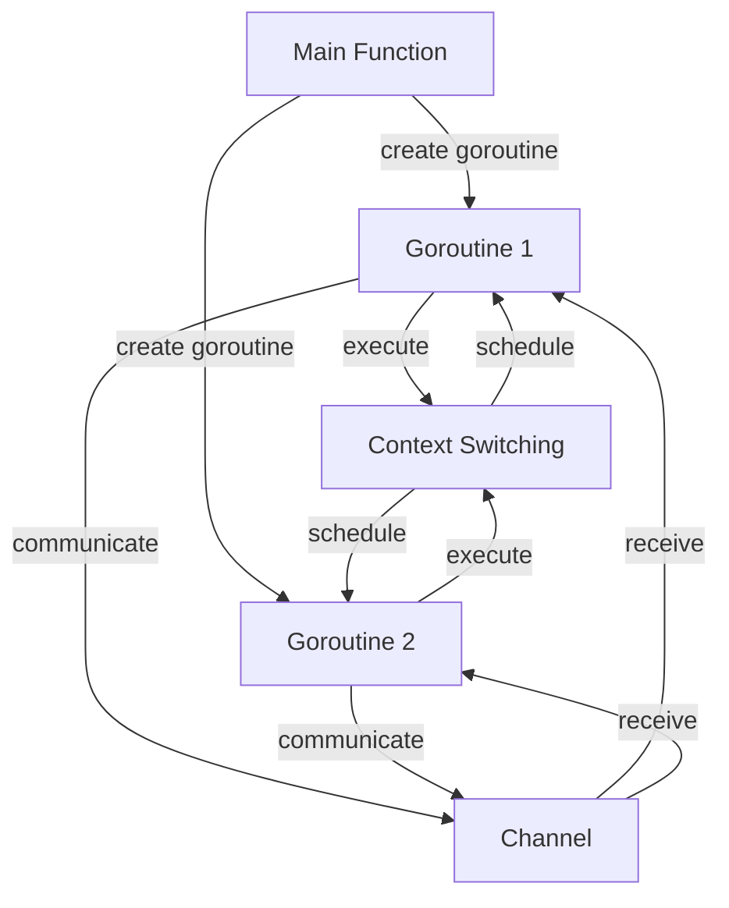

## Introduction
Goroutines are a fundamental concept in the Go programming language, allowing for lightweight, concurrent execution of functions. They are essentially functions that run concurrently with other functions, enabling efficient utilization of system resources. Goroutines are scheduled and managed by the Go runtime, making it easier to write concurrent programs. In this section, we will delve into the world of goroutines, exploring how they work internally, their benefits, and real-world applications.

> **Note:** Goroutines are not threads, although they share some similarities. Goroutines are much lighter in weight, requiring fewer resources to create and manage.

Goroutines are designed to solve the problem of concurrent programming, which can be complex and error-prone. By providing a simple and efficient way to execute functions concurrently, goroutines make it easier to write scalable and responsive programs. In real-world scenarios, goroutines are used in various applications, such as web servers, network servers, and data processing pipelines.

## Core Concepts
To understand goroutines, it's essential to grasp the following core concepts:

* **Goroutine**: A function that runs concurrently with other functions.
* **Channel**: A communication mechanism that allows goroutines to exchange data.
* **Scheduler**: The component responsible for scheduling and managing goroutines.
* **Context switching**: The process of switching between different goroutines.

> **Tip:** When working with goroutines, it's crucial to understand the concept of context switching, as it can significantly impact performance.

## How It Works Internally
Goroutines are scheduled and managed by the Go runtime, which uses a combination of operating system threads and its own scheduler. Here's a step-by-step breakdown of how goroutines work internally:

1. **Creation**: A goroutine is created when a function is called using the `go` keyword.
2. **Scheduling**: The goroutine is scheduled by the Go runtime, which allocates a stack and a context for the goroutine.
3. **Execution**: The goroutine is executed by the Go runtime, which runs the function concurrently with other goroutines.
4. **Context switching**: The Go runtime switches between different goroutines, allocating and deallocating resources as needed.

> **Warning:** Goroutines can lead to performance issues if not managed properly, as excessive context switching can occur.

## Code Examples
Here are three complete and runnable code examples that demonstrate the usage of goroutines:

### Example 1: Basic Goroutine Usage
```go
package main

import (
    "fmt"
    "time"
)

func printNumbers() {
    for i := 0; i < 5; i++ {
        time.Sleep(500 * time.Millisecond)
        fmt.Println(i)
    }
}

func printLetters() {
    for i := 'a'; i <= 'e'; i++ {
        time.Sleep(500 * time.Millisecond)
        fmt.Printf("%c\n", i)
    }
}

func main() {
    go printNumbers()
    go printLetters()
    time.Sleep(3000 * time.Millisecond)
}
```
This example demonstrates the basic usage of goroutines, where two functions are executed concurrently using the `go` keyword.

### Example 2: Goroutine Synchronization
```go
package main

import (
    "fmt"
    "sync"
)

var wg sync.WaitGroup

func printNumbers() {
    defer wg.Done()
    for i := 0; i < 5; i++ {
        fmt.Println(i)
    }
}

func printLetters() {
    defer wg.Done()
    for i := 'a'; i <= 'e'; i++ {
        fmt.Printf("%c\n", i)
    }
}

func main() {
    wg.Add(2)
    go printNumbers()
    go printLetters()
    wg.Wait()
}
```
This example demonstrates the use of a `WaitGroup` to synchronize goroutines, ensuring that the main function waits for both goroutines to complete before exiting.

### Example 3: Goroutine Communication
```go
package main

import (
    "fmt"
)

func producer(ch chan int) {
    for i := 0; i < 5; i++ {
        ch <- i
    }
    close(ch)
}

func consumer(ch chan int) {
    for v := range ch {
        fmt.Println(v)
    }
}

func main() {
    ch := make(chan int)
    go producer(ch)
    go consumer(ch)
}
```
This example demonstrates the use of channels to communicate between goroutines, where one goroutine produces values and another goroutine consumes them.

## Visual Diagram

This diagram illustrates the creation, execution, and communication of goroutines, as well as the context switching mechanism.

## Comparison
Here's a comparison table that highlights the differences between goroutines and other concurrency models:

| Approach | Time Complexity | Space Complexity | Pros | Cons | Best For |
| --- | --- | --- | --- | --- | --- |
| Goroutines | O(1) | O(1) | Lightweight, efficient, easy to use | Limited control over scheduling | I/O-bound applications, concurrent programming |
| Threads | O(n) | O(n) | Fine-grained control over scheduling | Heavyweight, complex to use | CPU-bound applications, systems programming |
| Coroutines | O(1) | O(1) | Cooperative scheduling, efficient | Limited control over scheduling | I/O-bound applications, concurrent programming |
| Processes | O(n) | O(n) | Independent memory space, fine-grained control | Heavyweight, complex to use | CPU-bound applications, systems programming |

## Real-world Use Cases
Goroutines are used in various real-world applications, including:

* **Google's Go net/http package**: Uses goroutines to handle HTTP requests and responses concurrently.
* **Netflix's Go-based microservices**: Utilizes goroutines to manage concurrent requests and responses in a distributed system.
* **Dropbox's Go-based file synchronization**: Employs goroutines to synchronize files concurrently across multiple systems.

## Common Pitfalls
Here are some common mistakes to avoid when working with goroutines:

* **Not using synchronization primitives**: Failing to use synchronization primitives, such as mutexes or channels, can lead to data corruption or other concurrency-related issues.
* **Not handling errors properly**: Not handling errors properly can cause goroutines to crash or produce unexpected behavior.
* **Not using context switching efficiently**: Not using context switching efficiently can lead to performance issues, such as excessive CPU usage or memory allocation.

> **Interview:** Can you explain the difference between a goroutine and a thread? How would you use goroutines to solve a real-world problem?

## Interview Tips
Here are some common interview questions related to goroutines, along with tips on how to answer them:

* **What is a goroutine, and how does it differ from a thread?**: Explain the lightweight nature of goroutines and their use of channels for communication.
* **How would you use goroutines to solve a concurrent programming problem?**: Describe a scenario where goroutines can be used to solve a concurrent programming problem, such as a web server handling multiple requests concurrently.
* **What are some common pitfalls when working with goroutines?**: Discuss common mistakes, such as not using synchronization primitives or not handling errors properly.

## Key Takeaways
Here are the key takeaways from this section:

* Goroutines are lightweight, concurrent functions that can be used to solve complex problems.
* Channels are a fundamental communication mechanism in Go, allowing goroutines to exchange data.
* Context switching is a critical component of goroutine scheduling, enabling efficient allocation and deallocation of resources.
* Synchronization primitives, such as mutexes or channels, are essential for ensuring data integrity and preventing concurrency-related issues.
* Goroutines can be used to solve real-world problems, such as concurrent programming, I/O-bound applications, and distributed systems.
* Common pitfalls, such as not using synchronization primitives or not handling errors properly, can be avoided by following best practices and understanding the underlying mechanics of goroutines.