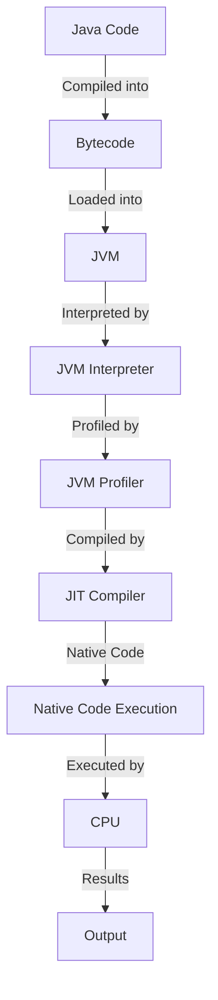

## Introduction
Just-In-Time (JIT) compilation is a technique used by the Java Virtual Machine (JVM) to improve the performance of Java programs. It works by compiling Java bytecode into native machine code at runtime, rather than interpreting it. This allows the JVM to optimize the code for the specific hardware it's running on, resulting in significant performance gains. In this section, we'll explore the benefits of JIT compilation and why it's an essential part of the Java ecosystem.

> **Note:** JIT compilation is not unique to Java and is used in other languages such as .NET and JavaScript. However, the JVM's implementation is particularly well-suited to Java's dynamic nature.

JIT compilation is especially important in real-world applications where performance is critical. For example, in high-frequency trading, every millisecond counts, and JIT compilation can provide a significant competitive edge. Similarly, in large-scale web applications, JIT compilation can help reduce latency and improve user experience.

## Core Concepts
To understand how JIT compilation works, it's essential to grasp some key concepts:

* **Bytecode**: Java code is compiled into an intermediate format called bytecode, which is platform-independent.
* **Native code**: Bytecode is compiled into native machine code, which is specific to the underlying hardware.
* **JIT compiler**: The JIT compiler is responsible for compiling bytecode into native code at runtime.
* **Hotspot**: A hotspot is a section of code that is executed frequently and is a prime candidate for JIT compilation.

> **Tip:** Understanding the difference between bytecode and native code is crucial to appreciating the benefits of JIT compilation. Bytecode is platform-independent, while native code is specific to the underlying hardware.

## How It Works Internally
Here's a step-by-step overview of how JIT compilation works:

1. **Bytecode loading**: The JVM loads the Java bytecode into memory.
2. **Interpretation**: The JVM interprets the bytecode, executing it line by line.
3. **Profiling**: The JVM profiles the code, identifying hotspots and gathering information about execution patterns.
4. **JIT compilation**: The JIT compiler compiles the hotspot code into native machine code.
5. **Native code execution**: The JVM executes the native code, bypassing the interpretation step.

> **Warning:** JIT compilation can introduce some overhead, especially during the initial compilation phase. However, this overhead is typically amortized over time as the compiled code is executed repeatedly.

## Code Examples
Here are three complete and runnable examples demonstrating JIT compilation in Java:

### Example 1: Basic JIT Compilation
```java
public class JitExample {
    public static void main(String[] args) {
        // Create a hotspot by executing a loop 10,000 times
        for (int i = 0; i < 10000; i++) {
            // Perform some computation
            int result = compute(i);
            System.out.println(result);
        }
    }

    public static int compute(int x) {
        // Simulate some computation
        return x * x;
    }
}
```
This example demonstrates a simple hotspot that is likely to be compiled by the JIT compiler.

### Example 2: Real-World Pattern
```java
public class RealWorldExample {
    public static void main(String[] args) {
        // Create a large array and perform some computation on it
        int[] array = new int[1000000];
        for (int i = 0; i < array.length; i++) {
            array[i] = i * i;
        }
        // Perform some additional computation
        int result = compute(array);
        System.out.println(result);
    }

    public static int compute(int[] array) {
        // Simulate some computation
        int result = 0;
        for (int i = 0; i < array.length; i++) {
            result += array[i];
        }
        return result;
    }
}
```
This example demonstrates a more complex hotspot that is likely to be compiled by the JIT compiler.

### Example 3: Advanced JIT Compilation
```java
public class AdvancedJitExample {
    public static void main(String[] args) {
        // Create a hotspot by executing a loop 100,000 times
        for (int i = 0; i < 100000; i++) {
            // Perform some computation
            int result = compute(i);
            System.out.println(result);
        }
    }

    public static int compute(int x) {
        // Simulate some computation
        return x * x;
    }

    // Add an additional method to simulate more complex computation
    public static int computeAdditional(int x) {
        return x * x * x;
    }
}
```
This example demonstrates a more complex hotspot that is likely to be compiled by the JIT compiler, with an additional method to simulate more complex computation.

## Visual Diagram

This diagram illustrates the process of JIT compilation, from Java code to native code execution.

## Comparison
| Approach | Time Complexity | Space Complexity | Pros | Cons | Best For |
| --- | --- | --- | --- | --- | --- |
| Interpretation | O(n) | O(1) | Simple to implement, fast startup | Slow execution | Small programs, development |
| JIT Compilation | O(n log n) | O(n) | Fast execution, optimized code | Complex implementation, slow startup | Large programs, production |
| Ahead-of-Time (AOT) Compilation | O(n) | O(n) | Fast execution, optimized code | Complex implementation, limited flexibility | Small programs, embedded systems |
| Dynamic Recompilation | O(n log n) | O(n) | Fast execution, optimized code | Complex implementation, slow startup | Large programs, production |

> **Interview:** What is the main difference between interpretation and JIT compilation? Answer: Interpretation involves executing bytecode line by line, while JIT compilation involves compiling bytecode into native code at runtime.

## Real-world Use Cases
Here are three real-world examples of JIT compilation in action:

* **Google's Android Runtime (ART)**: ART uses JIT compilation to improve the performance of Android apps.
* **Oracle's Java Virtual Machine (JVM)**: The JVM uses JIT compilation to optimize Java code execution.
* **IBM's WebSphere Application Server**: WebSphere uses JIT compilation to improve the performance of Java-based web applications.

## Common Pitfalls
Here are four common mistakes to avoid when working with JIT compilation:

* **Not understanding hotspot detection**: Failing to understand how the JVM detects hotspots can lead to suboptimal performance.
* **Not using JIT-friendly data structures**: Using data structures that are not optimized for JIT compilation can lead to poor performance.
* **Not monitoring JVM performance**: Failing to monitor JVM performance can lead to suboptimal JIT compilation.
* **Not using JVM options**: Failing to use JVM options to optimize JIT compilation can lead to suboptimal performance.

> **Warning:** Not understanding hotspot detection can lead to suboptimal performance. Make sure to monitor JVM performance and use JVM options to optimize JIT compilation.

## Interview Tips
Here are three common interview questions related to JIT compilation, along with weak and strong answers:

* **What is JIT compilation?**: Weak answer: "JIT compilation is a technique used to improve performance." Strong answer: "JIT compilation is a technique used to compile bytecode into native code at runtime, resulting in significant performance gains."
* **How does the JVM detect hotspots?**: Weak answer: "The JVM detects hotspots by monitoring execution patterns." Strong answer: "The JVM detects hotspots by monitoring execution patterns, using techniques such as method invocation counting and loop iteration counting."
* **What are the benefits of JIT compilation?**: Weak answer: "JIT compilation improves performance." Strong answer: "JIT compilation improves performance, reduces latency, and increases throughput, making it an essential technique for large-scale applications."

## Key Takeaways
Here are ten key takeaways to remember about JIT compilation:

* JIT compilation improves performance by compiling bytecode into native code at runtime.
* The JVM detects hotspots using techniques such as method invocation counting and loop iteration counting.
* JIT compilation can introduce some overhead, especially during the initial compilation phase.
* The JVM uses a combination of interpretation and JIT compilation to execute Java code.
* JIT compilation is an essential technique for large-scale applications, where performance is critical.
* Not understanding hotspot detection can lead to suboptimal performance.
* Using JVM options to optimize JIT compilation can lead to significant performance gains.
* Monitoring JVM performance is essential to optimizing JIT compilation.
* JIT compilation is not unique to Java and is used in other languages such as .NET and JavaScript.
* Understanding the difference between bytecode and native code is crucial to appreciating the benefits of JIT compilation.

> **Tip:** Remember that JIT compilation is an essential technique for large-scale applications, where performance is critical. Make sure to monitor JVM performance and use JVM options to optimize JIT compilation.