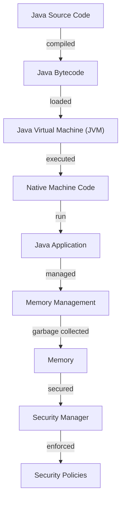

## Introduction
Java is a high-level, object-oriented programming language that has been widely adopted in the enterprise and community sectors. **One of the primary reasons for its massive adoption is its platform independence**, allowing developers to write once and run anywhere (WORA). This is achieved through the use of the Java Virtual Machine (JVM), which translates Java bytecode into native machine code. Java's **robust security features**, **multithreading capabilities**, and **extensive libraries** make it an ideal choice for developing large-scale applications. As a result, Java has become a staple in the software development industry, with many companies, including **Amazon**, **Google**, and **IBM**, relying heavily on Java for their core systems.

## Core Concepts
At its core, Java is built around the concept of **object-oriented programming (OOP)**, which involves organizing code into objects that contain data and behavior. Java's **class-based inheritance** model allows developers to create a hierarchy of classes, where subclasses inherit properties and behavior from their parent classes. **Polymorphism**, **encapsulation**, and **abstraction** are also fundamental principles of Java OOP. Additionally, Java's **type safety** features, such as **static typing** and **runtime type checking**, help prevent common programming errors like null pointer exceptions.

> **Note:** Java's OOP principles are designed to promote code reuse, modularity, and maintainability, making it easier to develop complex systems.

## How It Works Internally
When a Java program is compiled, the **Java compiler** translates the source code into an intermediate format called **bytecode**. The bytecode is then executed by the **Java Virtual Machine (JVM)**, which translates the bytecode into native machine code. The JVM provides a **runtime environment** for the Java program, managing memory allocation, garbage collection, and other low-level details. The JVM also provides a **class loader**, which loads Java classes into memory, and a **security manager**, which enforces security policies and prevents malicious code from executing.

```java
// Example of Java bytecode generation
public class HelloWorld {
    public static void main(String[] args) {
        System.out.println("Hello, World!"); // bytecode: getstatic, ldc, invokevirtual
    }
}
```

## Code Examples
### Example 1: Basic Java Program
```java
// Basic Java program that prints "Hello, World!" to the console
public class HelloWorld {
    public static void main(String[] args) {
        System.out.println("Hello, World!"); // time complexity: O(1), space complexity: O(1)
    }
}
```

### Example 2: Java Object-Oriented Programming
```java
// Example of Java OOP principles: encapsulation, inheritance, polymorphism
public class Animal {
    private String name;

    public Animal(String name) {
        this.name = name;
    }

    public void sound() {
        System.out.println("The animal makes a sound.");
    }
}

public class Dog extends Animal {
    public Dog(String name) {
        super(name);
    }

    @Override
    public void sound() {
        System.out.println("The dog barks.");
    }
}

public class Main {
    public static void main(String[] args) {
        Animal animal = new Dog("Fido");
        animal.sound(); // time complexity: O(1), space complexity: O(1)
    }
}
```

### Example 3: Java Multithreading
```java
// Example of Java multithreading: concurrent execution of threads
public class ThreadExample {
    public static void main(String[] args) {
        Thread thread1 = new Thread(() -> {
            System.out.println("Thread 1 is running.");
            try {
                Thread.sleep(1000);
            } catch (InterruptedException e) {
                Thread.currentThread().interrupt();
            }
        });

        Thread thread2 = new Thread(() -> {
            System.out.println("Thread 2 is running.");
            try {
                Thread.sleep(500);
            } catch (InterruptedException e) {
                Thread.currentThread().interrupt();
            }
        });

        thread1.start();
        thread2.start();

        try {
            thread1.join();
            thread2.join();
        } catch (InterruptedException e) {
            Thread.currentThread().interrupt();
        }
    }
}
```

## Visual Diagram

This diagram illustrates the Java execution process, from source code compilation to native machine code execution, and the various components involved in managing memory, security, and application execution.

## Comparison
| Approach | Time Complexity | Space Complexity | Pros | Cons | Best For |
|----------|----------------|-----------------|------|------|----------|
| Java | O(1) - O(n) | O(1) - O(n) | platform independence, robust security, extensive libraries | verbose syntax, slow performance | enterprise applications, Android app development |
| Python | O(1) - O(n) | O(1) - O(n) | easy to learn, fast development, dynamic typing | slow performance, limited multithreading | data science, machine learning, web development |
| C++ | O(1) - O(n) | O(1) - O(n) | high performance, low-level memory management | complex syntax, error-prone | systems programming, game development, high-performance computing |
| JavaScript | O(1) - O(n) | O(1) - O(n) | dynamic typing, first-class functions, versatile | security concerns, browser compatibility issues | web development, front-end development, mobile app development |

## Real-world Use Cases
1. **Amazon**: Amazon's core systems, including its e-commerce platform and cloud infrastructure, are built using Java.
2. **Google**: Google's Android operating system is built using Java, and many of its core services, such as Google Search and Google Maps, rely on Java-based technologies.
3. **IBM**: IBM's Watson AI platform is built using Java, and many of its enterprise software solutions, including its DB2 database and WebSphere application server, rely on Java.

> **Tip:** When choosing a programming language for a project, consider the specific requirements and constraints of the project, as well as the strengths and weaknesses of each language.

## Common Pitfalls
1. **Null Pointer Exceptions**: failing to initialize objects or variables can lead to null pointer exceptions, which can be difficult to debug.
2. **Memory Leaks**: failing to properly manage memory allocation and deallocation can lead to memory leaks, which can cause performance issues and crashes.
3. **Concurrent Modification Exceptions**: modifying a collection while iterating over it can lead to concurrent modification exceptions, which can be difficult to debug.
4. **Classloader Issues**: classloader issues can cause problems with loading and initializing classes, which can lead to errors and exceptions.

```java
// Example of a null pointer exception
public class NullPointerExceptionExample {
    public static void main(String[] args) {
        String str = null;
        System.out.println(str.length()); // throws NullPointerException
    }
}

// Example of a memory leak
public class MemoryLeakExample {
    public static void main(String[] args) {
        List<byte[]> list = new ArrayList<>();
        while (true) {
            list.add(new byte[1024 * 1024]); // allocates 1MB of memory
        }
    }
}
```

## Interview Tips
1. **What is the difference between Java and C++?**: be prepared to discuss the differences in syntax, performance, and use cases between Java and C++.
2. **How does Java's garbage collection work?**: be prepared to explain the basics of Java's garbage collection algorithm and how it manages memory.
3. **What is the purpose of the Java Virtual Machine (JVM)?**: be prepared to discuss the role of the JVM in executing Java bytecode and providing a runtime environment for Java applications.

> **Interview:** When answering interview questions, be sure to provide specific examples and code snippets to demonstrate your knowledge and understanding of the topic.

## Key Takeaways
* Java is a high-level, object-oriented programming language that is widely adopted in the enterprise and community sectors.
* Java's platform independence, robust security features, and extensive libraries make it an ideal choice for developing large-scale applications.
* Java's OOP principles, including encapsulation, inheritance, and polymorphism, promote code reuse, modularity, and maintainability.
* Java's type safety features, including static typing and runtime type checking, help prevent common programming errors.
* Java's multithreading capabilities and concurrent execution of threads make it suitable for developing high-performance applications.
* Java's garbage collection algorithm manages memory allocation and deallocation, preventing memory leaks and reducing the risk of null pointer exceptions.
* Java's class loader and security manager provide a secure runtime environment for Java applications.