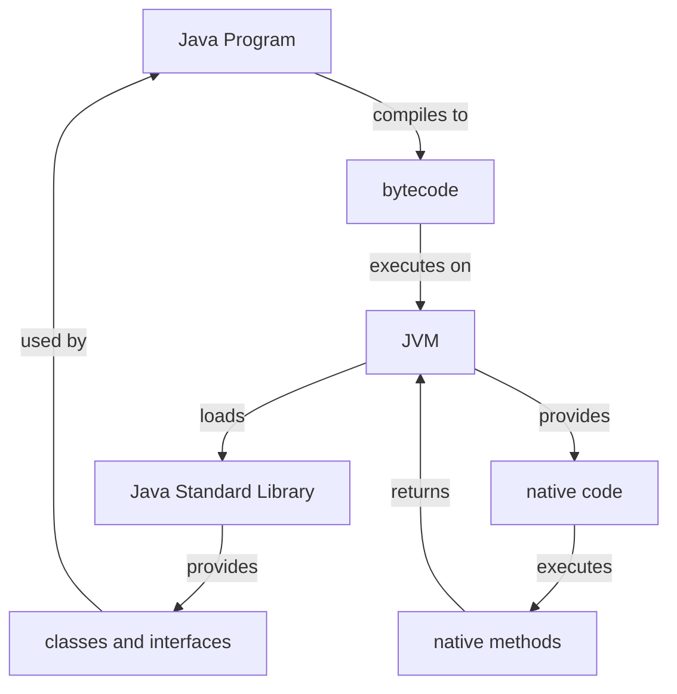

## Introduction
The **Rich Standard Library** is a fundamental aspect of the Java programming language, providing a comprehensive set of pre-built classes and methods that simplify the development process. The Java Standard Library, also known as the Java Class Library, is a collection of reusable code that can be used to perform various tasks, such as file I/O, networking, and data structures. In this section, we will explore the benefits of the Rich Standard Library, its real-world relevance, and why every engineer needs to know about it. 
> **Note:** The Java Standard Library is a crucial component of the Java ecosystem, and its benefits are numerous, including improved productivity, reduced development time, and enhanced code quality.

## Core Concepts
The Java Standard Library is built around several core concepts, including:
* **Packages**: The Java Standard Library is organized into packages, which are collections of related classes and interfaces. For example, the `java.util` package contains classes for working with collections, such as `ArrayList` and `HashMap`.
* **Classes**: The Java Standard Library provides a wide range of classes that can be used to perform various tasks. For example, the `File` class can be used to work with files, while the `Socket` class can be used to establish network connections.
* **Interfaces**: The Java Standard Library also provides interfaces that define contracts for classes to implement. For example, the `Serializable` interface defines a contract for classes that can be serialized.
> **Tip:** Understanding the core concepts of the Java Standard Library is essential for effective Java programming.

## How It Works Internally
The Java Standard Library is implemented using a combination of Java code and native code. The Java code is compiled into bytecode, which is then executed by the Java Virtual Machine (JVM). The JVM provides a layer of abstraction between the Java code and the underlying operating system, allowing Java programs to run on any platform that supports the JVM.
> **Warning:** The Java Standard Library is not a single, monolithic entity, but rather a collection of separate libraries and frameworks that work together to provide a comprehensive set of functionality.

## Code Examples
### Example 1: Basic File I/O
```java
import java.io.File;
import java.io.FileWriter;
import java.io.IOException;

public class FileIOExample {
    public static void main(String[] args) {
        // Create a new file
        File file = new File("example.txt");
        try {
            // Write to the file
            FileWriter writer = new FileWriter(file);
            writer.write("Hello, World!");
            writer.close();
        } catch (IOException e) {
            System.err.println("Error writing to file: " + e.getMessage());
        }
    }
}
```
### Example 2: Working with Collections
```java
import java.util.ArrayList;
import java.util.List;

public class CollectionExample {
    public static void main(String[] args) {
        // Create a new list
        List<String> list = new ArrayList<>();
        list.add("Apple");
        list.add("Banana");
        list.add("Cherry");
        // Print the list
        System.out.println(list);
    }
}
```
### Example 3: Networking with Sockets
```java
import java.net.Socket;
import java.net.ServerSocket;
import java.io.IOException;

public class SocketExample {
    public static void main(String[] args) {
        try {
            // Create a new server socket
            ServerSocket serverSocket = new ServerSocket(8000);
            // Accept incoming connections
            Socket socket = serverSocket.accept();
            // Read data from the socket
            byte[] buffer = new byte[1024];
            socket.getInputStream().read(buffer);
            System.out.println(new String(buffer));
        } catch (IOException e) {
            System.err.println("Error accepting connection: " + e.getMessage());
        }
    }
}
```
> **Interview:** Can you explain the difference between a `List` and a `Set` in Java? How would you implement a `Map` using a `List` and a `Set`?

## Visual Diagram

The diagram illustrates the relationship between the Java program, the JVM, and the Java Standard Library. The Java program compiles to bytecode, which is then executed by the JVM. The JVM loads the Java Standard Library, which provides classes and interfaces that can be used by the Java program. The JVM also provides native code, which executes native methods and returns results to the JVM.

## Comparison
| Approach | Time Complexity | Space Complexity | Pros | Cons | Best For |
| --- | --- | --- | --- | --- | --- |
| Java Standard Library | O(1) - O(n) | O(1) - O(n) | Comprehensive set of pre-built classes and methods, easy to use | Can be slow for very large datasets, limited control over implementation | General-purpose programming, rapid development |
| Custom Implementation | O(1) - O(n) | O(1) - O(n) | Complete control over implementation, can be optimized for specific use cases | Requires significant development time and expertise, may introduce bugs | High-performance applications, specialized domains |
| Third-Party Libraries | O(1) - O(n) | O(1) - O(n) | Pre-built and tested, can be more efficient than Java Standard Library | May introduce dependencies and compatibility issues, limited control over implementation | Specific tasks or domains, such as data processing or machine learning |

## Real-world Use Cases
* **Google**: Google's Java-based infrastructure relies heavily on the Java Standard Library, using classes such as `ArrayList` and `HashMap` to manage large datasets.
* **Amazon**: Amazon's Java-based e-commerce platform uses the Java Standard Library to handle tasks such as file I/O and networking.
* **Netflix**: Netflix's Java-based streaming platform uses the Java Standard Library to manage large collections of data and establish network connections.

## Common Pitfalls
* **Not checking for null**: Failing to check for null values can lead to `NullPointerExceptions` and crashes. For example:
```java
String str = null;
System.out.println(str.length()); // throws NullPointerException
```
* **Not handling exceptions**: Failing to handle exceptions can lead to crashes and data corruption. For example:
```java
try {
    File file = new File("example.txt");
    file.createNewFile();
} catch (IOException e) {
    // do nothing
}
```
* **Not using generics**: Failing to use generics can lead to type safety issues and bugs. For example:
```java
List list = new ArrayList();
list.add("Hello");
list.add(123);
```
> **Warning:** These pitfalls can be avoided by following best practices and using the Java Standard Library effectively.

## Interview Tips
* **What is the difference between a `List` and a `Set` in Java?**: A `List` is an ordered collection of elements, while a `Set` is an unordered collection of unique elements.
* **How would you implement a `Map` using a `List` and a `Set`?**: You can implement a `Map` using a `List` of key-value pairs and a `Set` of keys.
* **What is the time complexity of the `ArrayList` class?**: The time complexity of the `ArrayList` class is O(1) for addition and removal of elements at the end of the list, and O(n) for addition and removal of elements at arbitrary positions.

## Key Takeaways
* The Java Standard Library provides a comprehensive set of pre-built classes and methods for general-purpose programming.
* The Java Standard Library is implemented using a combination of Java code and native code.
* The Java Standard Library provides classes and interfaces for tasks such as file I/O, networking, and data structures.
* The Java Standard Library has a time complexity of O(1) - O(n) and a space complexity of O(1) - O(n).
* The Java Standard Library is suitable for general-purpose programming, rapid development, and high-performance applications.
* The Java Standard Library has several common pitfalls, including not checking for null, not handling exceptions, and not using generics.
* The Java Standard Library is widely used in real-world applications, including Google, Amazon, and Netflix.