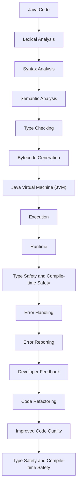

## Introduction
**Strong typing** and **compile-time safety** are fundamental concepts in programming languages, particularly in statically-typed languages like Java. Strong typing refers to the language's ability to enforce type constraints at compile-time, preventing type-related errors at runtime. Compile-time safety takes it a step further by ensuring that the code is free from errors that can be detected at compile-time, such as null pointer exceptions, type mismatches, and other potential issues. In this overview, we will delve into the benefits of strong typing and compile-time safety, exploring their importance, real-world relevance, and how they contribute to writing robust, maintainable, and efficient code.

## Core Concepts
- **Type Safety**: The concept of ensuring that the type of a variable, method, or expression is consistent with its intended use, preventing type-related errors at runtime.
- **Compile-time Checking**: The process of analyzing the code for errors, such as type mismatches, null pointer exceptions, and other potential issues, before the code is executed.
- **Static Typing**: A programming paradigm where the data type of a variable is known at compile-time, as opposed to dynamic typing, where the type is determined at runtime.
- **Type Inference**: The ability of the compiler to automatically determine the type of a variable, method, or expression, without the need for explicit type declarations.

> **Note:** Strong typing and compile-time safety are not unique to Java; other languages, such as C#, F#, and Rust, also employ similar concepts to ensure type safety and prevent runtime errors.

## How It Works Internally
When you write Java code, the compiler performs a series of checks to ensure type safety and compile-time safety. Here's a step-by-step breakdown:

1. **Lexical Analysis**: The compiler breaks the code into individual tokens, such as keywords, identifiers, and literals.
2. **Syntax Analysis**: The compiler analyzes the tokens to ensure that the code follows the language's syntax rules.
3. **Semantic Analysis**: The compiler checks the code for semantic errors, such as type mismatches, null pointer exceptions, and other potential issues.
4. **Type Checking**: The compiler performs type checking to ensure that the types of variables, methods, and expressions are consistent with their intended use.
5. **Bytecode Generation**: The compiler generates bytecode, which is platform-independent, intermediate code that can be executed by the Java Virtual Machine (JVM).

> **Tip:** To take advantage of strong typing and compile-time safety in Java, use explicit type declarations, avoid using raw types, and utilize the `@NonNull` and `@Nullable` annotations to indicate the nullability of variables and methods.

## Code Examples
### Example 1: Basic Type Safety
```java
public class TypeSafetyExample {
    public static void main(String[] args) {
        // Explicit type declaration
        String name = "John";
        // Trying to assign an integer to a string variable will result in a compile-time error
        // name = 123; // Uncommenting this line will cause a compile-time error
    }
}
```

### Example 2: Compile-time Safety
```java
public class CompileTimeSafetyExample {
    public static void main(String[] args) {
        // Null pointer exception at compile-time
        // String name = null;
        // System.out.println(name.length()); // Uncommenting this line will cause a compile-time warning
    }
}
```

### Example 3: Advanced Type Inference
```java
public class TypeInferenceExample {
    public static void main(String[] args) {
        // Type inference
        var name = "John";
        // The type of 'name' is inferred to be 'String'
        System.out.println(name.length());
    }
}
```

## Visual Diagram

This diagram illustrates the process of how Java code is compiled, executed, and how type safety and compile-time safety are enforced throughout the process.

## Comparison
| Approach | Time Complexity | Space Complexity | Pros | Cons | Best For |
| --- | --- | --- | --- | --- | --- |
| Strong Typing | O(1) | O(1) | Prevents type-related errors at runtime, improves code maintainability | Can be verbose, requires explicit type declarations | Large-scale, complex systems |
| Dynamic Typing | O(1) | O(1) | Flexible, allows for rapid prototyping | Can lead to type-related errors at runtime, reduces code maintainability | Small-scale, rapid development projects |
| Type Inference | O(1) | O(1) | Reduces verbosity, improves code readability | Can lead to type-related errors if not implemented correctly | Medium-scale, balanced development projects |
| Compile-time Safety | O(n) | O(n) | Prevents runtime errors, improves code reliability | Can be computationally expensive, requires advanced compiler capabilities | Critical, safety-critical systems |

## Real-world Use Cases
- **Android Apps**: Android apps are built using Java, which provides strong typing and compile-time safety, ensuring that apps are reliable, maintainable, and efficient.
- **Enterprise Software**: Large-scale enterprise software systems, such as banking and financial applications, rely on strong typing and compile-time safety to ensure data integrity, security, and compliance.
- **NASA's Jet Propulsion Laboratory**: NASA's Jet Propulsion Laboratory uses Java to develop mission-critical software systems, which require strong typing and compile-time safety to ensure reliability, safety, and efficiency.

> **Warning:** Ignoring strong typing and compile-time safety can lead to runtime errors, security vulnerabilities, and maintenance nightmares.

## Common Pitfalls
- **Raw Types**: Using raw types, such as `List` instead of `List<String>`, can lead to type-related errors at runtime.
- **Null Pointer Exceptions**: Failing to check for null pointer exceptions can result in runtime errors.
- **Type Mismatches**: Assigning a value of one type to a variable of another type can lead to type-related errors at runtime.
- **Lack of Type Inference**: Failing to utilize type inference can lead to verbose code and reduced readability.

```java
// Wrong way: Using raw types
List list = new ArrayList();
list.add("John");
list.add(123); // This will compile, but may cause issues at runtime

// Right way: Using parameterized types
List<String> list = new ArrayList<>();
list.add("John");
// list.add(123); // This will cause a compile-time error
```

## Interview Tips
- **What is strong typing, and how does it differ from dynamic typing?**: A strong answer should explain the benefits of strong typing, such as preventing type-related errors at runtime, and provide examples of languages that employ strong typing.
- **How does compile-time safety contribute to code reliability?**: A strong answer should discuss the role of compile-time safety in preventing runtime errors, improving code maintainability, and reducing debugging time.
- **What are some common pitfalls to avoid when using strong typing and compile-time safety?**: A strong answer should identify common mistakes, such as using raw types, ignoring null pointer exceptions, and failing to utilize type inference.

> **Interview:** When asked about strong typing and compile-time safety, be prepared to provide examples, discuss the benefits, and explain how to avoid common pitfalls.

## Key Takeaways
- **Strong typing prevents type-related errors at runtime**: By enforcing type constraints at compile-time, strong typing ensures that the code is free from type-related errors.
- **Compile-time safety improves code reliability**: By detecting potential errors at compile-time, compile-time safety reduces the likelihood of runtime errors and improves code maintainability.
- **Type inference reduces verbosity and improves readability**: By automatically determining the type of a variable, method, or expression, type inference reduces the need for explicit type declarations and improves code readability.
- **Raw types can lead to type-related errors**: Using raw types, such as `List` instead of `List<String>`, can lead to type-related errors at runtime.
- **Null pointer exceptions can be prevented**: By checking for null pointer exceptions, developers can prevent runtime errors and improve code reliability.
- **Type mismatches can be avoided**: By using parameterized types and type inference, developers can avoid type mismatches and reduce the likelihood of runtime errors.
- **Strong typing and compile-time safety are essential for large-scale systems**: By enforcing type constraints and detecting potential errors at compile-time, strong typing and compile-time safety ensure that large-scale systems are reliable, maintainable, and efficient.
- **Type safety and compile-time safety are not unique to Java**: Other languages, such as C#, F#, and Rust, also employ similar concepts to ensure type safety and prevent runtime errors.
- **Developers should utilize type inference and parameterized types**: By utilizing type inference and parameterized types, developers can reduce verbosity, improve readability, and prevent type-related errors.
- **Code reviews and testing are essential for ensuring type safety and compile-time safety**: By performing regular code reviews and testing, developers can ensure that their code is free from type-related errors and potential runtime issues.