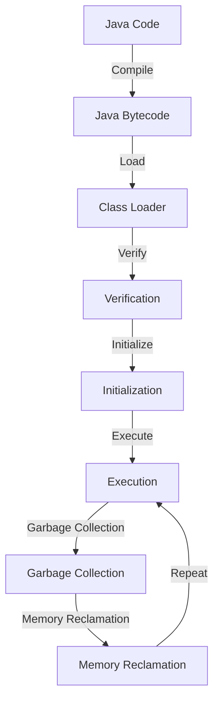

## Introduction
The Java Virtual Machine (JVM) is a crucial component of the Java ecosystem, enabling the "Write Once, Run Anywhere" (WORA) philosophy. This concept allows developers to write Java code once and run it on any platform that has a JVM, without the need for recompilation. The JVM is responsible for loading, linking, and executing Java bytecode, providing a platform-independent environment for Java programs. In this section, we will explore the importance of the JVM, its real-world relevance, and why every engineer needs to understand its inner workings.

> **Note:** The JVM is not specific to Java; other languages, such as Scala and Kotlin, also compile to Java bytecode and run on the JVM.

## Core Concepts
To understand the JVM, it's essential to grasp the following core concepts:

* **Java bytecode**: The intermediate form of Java code, generated by the Java compiler (javac). Bytecode is platform-independent and can be executed by the JVM.
* **Class loader**: Responsible for loading Java classes into the JVM. The class loader verifies the integrity of the class file and ensures that it conforms to the Java specification.
* **Runtime data area**: The JVM's memory management system, which includes the method area, heap, stack, native method stack, and program counter register.
* **Garbage collection**: The JVM's mechanism for automatically managing memory and eliminating memory leaks.

## How It Works Internally
The JVM's internal workings can be broken down into the following steps:

1. **Class loading**: The class loader loads the Java class into the JVM.
2. **Verification**: The JVM verifies the integrity of the class file, ensuring that it conforms to the Java specification.
3. **Initialization**: The JVM initializes the class, allocating memory for its instances.
4. **Execution**: The JVM executes the Java bytecode, using the runtime data area to manage memory and resources.
5. **Garbage collection**: The JVM periodically runs the garbage collector to reclaim memory occupied by objects that are no longer referenced.

> **Warning:** A common mistake is to assume that the JVM's garbage collection is instantaneous. In reality, garbage collection can introduce pauses in the application, which can be mitigated using techniques such as concurrent garbage collection.

## Code Examples
Here are three complete and runnable examples that demonstrate the JVM's capabilities:

### Example 1: Basic Java Class
```java
// Define a simple Java class
public class HelloWorld {
    public static void main(String[] args) {
        System.out.println("Hello, World!");
    }
}
```
This example demonstrates the basic structure of a Java class and how it can be executed by the JVM.

### Example 2: Java Class with Garbage Collection
```java
// Define a Java class that demonstrates garbage collection
public class GarbageCollectionExample {
    public static void main(String[] args) {
        // Create an object that is no longer referenced
        Object obj = new Object();
        obj = null;
        // Request the JVM to perform garbage collection
        System.gc();
    }
}
```
This example illustrates how the JVM's garbage collector reclaims memory occupied by objects that are no longer referenced.

### Example 3: Java Class with Multi-Threading
```java
// Define a Java class that demonstrates multi-threading
public class MultiThreadingExample {
    public static void main(String[] args) {
        // Create two threads that execute concurrently
        Thread thread1 = new Thread(() -> {
            for (int i = 0; i < 10; i++) {
                System.out.println("Thread 1: " + i);
            }
        });
        Thread thread2 = new Thread(() -> {
            for (int i = 0; i < 10; i++) {
                System.out.println("Thread 2: " + i);
            }
        });
        thread1.start();
        thread2.start();
    }
}
```
This example demonstrates how the JVM supports multi-threading, allowing multiple threads to execute concurrently.

## Visual Diagram

This diagram illustrates the JVM's internal workings, from class loading to garbage collection.

## Comparison
The following table compares the JVM with other popular virtual machines:

| Virtual Machine | Language | Platform Independence | Garbage Collection |
| --- | --- | --- | --- |
| JVM | Java, Scala, Kotlin | Yes | Yes |
| .NET CLR | C#, F#, Visual Basic | Yes | Yes |
| Python VM | Python | Yes | Yes |
| Node.js | JavaScript | Yes | Yes |

## Real-world Use Cases
The JVM is widely used in production environments, including:

* **Android**: The Android operating system uses a modified version of the JVM, known as the Dalvik VM, to run Android apps.
* **Web Applications**: Many web applications, such as those built using Spring and Hibernate, run on the JVM.
* **Enterprise Software**: The JVM is used in many enterprise software systems, such as those built using Java EE.

## Common Pitfalls
Here are four common mistakes that engineers make when working with the JVM:

* **Incorrectly assuming that the JVM's garbage collection is instantaneous**: Garbage collection can introduce pauses in the application, which can be mitigated using techniques such as concurrent garbage collection.
* **Not understanding the JVM's memory management**: The JVM's memory management system is complex, and not understanding it can lead to memory leaks and performance issues.
* **Not using the correct JVM flags**: The JVM has many flags that can be used to optimize performance, but using the wrong flags can lead to performance issues.
* **Not monitoring the JVM's performance**: The JVM's performance can be monitored using tools such as VisualVM and JConsole, but not monitoring it can lead to performance issues.

## Interview Tips
Here are three common interview questions related to the JVM, along with weak and strong answers:

* **What is the JVM, and how does it work?**: A weak answer would be "The JVM is a virtual machine that runs Java code." A strong answer would be "The JVM is a virtual machine that loads, links, and executes Java bytecode, providing a platform-independent environment for Java programs. It includes a class loader, runtime data area, and garbage collector, which work together to manage memory and resources."
* **How does the JVM's garbage collection work?**: A weak answer would be "The JVM's garbage collection is instantaneous." A strong answer would be "The JVM's garbage collection is a periodic process that reclaims memory occupied by objects that are no longer referenced. It uses a combination of mark-and-sweep and generational garbage collection algorithms to minimize pauses in the application."
* **What are some common performance issues with the JVM, and how can they be mitigated?**: A weak answer would be "The JVM can have performance issues due to garbage collection." A strong answer would be "The JVM can have performance issues due to garbage collection, but these can be mitigated using techniques such as concurrent garbage collection, profiling, and optimizing JVM flags. Additionally, monitoring the JVM's performance using tools such as VisualVM and JConsole can help identify and address performance issues."

## Key Takeaways
Here are ten key takeaways about the JVM:

* **The JVM is a virtual machine that loads, links, and executes Java bytecode**.
* **The JVM provides a platform-independent environment for Java programs**.
* **The JVM includes a class loader, runtime data area, and garbage collector**.
* **The JVM's garbage collection is a periodic process that reclaims memory occupied by objects that are no longer referenced**.
* **The JVM's garbage collection can introduce pauses in the application**.
* **The JVM's performance can be monitored using tools such as VisualVM and JConsole**.
* **The JVM has many flags that can be used to optimize performance**.
* **The JVM is widely used in production environments, including Android, web applications, and enterprise software**.
* **Understanding the JVM's internal workings is essential for optimizing performance and troubleshooting issues**.
* **The JVM is a complex system, and not understanding it can lead to performance issues and memory leaks**.