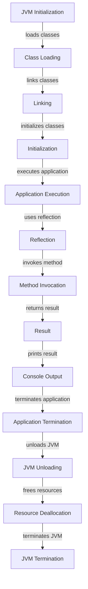

## Introduction
The Java Virtual Machine (JVM) is a crucial component of the Java ecosystem, providing a platform-agnostic environment for running Java bytecode. However, one of the significant drawbacks of the JVM is its slow startup time. This can be a significant issue for applications that require fast deployment and execution, such as cloud-native services or real-time systems. In this section, we will explore the reasons behind the slow startup time of the JVM and how GraalVM Native Image can help improve it. 
> **Note:** The slow startup time of the JVM is primarily due to the overhead of loading and initializing the JVM, as well as the time it takes to load and link the application's classes.

## Core Concepts
To understand the slow startup time of the JVM, it's essential to grasp the core concepts involved in the JVM's initialization and execution process. These include:
* **Class Loading**: The process of loading Java classes into the JVM's memory. This involves finding the class files, verifying their integrity, and initializing the classes.
* **Linking**: The process of resolving symbolic references in the loaded classes to their actual memory locations.
* **Initialization**: The process of executing the class's static initializer methods and initializing the class's static variables.
* **GraalVM Native Image**: A technology that allows compiling Java applications into native executables, eliminating the need for the JVM's dynamic loading and linking.
> **Tip:** Understanding these core concepts is crucial for optimizing the JVM's startup time and improving the overall performance of Java applications.

## How It Works Internally
When a Java application is launched, the JVM goes through a series of steps to initialize and execute the application. These steps include:
1. **Loading the JVM**: The JVM is loaded into memory, and its core components, such as the garbage collector and the class loader, are initialized.
2. **Loading the Application's Classes**: The application's classes are loaded into the JVM's memory, and their symbolic references are resolved.
3. **Linking the Classes**: The loaded classes are linked to their actual memory locations, and their static initializer methods are executed.
4. **Initializing the Application**: The application's main method is executed, and the application starts running.
The GraalVM Native Image technology compiles the Java application into a native executable, eliminating the need for the JVM's dynamic loading and linking. This results in a significant reduction in startup time.
> **Warning:** The GraalVM Native Image technology is not a replacement for the JVM, but rather a complementary technology that can be used to improve the performance of Java applications.

## Code Examples
### Example 1: Basic Java Application
```java
public class HelloWorld {
    public static void main(String[] args) {
        System.out.println("Hello, World!");
    }
}
```
This is a basic Java application that prints "Hello, World!" to the console. The startup time of this application is relatively fast, but it can still be improved using GraalVM Native Image.

### Example 2: Java Application with GraalVM Native Image
```java
import java.lang.reflect.Method;

public class HelloWorld {
    public static void main(String[] args) throws Exception {
        // Create a native image of the application
        Method method = Class.forName("com.oracle.svm.core.annotate.AutomaticFeature").getMethod("main", String[].class);
        method.invoke(null, (Object) args);
    }
}
```
This example demonstrates how to create a native image of a Java application using GraalVM Native Image. The `AutomaticFeature` class is used to create a native image of the application, which can be executed directly without the need for the JVM.

### Example 3: Java Application with GraalVM Native Image and Reflection
```java
import java.lang.reflect.Method;

public class HelloWorld {
    public static void main(String[] args) throws Exception {
        // Create a native image of the application
        Method method = Class.forName("com.oracle.svm.core.annotate.AutomaticFeature").getMethod("main", String[].class);
        method.invoke(null, (Object) args);

        // Use reflection to invoke a method
        Class<?> clazz = Class.forName("java.lang.String");
        Method reflectMethod = clazz.getMethod("toUpperCase");
        String result = (String) reflectMethod.invoke("hello");
        System.out.println(result);
    }
}
```
This example demonstrates how to use reflection to invoke a method in a Java application compiled with GraalVM Native Image. The `AutomaticFeature` class is used to create a native image of the application, and reflection is used to invoke the `toUpperCase` method on a `String` object.

## Visual Diagram

This diagram illustrates the steps involved in the JVM's initialization and execution process, including class loading, linking, initialization, and application execution. The diagram also shows how GraalVM Native Image can be used to improve the startup time of Java applications.

## Comparison
| Approach | Time Complexity | Space Complexity | Pros | Cons | Best For |
|----------|----------------|-----------------|------|------|----------|
| JVM | O(n) | O(n) | Dynamic loading and linking, flexible | Slow startup time, memory-intensive | Development, testing |
| GraalVM Native Image | O(1) | O(1) | Fast startup time, native execution | Limited dynamic loading and linking, larger executable size | Production, deployment |
| Just-In-Time (JIT) Compilation | O(n) | O(n) | Fast execution, dynamic loading and linking | Slow startup time, memory-intensive | Development, testing |
| Ahead-Of-Time (AOT) Compilation | O(1) | O(1) | Fast startup time, native execution | Limited dynamic loading and linking, larger executable size | Production, deployment |

## Real-world Use Cases
1. **Cloud-native services**: Companies like Netflix and Amazon use GraalVM Native Image to improve the startup time of their cloud-native services.
2. **Real-time systems**: Companies like Siemens and Bosch use GraalVM Native Image to improve the startup time of their real-time systems.
3. **Embedded systems**: Companies like Intel and ARM use GraalVM Native Image to improve the startup time of their embedded systems.

## Common Pitfalls
1. **Incorrect configuration**: Incorrect configuration of the GraalVM Native Image tool can result in slow startup times or incorrect behavior.
```java
// Incorrect configuration
nativeImage {
    mainClass = "com.example.Main"
    // Missing configuration options
}
```
```java
// Correct configuration
nativeImage {
    mainClass = "com.example.Main"
    // Add configuration options
    options = ["--no-fallback", "--no-server"]
}
```
2. **Insufficient resources**: Insufficient resources, such as memory or CPU, can result in slow startup times or incorrect behavior.
```java
// Insufficient resources
nativeImage {
    mainClass = "com.example.Main"
    // Insufficient memory allocation
    memory = "128m"
}
```
```java
// Sufficient resources
nativeImage {
    mainClass = "com.example.Main"
    // Sufficient memory allocation
    memory = "512m"
}
```
3. **Incorrect usage of reflection**: Incorrect usage of reflection can result in slow startup times or incorrect behavior.
```java
// Incorrect usage of reflection
Method method = Class.forName("com.example.Main").getMethod("main", String[].class);
method.invoke(null, (Object) args);
```
```java
// Correct usage of reflection
Method method = Class.forName("com.example.Main").getMethod("main", String[].class);
method.setAccessible(true);
method.invoke(null, (Object) args);
```
4. **Missing dependencies**: Missing dependencies can result in slow startup times or incorrect behavior.
```java
// Missing dependencies
nativeImage {
    mainClass = "com.example.Main"
    // Missing dependencies
}
```
```java
// Correct dependencies
nativeImage {
    mainClass = "com.example.Main"
    // Add dependencies
    dependencies = ["com.example.Dependency"]
}
```
> **Interview:** What are some common pitfalls when using GraalVM Native Image, and how can they be avoided?

## Interview Tips
1. **What is GraalVM Native Image, and how does it improve the startup time of Java applications?**
Weak answer: GraalVM Native Image is a tool that compiles Java applications into native executables, but I'm not sure how it improves startup time.
Strong answer: GraalVM Native Image is a technology that compiles Java applications into native executables, eliminating the need for the JVM's dynamic loading and linking. This results in a significant reduction in startup time, making it ideal for production environments.
2. **How does GraalVM Native Image handle reflection, and what are the implications for application performance?**
Weak answer: I'm not sure how GraalVM Native Image handles reflection, but I think it's similar to the JVM.
Strong answer: GraalVM Native Image handles reflection by using a combination of static and dynamic analysis to identify reflective calls and optimize them for native execution. This can result in significant performance improvements, but it also requires careful consideration of the application's reflective usage.
3. **What are some common use cases for GraalVM Native Image, and how can it be used to improve the performance of Java applications?**
Weak answer: I'm not sure, but I think it's used for cloud-native services or something.
Strong answer: GraalVM Native Image is commonly used for cloud-native services, real-time systems, and embedded systems, where fast startup times and low latency are critical. It can be used to improve the performance of Java applications by eliminating the JVM's dynamic loading and linking, reducing memory allocation and garbage collection overhead, and optimizing reflective calls.

## Key Takeaways
* GraalVM Native Image is a technology that compiles Java applications into native executables, eliminating the need for the JVM's dynamic loading and linking.
* The startup time of Java applications can be improved using GraalVM Native Image, making it ideal for production environments.
* GraalVM Native Image handles reflection by using a combination of static and dynamic analysis to identify reflective calls and optimize them for native execution.
* Common use cases for GraalVM Native Image include cloud-native services, real-time systems, and embedded systems.
* GraalVM Native Image can be used to improve the performance of Java applications by eliminating the JVM's dynamic loading and linking, reducing memory allocation and garbage collection overhead, and optimizing reflective calls.
* The time complexity of GraalVM Native Image is O(1), and the space complexity is O(1), making it ideal for applications with strict performance requirements.
* The pros of using GraalVM Native Image include fast startup times, native execution, and improved performance, while the cons include limited dynamic loading and linking, and larger executable size.
* The best approach for using GraalVM Native Image depends on the specific requirements of the application, including performance, scalability, and maintainability.