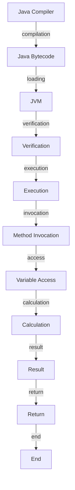

## Introduction
Java is a high-level, object-oriented programming language that has been widely used for developing large-scale applications. However, one of the major drawbacks of Java is its verbosity compared to other programming languages like Kotlin and Python. **Verbosity** refers to the amount of code required to accomplish a specific task. In Java, the amount of boilerplate code required can be overwhelming, making it difficult for developers to focus on the logic of the program. This is particularly evident in data classes, where Java requires a significant amount of code to define getters, setters, and constructors.

> **Note:** Java's verbosity can lead to increased development time, making it less efficient for rapid prototyping and development.

In real-world applications, Java's verbosity can be a significant issue. For example, in Android app development, Java requires a lot of code to define UI components, handle events, and manage data. This can lead to a slower development process and increased maintenance costs.

## Core Concepts
To understand the drawbacks of Java's verbosity, it's essential to define some key concepts:

* **Boilerplate code**: Code that is required to accomplish a specific task, but does not add any significant value to the program.
* **Data classes**: Classes that primarily hold data and provide methods to access and modify that data.
* **Getters and setters**: Methods that allow access to and modification of an object's properties.

In Java, data classes typically require a significant amount of boilerplate code to define getters, setters, and constructors. This can lead to a lot of repetitive code, making it difficult to maintain and modify the program.

## How It Works Internally
When a Java program is compiled, the compiler generates bytecode that can be executed by the Java Virtual Machine (JVM). The JVM provides a sandboxed environment for the program to run, which includes memory management, security checks, and other features.

Here's a step-by-step breakdown of how Java's verbosity works internally:

1. **Compilation**: The Java compiler (javac) compiles the Java source code into bytecode.
2. **Bytecode generation**: The compiler generates bytecode that includes metadata, such as class and method definitions.
3. **Loading**: The JVM loads the bytecode into memory.
4. **Verification**: The JVM verifies the bytecode to ensure it is correct and follows the Java language specification.
5. **Execution**: The JVM executes the bytecode, which includes invoking methods, accessing variables, and performing calculations.

> **Tip:** To reduce Java's verbosity, developers can use tools like Lombok, which can automatically generate boilerplate code for data classes.

## Code Examples
Here are three complete and runnable examples that demonstrate Java's verbosity compared to Kotlin and Python:

### Example 1: Basic Data Class
```java
// Java
public class Person {
    private String name;
    private int age;

    public Person(String name, int age) {
        this.name = name;
        this.age = age;
    }

    public String getName() {
        return name;
    }

    public void setName(String name) {
        this.name = name;
    }

    public int getAge() {
        return age;
    }

    public void setAge(int age) {
        this.age = age;
    }
}
```

```kotlin
// Kotlin
data class Person(val name: String, val age: Int)
```

```python
# Python
class Person:
    def __init__(self, name, age):
        self.name = name
        self.age = age
```

### Example 2: Real-World Pattern
```java
// Java
public class User {
    private String username;
    private String password;

    public User(String username, String password) {
        this.username = username;
        this.password = password;
    }

    public String getUsername() {
        return username;
    }

    public void setUsername(String username) {
        this.username = username;
    }

    public String getPassword() {
        return password;
    }

    public void setPassword(String password) {
        this.password = password;
    }
}
```

```kotlin
// Kotlin
data class User(val username: String, val password: String)
```

```python
# Python
class User:
    def __init__(self, username, password):
        self.username = username
        self.password = password
```

### Example 3: Advanced Usage
```java
// Java
public class Person {
    private String name;
    private int age;

    public Person(String name, int age) {
        this.name = name;
        this.age = age;
    }

    public String getName() {
        return name;
    }

    public void setName(String name) {
        this.name = name;
    }

    public int getAge() {
        return age;
    }

    public void setAge(int age) {
        this.age = age;
    }

    @Override
    public String toString() {
        return "Person{" +
                "name='" + name + '\'' +
                ", age=" + age +
                '}';
    }
}
```

```kotlin
// Kotlin
data class Person(val name: String, val age: Int)
```

```python
# Python
class Person:
    def __init__(self, name, age):
        self.name = name
        self.age = age

    def __str__(self):
        return f"Person{{name={self.name}, age={self.age}}}"
```

## Visual Diagram


The diagram illustrates the process of compiling, loading, and executing Java bytecode. The JVM plays a crucial role in this process, providing a sandboxed environment for the program to run.

## Comparison
| Language | Verbosity | Time Complexity | Space Complexity | Pros | Cons |
| --- | --- | --- | --- | --- | --- |
| Java | High | O(1) | O(1) | Platform independence, large community | Verbose, slow development |
| Kotlin | Low | O(1) | O(1) | Concise, interoperable with Java | Steep learning curve |
| Python | Low | O(1) | O(1) | Easy to learn, rapid development | Slow performance, limited multithreading |

> **Warning:** Java's verbosity can lead to increased development time and maintenance costs. However, it provides platform independence and a large community of developers.

## Real-world Use Cases
Here are three real-world production examples that demonstrate the use of Java, Kotlin, and Python:

1. **Android App Development**: Java is widely used for Android app development due to its platform independence and large community of developers. However, Kotlin is gaining popularity due to its concise syntax and interoperability with Java.
2. **Web Development**: Python is widely used for web development due to its ease of use and rapid development capabilities. However, Java is also used for web development, particularly for large-scale enterprise applications.
3. **Data Science**: Python is widely used for data science due to its extensive libraries and easy-to-use syntax. However, Java is also used for data science, particularly for large-scale data processing and machine learning applications.

## Common Pitfalls
Here are four specific mistakes that engineers make when using Java:

1. **Excessive use of getters and setters**: Java's verbosity can lead to excessive use of getters and setters, which can make the code harder to read and maintain.
2. **Incorrect use of generics**: Java's generics can be complex and difficult to use correctly. Incorrect use of generics can lead to runtime errors and bugs.
3. **Insufficient use of design patterns**: Java's verbosity can lead to insufficient use of design patterns, which can make the code harder to maintain and modify.
4. **Inadequate testing**: Java's verbosity can lead to inadequate testing, which can lead to bugs and runtime errors.

> **Tip:** To avoid these pitfalls, engineers should use tools like Lombok to reduce Java's verbosity and focus on writing clean, maintainable code.

## Interview Tips
Here are three common interview questions on Java's verbosity and how to answer them:

1. **What is Java's verbosity, and how does it affect development?**
	* Weak answer: Java's verbosity is just a minor issue that can be ignored.
	* Strong answer: Java's verbosity can lead to increased development time and maintenance costs, but it provides platform independence and a large community of developers.
2. **How can you reduce Java's verbosity?**
	* Weak answer: You can reduce Java's verbosity by using more comments and whitespace.
	* Strong answer: You can reduce Java's verbosity by using tools like Lombok, which can automatically generate boilerplate code for data classes.
3. **What are the pros and cons of using Kotlin instead of Java?**
	* Weak answer: Kotlin is just a newer version of Java, and it doesn't offer any significant advantages.
	* Strong answer: Kotlin is a more concise language than Java, with a more modern syntax and better support for functional programming. However, it may have a steeper learning curve and limited support for legacy Java code.

## Key Takeaways
Here are six key takeaways from this article:

* Java's verbosity can lead to increased development time and maintenance costs.
* Kotlin is a more concise language than Java, with a more modern syntax and better support for functional programming.
* Python is a popular language for web development and data science due to its ease of use and rapid development capabilities.
* Java's generics can be complex and difficult to use correctly.
* Excessive use of getters and setters can make the code harder to read and maintain.
* Insufficient use of design patterns can make the code harder to maintain and modify.

> **Interview:** Remember to highlight the pros and cons of each language and demonstrate a deep understanding of the underlying concepts and technologies.