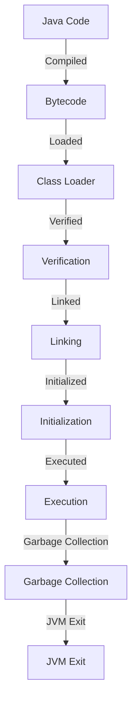

## Introduction
Java is a high-level, **object-oriented** programming language that is designed to be **platform-independent**, meaning that Java code can run on any device that has a Java Virtual Machine (JVM) installed. Java is widely used for developing large-scale applications, including Android apps, web applications, and enterprise software. Its platform independence, strong security features, and vast ecosystem of libraries and tools make it a popular choice among developers. 
> **Note:** Java's platform independence is achieved through the use of bytecode, which is executed by the JVM. This allows Java code to run on any device that has a JVM, without the need for recompilation.

## Core Concepts
Java is based on several core concepts, including **encapsulation**, **inheritance**, and **polymorphism**. Encapsulation refers to the idea of bundling data and methods that operate on that data within a single unit, called a **class**. Inheritance allows one class to inherit the properties and behavior of another class, while polymorphism enables objects of different classes to be treated as objects of a common superclass. 
> **Warning:** Failure to understand and apply these core concepts can lead to poorly designed and maintainable code.

## How It Works Internally
When Java code is compiled, it is translated into an intermediate form called **bytecode**. The bytecode is then executed by the JVM, which translates it into machine code that can be executed directly by the computer's processor. The JVM provides a number of services, including **memory management**, **thread management**, and **security**. The JVM also provides a **class loader**, which is responsible for loading Java classes into memory.
> **Tip:** Understanding how the JVM works internally can help developers optimize their code for performance and write more efficient programs.

## Code Examples
### Example 1: Basic Java Class
```java
// Define a simple Java class called "Person"
public class Person {
    // Define a constructor that takes a name and age
    public Person(String name, int age) {
        this.name = name;
        this.age = age;
    }

    // Define a method that prints out the person's name and age
    public void printInfo() {
        System.out.println("Name: " + name);
        System.out.println("Age: " + age);
    }

    // Define private fields for the person's name and age
    private String name;
    private int age;

    // Main method for testing the class
    public static void main(String[] args) {
        // Create a new Person object
        Person person = new Person("John Doe", 30);

        // Call the printInfo method to print out the person's info
        person.printInfo();
    }
}
```
### Example 2: Java Inheritance
```java
// Define a superclass called "Vehicle"
public class Vehicle {
    // Define a method that prints out the vehicle's type
    public void printType() {
        System.out.println("This is a vehicle.");
    }
}

// Define a subclass called "Car" that inherits from Vehicle
public class Car extends Vehicle {
    // Define a method that prints out the car's type
    public void printType() {
        System.out.println("This is a car.");
    }

    // Define a method that prints out the car's details
    public void printDetails() {
        System.out.println("This car has 4 wheels and a engine.");
    }

    // Main method for testing the class
    public static void main(String[] args) {
        // Create a new Car object
        Car car = new Car();

        // Call the printType method to print out the car's type
        car.printType();

        // Call the printDetails method to print out the car's details
        car.printDetails();
    }
}
```
### Example 3: Java Polymorphism
```java
// Define a superclass called "Shape"
public class Shape {
    // Define a method that prints out the shape's area
    public void printArea() {
        System.out.println("This shape has an area.");
    }
}

// Define a subclass called "Circle" that inherits from Shape
public class Circle extends Shape {
    // Define a method that prints out the circle's area
    public void printArea() {
        System.out.println("This circle has an area of pi * r^2.");
    }

    // Define a method that prints out the circle's details
    public void printDetails() {
        System.out.println("This circle has a radius and a center.");
    }
}

// Define a subclass called "Rectangle" that inherits from Shape
public class Rectangle extends Shape {
    // Define a method that prints out the rectangle's area
    public void printArea() {
        System.out.println("This rectangle has an area of length * width.");
    }

    // Define a method that prints out the rectangle's details
    public void printDetails() {
        System.out.println("This rectangle has a length and a width.");
    }
}

// Main method for testing the classes
public class Main {
    public static void main(String[] args) {
        // Create an array of Shape objects
        Shape[] shapes = new Shape[2];

        // Create a new Circle object and add it to the array
        shapes[0] = new Circle();

        // Create a new Rectangle object and add it to the array
        shapes[1] = new Rectangle();

        // Iterate over the array and call the printArea method on each shape
        for (Shape shape : shapes) {
            shape.printArea();
        }
    }
}
```
> **Interview:** Can you explain the difference between **overloading** and **overriding** in Java?

## Visual Diagram

This diagram illustrates the steps involved in the execution of Java code, from compilation to garbage collection.

## Comparison
| Language | Type System | Platform Independence | Object-oriented |
| --- | --- | --- | --- |
| Java | Statically-typed | Yes | Yes |
| Python | Dynamically-typed | Yes | Yes |
| C++ | Statically-typed | No | Yes |
| JavaScript | Dynamically-typed | Yes | Yes |
> **Tip:** When choosing a programming language, consider the type system, platform independence, and object-oriented features.

## Real-world Use Cases
1. **Android Apps**: Java is widely used for developing Android apps, including games, social media apps, and productivity apps.
2. **Web Applications**: Java is used for developing web applications, including e-commerce websites, online banking systems, and social media platforms.
3. **Enterprise Software**: Java is used for developing enterprise software, including customer relationship management (CRM) systems, enterprise resource planning (ERP) systems, and supply chain management (SCM) systems.
> **Note:** Java's platform independence and object-oriented features make it a popular choice for developing large-scale applications.

## Common Pitfalls
1. **Null Pointer Exceptions**: Null pointer exceptions occur when an application attempts to access or manipulate a null object reference.
2. **Resource Leaks**: Resource leaks occur when an application fails to release system resources, such as file handles or network connections.
3. **Concurrent Modification Exceptions**: Concurrent modification exceptions occur when an application attempts to modify a collection while it is being iterated over by another thread.
4. **ClassCastException**: ClassCastException occurs when an application attempts to cast an object to a class that it is not an instance of.
> **Warning:** These pitfalls can be avoided by following best practices, such as checking for null references, releasing system resources, and synchronizing access to shared data.

## Interview Tips
1. **What is the difference between **equals()** and **==** in Java?**: The **equals()** method checks for equality of object values, while the **==** operator checks for equality of object references.
2. **How do you handle **NullPointerException** in Java?**: You can handle NullPointerException by checking for null references before attempting to access or manipulate them.
3. **What is the purpose of the **finally** block in Java?**: The **finally** block is used to release system resources, such as file handles or network connections, regardless of whether an exception is thrown.
> **Interview:** Can you explain the difference between **synchronized** and **ReentrantLock** in Java?

## Key Takeaways
* Java is a high-level, object-oriented programming language that is designed to be platform-independent.
* Java code is compiled into bytecode, which is executed by the JVM.
* The JVM provides a number of services, including memory management, thread management, and security.
* Java's core concepts include encapsulation, inheritance, and polymorphism.
* Java's type system is statically-typed, which helps to prevent type-related errors at runtime.
* Java's platform independence and object-oriented features make it a popular choice for developing large-scale applications.
* Java's garbage collection helps to prevent memory leaks and reduce the risk of null pointer exceptions.
* Java's concurrency features, such as threads and locks, help to improve the performance and responsiveness of applications.
> **Note:** These key takeaways summarize the main points of the Java programming language and its ecosystem.