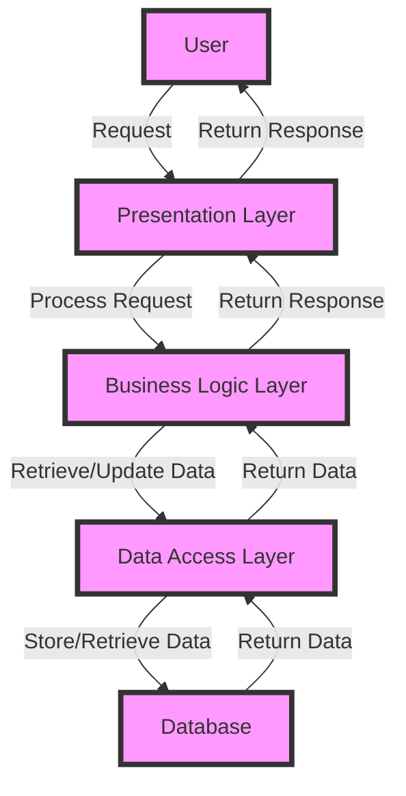

## Introduction
Enterprise applications are complex software systems designed to support the operations of an organization. They are typically large-scale, distributed systems that provide a wide range of functionalities, such as customer relationship management, supply chain management, and financial management. **Enterprise applications** are crucial for businesses as they help to streamline processes, improve efficiency, and reduce costs. In this overview, we will explore the core concepts, internal workings, and best practices for developing enterprise applications. Every engineer should understand the principles of enterprise application development, as it is a critical aspect of software engineering.

> **Note:** Enterprise applications are not just limited to large corporations; smaller organizations and startups can also benefit from these systems.

## Core Concepts
To develop effective enterprise applications, it is essential to understand the following core concepts:
- **Scalability**: The ability of the system to handle increased traffic, data, or user growth without compromising performance.
- **Reliability**: The ability of the system to maintain its functionality and performance over time, even in the presence of failures or errors.
- **Security**: The ability of the system to protect sensitive data and prevent unauthorized access.
- **Maintainability**: The ability of the system to be easily updated, modified, or extended without affecting its overall functionality.

> **Tip:** When designing enterprise applications, consider using a **microservices architecture**, which allows for greater scalability, flexibility, and maintainability.

## How It Works Internally
Enterprise applications typically consist of multiple layers, including:
1. **Presentation Layer**: Handles user interactions and provides a user interface.
2. **Business Logic Layer**: Contains the core logic of the application, including rules, processes, and calculations.
3. **Data Access Layer**: Responsible for accessing and manipulating data stored in databases or other storage systems.
4. **Infrastructure Layer**: Provides the underlying infrastructure, including servers, networks, and operating systems.

The internal mechanics of an enterprise application involve a complex interplay between these layers. When a user interacts with the system, the presentation layer sends a request to the business logic layer, which processes the request and retrieves or updates data from the data access layer. The infrastructure layer provides the necessary resources and support for the entire system.

## Code Examples
### Example 1: Basic Enterprise Application (Java)
```java
// Import necessary libraries
import javax.servlet.http.HttpServlet;
import javax.servlet.http.HttpServletRequest;
import javax.servlet.http.HttpServletResponse;

// Define a simple enterprise application
public class EnterpriseApp extends HttpServlet {
    @Override
    public void doGet(HttpServletRequest request, HttpServletResponse response) {
        // Handle GET request
        response.setContentType("text/html");
        response.getWriter().println("Hello, World!");
    }
}
```
### Example 2: Real-World Enterprise Application (Java)
```java
// Import necessary libraries
import java.sql.Connection;
import java.sql.DriverManager;
import java.sql.PreparedStatement;
import java.sql.ResultSet;

// Define a more complex enterprise application
public class CustomerManagementSystem {
    public static void main(String[] args) {
        // Connect to database
        Connection conn = DriverManager.getConnection("jdbc:mysql://localhost:3306/customer_db", "username", "password");
        
        // Retrieve customer data
        PreparedStatement stmt = conn.prepareStatement("SELECT * FROM customers");
        ResultSet result = stmt.executeQuery();
        
        // Process customer data
        while (result.next()) {
            System.out.println("Customer ID: " + result.getInt("customer_id"));
            System.out.println("Customer Name: " + result.getString("customer_name"));
        }
    }
}
```
### Example 3: Advanced Enterprise Application (Java)
```java
// Import necessary libraries
import org.springframework.boot.SpringApplication;
import org.springframework.boot.autoconfigure.SpringBootApplication;
import org.springframework.web.bind.annotation.GetMapping;
import org.springframework.web.bind.annotation.RestController;

// Define an advanced enterprise application using Spring Boot
@SpringBootApplication
@RestController
public class AdvancedEnterpriseApp {
    @GetMapping("/customers")
    public String getCustomers() {
        // Handle GET request
        return "Customer List";
    }
    
    public static void main(String[] args) {
        // Start Spring Boot application
        SpringApplication.run(AdvancedEnterpriseApp.class, args);
    }
}
```
## Visual Diagram

The diagram illustrates the flow of a request through an enterprise application, from the user to the presentation layer, business logic layer, data access layer, and database.

## Comparison
| Approach | Time Complexity | Space Complexity | Pros | Cons | Best For |
| --- | --- | --- | --- | --- | --- |
| Monolithic Architecture | O(n) | O(n) | Simple, easy to develop | Limited scalability, rigid | Small-scale applications |
| Microservices Architecture | O(n log n) | O(n) | Scalable, flexible, maintainable | Complex, requires orchestration | Large-scale applications |
| Service-Oriented Architecture (SOA) | O(n) | O(n) | Reusable services, loose coupling | Steep learning curve, requires governance | Enterprise applications with reusable services |
| Event-Driven Architecture (EDA) | O(n log n) | O(n) | Scalable, flexible, real-time processing | Complex, requires event handling | Real-time applications with high scalability requirements |

## Real-world Use Cases
1. **SAP**: A leading enterprise software company that provides a wide range of applications for customer relationship management, supply chain management, and financial management.
2. **Oracle**: A multinational technology corporation that offers a suite of enterprise applications for database management, enterprise resource planning, and customer relationship management.
3. **Salesforce**: A cloud-based customer relationship management platform that provides a range of applications for sales, marketing, and customer service.

## Common Pitfalls
1. **Insufficient testing**: Failing to thoroughly test an enterprise application can lead to bugs, errors, and performance issues.
2. **Poor architecture**: Designing an enterprise application with a poor architecture can result in scalability, maintainability, and performance problems.
3. **Inadequate security**: Failing to implement robust security measures can compromise sensitive data and expose the application to vulnerabilities.
4. **Inefficient data management**: Poor data management practices can lead to data inconsistencies, duplicates, and errors.

> **Warning:** Inadequate security can have severe consequences, including data breaches and financial losses.

## Interview Tips
1. **What is your experience with enterprise applications?**: Be prepared to discuss your experience with developing, deploying, and maintaining enterprise applications.
2. **How do you ensure scalability in an enterprise application?**: Explain your approach to designing scalable enterprise applications, including the use of microservices, load balancing, and caching.
3. **What security measures do you implement in an enterprise application?**: Discuss your experience with implementing security measures, such as authentication, authorization, and encryption.

> **Interview:** When answering interview questions, be sure to provide specific examples from your experience and highlight your skills and knowledge in enterprise application development.

## Key Takeaways
* Enterprise applications are complex software systems that support the operations of an organization.
* Scalability, reliability, security, and maintainability are critical aspects of enterprise application development.
* Microservices architecture is a popular approach for developing scalable and maintainable enterprise applications.
* Insufficient testing, poor architecture, inadequate security, and inefficient data management are common pitfalls in enterprise application development.
* Experience with enterprise applications, scalability, security, and data management are essential skills for enterprise application developers.
* Time complexity and space complexity are important considerations in enterprise application development, with typical ranges of O(n) to O(n log n) for time complexity and O(n) for space complexity.