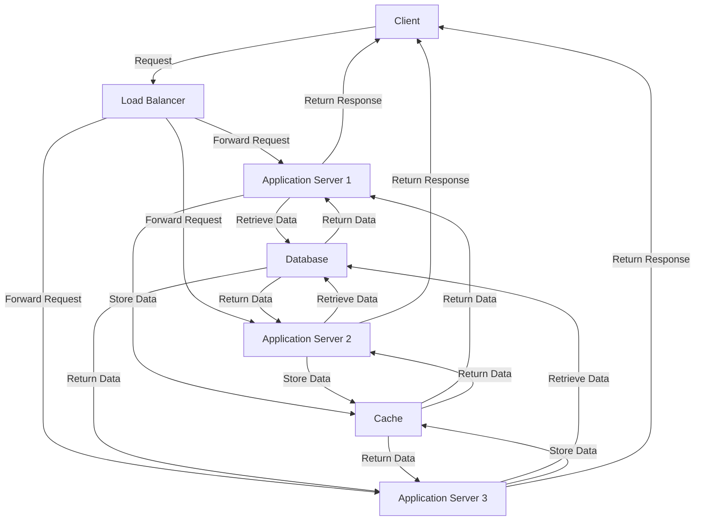

## Introduction
Large-scale backend systems are designed to handle massive amounts of data and traffic, providing a scalable and reliable infrastructure for applications. These systems are crucial in today's digital age, where businesses and organizations rely heavily on technology to operate efficiently. A well-designed large-scale backend system can make all the difference in providing a seamless user experience, improving performance, and reducing costs. In this overview, we will explore the core concepts, internal mechanics, and best practices for building large-scale backend systems.

> **Note:** Large-scale backend systems are not just about handling large amounts of data, but also about providing a scalable and reliable infrastructure that can adapt to changing business needs.

## Core Concepts
To build a large-scale backend system, it's essential to understand the core concepts that make up such a system. These include:

* **Scalability**: The ability of a system to handle increased traffic and data without compromising performance.
* **Reliability**: The ability of a system to maintain its functionality and performance even in the presence of failures or errors.
* **Availability**: The ability of a system to be accessible and usable at all times.
* **Performance**: The ability of a system to respond quickly to user requests and provide a seamless user experience.

> **Warning:** Ignoring these core concepts can lead to a system that is prone to failures, slow performance, and poor user experience.

## How It Works Internally
A large-scale backend system typically consists of multiple layers, each with its own set of responsibilities. These layers include:

1. **Load Balancer**: Distributes incoming traffic across multiple servers to ensure efficient use of resources.
2. **Application Server**: Handles business logic and provides a interface for clients to interact with the system.
3. **Database**: Stores and retrieves data in a structured and efficient manner.
4. **Cache**: Stores frequently accessed data in memory to reduce the load on the database.

The internal mechanics of a large-scale backend system involve a complex interplay between these layers. For example, when a user makes a request to the system, the load balancer directs the request to an available application server, which then retrieves the required data from the database or cache.

> **Tip:** Using a caching layer can significantly improve the performance of a large-scale backend system by reducing the number of database queries.

## Code Examples
Here are three complete and runnable code examples that demonstrate the concepts of large-scale backend systems:

### Example 1: Basic Load Balancer
```java
import java.net.*;
import java.io.*;

public class LoadBalancer {
    public static void main(String[] args) throws Exception {
        // Create a server socket
        ServerSocket serverSocket = new ServerSocket(8000);
        
        // Create a list of available application servers
        String[] applicationServers = {"app1", "app2", "app3"};
        
        // Distribute incoming traffic across application servers
        while (true) {
            Socket socket = serverSocket.accept();
            // Get the next available application server
            String nextServer = getNextServer(applicationServers);
            // Forward the request to the next available application server
            forwardRequest(socket, nextServer);
        }
    }
    
    private static String getNextServer(String[] applicationServers) {
        // Implement a simple round-robin algorithm to select the next available application server
        // ...
    }
    
    private static void forwardRequest(Socket socket, String nextServer) {
        // Forward the request to the next available application server
        // ...
    }
}
```

### Example 2: Real-world Application Server
```java
import java.net.*;
import java.io.*;
import javax.servlet.http.*;

public class ApplicationServer extends HttpServlet {
    public void doGet(HttpServletRequest request, HttpServletResponse response) throws ServletException, IOException {
        // Handle business logic and provide a response to the client
        String userId = request.getParameter("userId");
        // Retrieve user data from the database
        UserData userData = retrieveUserData(userId);
        // Return the user data to the client
        response.setContentType("application/json");
        response.getWriter().write(userData.toJson());
    }
    
    private UserData retrieveUserData(String userId) {
        // Retrieve user data from the database
        // ...
    }
}
```

### Example 3: Advanced Caching Layer
```java
import java.util.concurrent.*;
import java.util.*;

public class CacheLayer {
    private ConcurrentHashMap<String, Object> cache;
    private ScheduledExecutorService scheduler;
    
    public CacheLayer() {
        cache = new ConcurrentHashMap<>();
        scheduler = Executors.newSingleThreadScheduledExecutor();
    }
    
    public Object get(String key) {
        // Check if the key is in the cache
        if (cache.containsKey(key)) {
            return cache.get(key);
        }
        // If not, retrieve the data from the database and store it in the cache
        Object data = retrieveDataFromDatabase(key);
        cache.put(key, data);
        // Schedule a task to expire the cache entry after a certain time
        scheduler.schedule(() -> cache.remove(key), 1, TimeUnit.HOURS);
        return data;
    }
    
    private Object retrieveDataFromDatabase(String key) {
        // Retrieve data from the database
        // ...
    }
}
```

## Visual Diagram

This diagram illustrates the flow of requests and data between the client, load balancer, application servers, database, and cache.

> **Interview:** A common interview question is to design a large-scale backend system for a fictional application. The interviewer wants to see if you can think critically about scalability, reliability, and performance.

## Comparison
Here is a comparison table of different approaches to building large-scale backend systems:

| Approach | Time Complexity | Space Complexity | Pros | Cons | Best For |
| --- | --- | --- | --- | --- | --- |
| Monolithic Architecture | O(1) | O(n) | Simple to implement, easy to maintain | Limited scalability, single point of failure | Small applications, prototyping |
| Microservices Architecture | O(n) | O(n^2) | Highly scalable, flexible, and fault-tolerant | Complex to implement, difficult to maintain | Large applications, enterprise systems |
| Service-Oriented Architecture | O(n) | O(n) | Scalable, flexible, and fault-tolerant | Complex to implement, requires careful planning | Medium to large applications |
| Event-Driven Architecture | O(1) | O(n) | Scalable, flexible, and fault-tolerant | Complex to implement, requires careful planning | Real-time systems, high-performance applications |

## Real-world Use Cases
Here are three real-world examples of large-scale backend systems:

1. **Netflix**: Netflix uses a microservices architecture to provide a scalable and reliable streaming service to its users. Each microservice is responsible for a specific function, such as user authentication or content recommendation.
2. **Amazon**: Amazon uses a service-oriented architecture to provide a scalable and flexible e-commerce platform. Each service is responsible for a specific function, such as order processing or inventory management.
3. **Google**: Google uses an event-driven architecture to provide a scalable and fault-tolerant search engine. Each event is processed in real-time, allowing Google to provide fast and accurate search results.

> **Tip:** When designing a large-scale backend system, it's essential to consider the trade-offs between different approaches and choose the one that best fits your needs.

## Common Pitfalls
Here are four common mistakes to avoid when building large-scale backend systems:

1. **Insufficient planning**: Failing to plan for scalability and reliability can lead to a system that is prone to failures and poor performance.
2. **Poor database design**: A poorly designed database can lead to slow query performance and data inconsistencies.
3. **Inadequate caching**: Failing to implement caching can lead to slow performance and increased load on the database.
4. **Lack of monitoring and logging**: Failing to implement monitoring and logging can make it difficult to diagnose and fix issues.

> **Warning:** Ignoring these common pitfalls can lead to a system that is prone to failures, slow performance, and poor user experience.

## Interview Tips
Here are three common interview questions related to large-scale backend systems, along with tips on how to answer them:

1. **Design a large-scale backend system for a fictional application**: The interviewer wants to see if you can think critically about scalability, reliability, and performance. Be sure to consider the trade-offs between different approaches and choose the one that best fits the needs of the application.
2. **Explain the differences between monolithic and microservices architectures**: The interviewer wants to see if you understand the pros and cons of each approach. Be sure to provide specific examples of when each approach is best suited.
3. **Describe a situation where you had to troubleshoot a issue in a large-scale backend system**: The interviewer wants to see if you can think critically and troubleshoot issues. Be sure to provide specific details about the issue, how you diagnosed it, and how you fixed it.

> **Interview:** A common interview question is to design a large-scale backend system for a fictional application. The interviewer wants to see if you can think critically about scalability, reliability, and performance.

## Key Takeaways
Here are ten key takeaways to remember when building large-scale backend systems:

* **Scalability is key**: A large-scale backend system must be able to handle increased traffic and data without compromising performance.
* **Reliability is crucial**: A large-scale backend system must be able to maintain its functionality and performance even in the presence of failures or errors.
* **Availability is essential**: A large-scale backend system must be accessible and usable at all times.
* **Performance is critical**: A large-scale backend system must be able to respond quickly to user requests and provide a seamless user experience.
* **Caching is important**: Caching can significantly improve the performance of a large-scale backend system by reducing the load on the database.
* **Monitoring and logging are essential**: Monitoring and logging are critical for diagnosing and fixing issues in a large-scale backend system.
* **Security is paramount**: A large-scale backend system must be secure and protect user data from unauthorized access.
* **Testing is crucial**: Thorough testing is essential to ensure that a large-scale backend system is functioning correctly and performing well.
* **Maintenance is ongoing**: A large-scale backend system requires ongoing maintenance to ensure that it continues to function correctly and perform well.
* **Trade-offs are necessary**: When designing a large-scale backend system, it's essential to consider the trade-offs between different approaches and choose the one that best fits your needs.