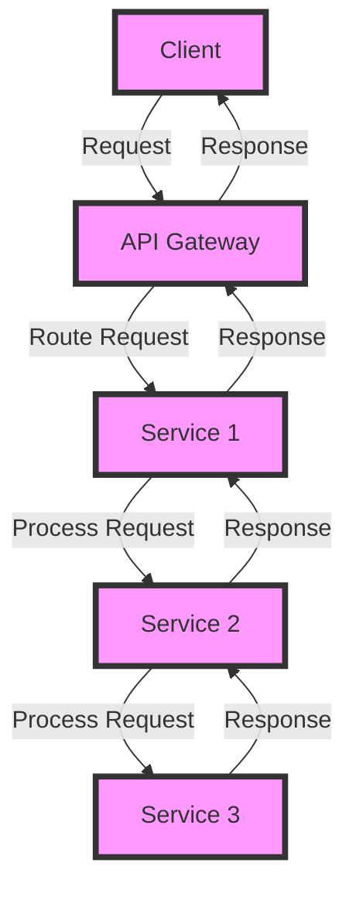

## Introduction
Microservices with Spring Boot is an architectural approach that allows developers to build and deploy independent, modular services that communicate with each other to form a complete application. This approach has gained popularity in recent years due to its ability to improve scalability, flexibility, and maintainability of complex systems. In this section, we will explore the concept of microservices, why they matter, and their real-world relevance.

> **Note:** Microservices are not a new concept, but the use of Spring Boot has made it easier to develop and deploy microservices-based applications.

Microservices are designed to solve the problem of monolithic architecture, where a single, large application is responsible for handling all the business logic. This approach can lead to tight coupling, making it difficult to modify or scale individual components. By breaking down the application into smaller, independent services, microservices provide a more flexible and scalable approach to software development.

Real-world relevance of microservices can be seen in companies like Netflix, Amazon, and eBay, which have adopted this approach to build and deploy their applications. For example, Netflix uses microservices to provide personalized recommendations to its users, while Amazon uses microservices to manage its inventory and order processing systems.

## Core Concepts
To understand microservices with Spring Boot, it is essential to grasp the core concepts of this approach. These include:

* **Service**: A service is a self-contained module that provides a specific business capability. Services are designed to be independent and can be developed, tested, and deployed separately.
* **API Gateway**: An API gateway acts as an entry point for clients to access the microservices. It provides a single interface for clients to interact with the application and routes requests to the appropriate services.
* **Service Registry**: A service registry is a component that keeps track of all the available services and their instances. It provides a way for services to register and deregister themselves, and for clients to discover available services.
* **Communication**: Communication between services can be synchronous or asynchronous. Synchronous communication involves direct requests and responses between services, while asynchronous communication involves the use of message queues or event-driven architecture.

> **Warning:** One of the common pitfalls of microservices is the complexity of communication between services. It is essential to choose the right communication approach based on the requirements of the application.

## How It Works Internally
To understand how microservices with Spring Boot work internally, let's take a look at the following step-by-step process:

1. **Service Development**: Each service is developed as a separate Spring Boot application.
2. **Service Registration**: Each service registers itself with the service registry.
3. **Client Request**: A client sends a request to the API gateway.
4. **API Gateway Routing**: The API gateway routes the request to the appropriate service.
5. **Service Response**: The service processes the request and sends a response back to the API gateway.
6. **API Gateway Response**: The API gateway sends the response back to the client.

> **Tip:** To improve the scalability of microservices, it is essential to use a load balancer to distribute incoming traffic across multiple instances of each service.

## Code Examples
Here are three complete and runnable examples of microservices with Spring Boot:

### Example 1: Basic Service
```java
// Service.java
@Service
public class UserService {
    
    @Autowired
    private UserRepository userRepository;
    
    public User getUser(String userId) {
        return userRepository.findById(userId).orElseThrow();
    }
}

// UserController.java
@RestController
@RequestMapping("/users")
public class UserController {
    
    @Autowired
    private UserService userService;
    
    @GetMapping("/{userId}")
    public User getUser(@PathVariable String userId) {
        return userService.getUser(userId);
    }
}
```

### Example 2: Real-World Pattern
```java
// OrderService.java
@Service
public class OrderService {
    
    @Autowired
    private OrderRepository orderRepository;
    
    @Autowired
    private InventoryService inventoryService;
    
    public Order createOrder(Order order) {
        // Check inventory
        if (!inventoryService.checkInventory(order.getProductId())) {
            throw new InsufficientInventoryException();
        }
        
        // Create order
        Order savedOrder = orderRepository.save(order);
        
        // Update inventory
        inventoryService.updateInventory(order.getProductId(), order.getQuantity());
        
        return savedOrder;
    }
}

// InventoryService.java
@Service
public class InventoryService {
    
    @Autowired
    private InventoryRepository inventoryRepository;
    
    public boolean checkInventory(String productId) {
        // Check inventory
        return inventoryRepository.findByProductId(productId).getQuantity() > 0;
    }
    
    public void updateInventory(String productId, int quantity) {
        // Update inventory
        inventoryRepository.findByProductId(productId).setQuantity(inventoryRepository.findByProductId(productId).getQuantity() - quantity);
    }
}
```

### Example 3: Advanced Usage
```java
// PaymentService.java
@Service
public class PaymentService {
    
    @Autowired
    private PaymentGateway paymentGateway;
    
    public PaymentResponse processPayment(PaymentRequest paymentRequest) {
        // Process payment
        PaymentResponse paymentResponse = paymentGateway.processPayment(paymentRequest);
        
        // Update order status
        Order order = orderRepository.findById(paymentRequest.getOrderId()).orElseThrow();
        order.setStatus(OrderStatus.PAID);
        orderRepository.save(order);
        
        return paymentResponse;
    }
}
```

## Visual Diagram

The above diagram illustrates the flow of a request through the API gateway and multiple services.

> **Note:** The diagram shows a simple example of a request flowing through multiple services. In a real-world application, the flow can be more complex and involve multiple services, databases, and external systems.

## Comparison
| Approach | Time Complexity | Space Complexity | Pros | Cons | Best For |
| --- | --- | --- | --- | --- | --- |
| Monolithic Architecture | O(1) | O(1) | Simple, easy to develop and deploy | Tight coupling, difficult to scale | Small applications, prototyping |
| Microservices Architecture | O(n) | O(n) | Scalable, flexible, easy to maintain | Complex, difficult to develop and deploy | Large applications, complex systems |
| Service-Oriented Architecture | O(n) | O(n) | Scalable, flexible, easy to maintain | Complex, difficult to develop and deploy | Large applications, complex systems |
| Event-Driven Architecture | O(n) | O(n) | Scalable, flexible, easy to maintain | Complex, difficult to develop and deploy | Real-time systems, streaming data |

## Real-world Use Cases
Here are three real-world use cases of microservices with Spring Boot:

1. **Netflix**: Netflix uses microservices to provide personalized recommendations to its users. Each microservice is responsible for a specific business capability, such as user profiling, content recommendation, and rating prediction.
2. **Amazon**: Amazon uses microservices to manage its inventory and order processing systems. Each microservice is responsible for a specific business capability, such as inventory management, order processing, and shipping.
3. **eBay**: eBay uses microservices to provide a scalable and flexible e-commerce platform. Each microservice is responsible for a specific business capability, such as user authentication, product catalog, and payment processing.

## Common Pitfalls
Here are four common pitfalls of microservices with Spring Boot:

1. **Tight Coupling**: One of the common pitfalls of microservices is tight coupling between services. This can lead to a monolithic architecture, where changes to one service affect multiple services.
2. **Complex Communication**: Another common pitfall of microservices is complex communication between services. This can lead to errors, delays, and increased latency.
3. **Insufficient Monitoring**: Insufficient monitoring is another common pitfall of microservices. This can lead to errors, delays, and increased latency, as well as difficulty in debugging and troubleshooting.
4. **Inadequate Security**: Inadequate security is another common pitfall of microservices. This can lead to security breaches, data loss, and reputational damage.

> **Warning:** To avoid these pitfalls, it is essential to follow best practices, such as loose coupling, simple communication, sufficient monitoring, and adequate security.

## Interview Tips
Here are three common interview questions on microservices with Spring Boot, along with weak and strong answers:

1. **What is microservices architecture?**
	* Weak answer: Microservices architecture is a way of building applications as a collection of small, independent services.
	* Strong answer: Microservices architecture is a way of building applications as a collection of small, independent services, each responsible for a specific business capability, and communicating with each other through APIs or message queues.
2. **How do you implement microservices with Spring Boot?**
	* Weak answer: I implement microservices with Spring Boot by creating a separate Spring Boot application for each service, and using APIs or message queues to communicate between services.
	* Strong answer: I implement microservices with Spring Boot by creating a separate Spring Boot application for each service, using APIs or message queues to communicate between services, and following best practices such as loose coupling, simple communication, sufficient monitoring, and adequate security.
3. **What are the benefits of microservices architecture?**
	* Weak answer: The benefits of microservices architecture include scalability, flexibility, and ease of maintenance.
	* Strong answer: The benefits of microservices architecture include scalability, flexibility, ease of maintenance, improved fault tolerance, and increased agility, as well as the ability to use different programming languages, frameworks, and databases for each service.

> **Interview:** When answering interview questions on microservices with Spring Boot, it is essential to demonstrate a deep understanding of the concepts, as well as the ability to implement and deploy microservices-based applications.

## Key Takeaways
Here are ten key takeaways on microservices with Spring Boot:

* **Microservices architecture is a way of building applications as a collection of small, independent services**.
* **Each service is responsible for a specific business capability**.
* **Services communicate with each other through APIs or message queues**.
* **Microservices architecture provides scalability, flexibility, and ease of maintenance**.
* **Microservices architecture requires loose coupling, simple communication, sufficient monitoring, and adequate security**.
* **Spring Boot provides a simple and efficient way to implement microservices**.
* **Spring Boot provides a range of features, including auto-configuration, annotation-based configuration, and built-in support for APIs and message queues**.
* **Microservices with Spring Boot require a deep understanding of the concepts, as well as the ability to implement and deploy microservices-based applications**.
* **Microservices with Spring Boot provide a range of benefits, including improved fault tolerance, increased agility, and the ability to use different programming languages, frameworks, and databases for each service**.
* **Microservices with Spring Boot require careful planning, design, and implementation to avoid common pitfalls, such as tight coupling, complex communication, insufficient monitoring, and inadequate security**.