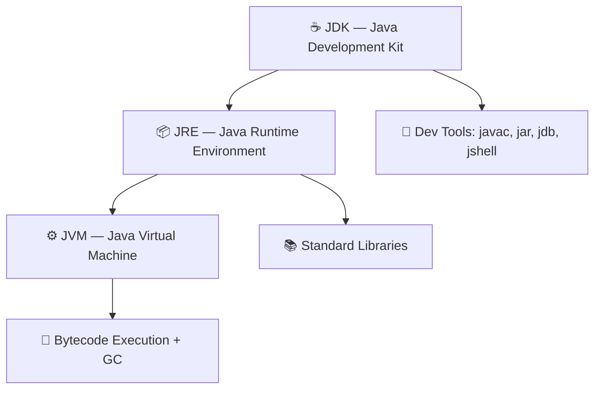

## Introduction

Understanding the difference between JDK, JRE, and JVM is foundational to every Java developer's knowledge. These three components form the Java platform stack — each serving a distinct purpose in the lifecycle of a Java application, from writing code to executing it.

> **Note:** Confusing these three is one of the most common mistakes for Java beginners. Getting this right will help you make better decisions about what to install and how Java actually runs your code.

## Core Concepts

### JVM — Java Virtual Machine

The JVM is the runtime engine that executes Java bytecode. It is **platform-specific** — there are different JVM implementations for Windows, macOS, and Linux — but the bytecode it runs is platform-independent. This is the foundation of Java's "Write Once, Run Anywhere" promise.

Key responsibilities of the JVM:
- **Class loading** — loads `.class` files into memory
- **Bytecode verification** — ensures code is safe to execute
- **Execution** — interprets or JIT-compiles bytecode to native machine code
- **Memory management** — Garbage Collection (GC), heap/stack management
- **Security** — sandboxing untrusted code

### JRE — Java Runtime Environment

The JRE = JVM + standard class libraries. It is everything you need to **run** a Java application, but not to develop one. End users who just want to run a `.jar` file install the JRE.

Components:
- JVM
- Core libraries (`java.lang`, `java.util`, `java.io`, etc.)
- Supporting files and configuration

> **Warning:** As of Java 11+, Oracle no longer ships a standalone JRE. You install the JDK and use `jlink` to create a minimal custom runtime if needed.

### JDK — Java Development Kit

The JDK = JRE + development tools. It is everything you need to **write, compile, and debug** Java applications.

Additional tools in the JDK:
- `javac` — the Java compiler (`.java` → `.class`)
- `javadoc` — documentation generator
- `jar` — archive tool
- `jdb` — debugger
- `jshell` — interactive REPL (Java 9+)
- `jlink` — custom runtime image builder (Java 9+)
- `jmap`, `jstack`, `jconsole` — profiling and monitoring tools

## Visual Hierarchy



## Comparison Table

| Feature | JVM | JRE | JDK |
|---------|-----|-----|-----|
| Run Java apps | ✅ | ✅ | ✅ |
| Compile Java code | ❌ | ❌ | ✅ |
| Includes `javac` | ❌ | ❌ | ✅ |
| Includes standard libs | ❌ | ✅ | ✅ |
| Platform-specific | ✅ | ✅ | ✅ |
| Who needs it | Runtime only | End users | Developers |

## Code Examples

### Example 1: Compiling and Running (JDK in action)

```bash
# Compile with javac (JDK tool)
javac HelloWorld.java

# Run with java (uses JVM via JRE)
java HelloWorld

# Check your JDK version
java -version
javac -version
```

### Example 2: JShell — Interactive REPL (Java 9+)

```bash
# Launch JShell (JDK tool)
jshell

# Inside JShell:
jshell> int x = 10;
jshell> System.out.println("Value: " + x * 2);
Value: 20
jshell> /exit
```

### Example 3: Creating a Minimal Runtime with jlink

```bash
# Create a custom JRE containing only the modules your app needs
jlink \
  --module-path $JAVA_HOME/jmods \
  --add-modules java.base,java.logging,java.sql \
  --output my-custom-jre \
  --compress=2 \
  --no-header-files \
  --no-man-pages

# Result: a ~30MB runtime instead of a full 200MB JDK
./my-custom-jre/bin/java -version
```

## Real-world Use Cases

- **CI/CD pipelines** — install the full JDK to compile and test; ship only a minimal runtime in Docker
- **Docker images** — use `eclipse-temurin:21-jdk` for build stage, `eclipse-temurin:21-jre` for runtime stage (multi-stage builds)
- **End-user installers** — bundle a JRE with your desktop app so users don't need to install Java separately
- **GraalVM Native Image** — compiles Java to a native binary, bypassing the JVM entirely at runtime

```dockerfile
# Multi-stage Docker build — JDK to compile, JRE to run
FROM eclipse-temurin:21-jdk AS builder
WORKDIR /app
COPY . .
RUN ./mvnw package -DskipTests

FROM eclipse-temurin:21-jre AS runtime
WORKDIR /app
COPY --from=builder /app/target/app.jar .
ENTRYPOINT ["java", "-jar", "app.jar"]
```

## Common Pitfalls & How to Avoid Them

- **Installing JRE for development** — you won't have `javac`. Always install the JDK for development work.
- **Multiple JDK versions** — use a version manager like `SDKMAN!` (`sdk install java 21-tem`) to switch between versions cleanly.
- **Forgetting `JAVA_HOME`** — many tools (Maven, Gradle, IDEs) rely on this env variable. Set it to your JDK installation path.
- **JVM ≠ JDK** — when someone says "install Java", they usually mean the JDK. The JVM alone is not enough to run most tooling.

```bash
# Set JAVA_HOME (add to ~/.bashrc or ~/.zshrc)
export JAVA_HOME=$(/usr/libexec/java_home -v 21)  # macOS
export PATH=$JAVA_HOME/bin:$PATH

# Verify
echo $JAVA_HOME
java -version
```

## Summary / Key Takeaways

- **JVM** executes bytecode — it's the engine, platform-specific but runs platform-independent code
- **JRE** = JVM + standard libraries — enough to run Java apps, not to build them
- **JDK** = JRE + dev tools (`javac`, `jshell`, `jlink`, etc.) — everything a developer needs
- Since Java 11, Oracle ships only the JDK; use `jlink` to create slim custom runtimes
- For Docker, use multi-stage builds: JDK to compile, JRE (or distroless) to run

> **Tip:** For modern Java development, always install the latest LTS JDK (currently Java 21). Use SDKMAN! to manage multiple versions side by side.
