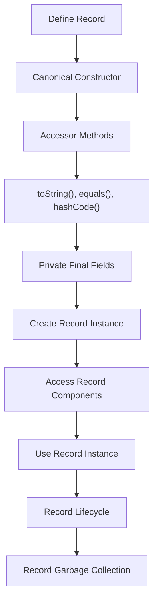

## Introduction
Java Records, introduced in Java 14, is a new feature that allows developers to create classes that mainly hold data in a more concise and expressive way. Records are a way to simplify the creation of classes that follow the **Immutable Data Object** pattern, which is a common pattern in object-oriented programming. With Records, you can create a class with a single line of code, which makes it easier to work with data in your Java applications. 
> **Note:** Java Records are a preview feature in Java 14 and 15, but they became a standard feature in Java 16.

In real-world applications, Records can be used to represent data that doesn't change once it's created, such as a **Point** in a 2D space or a **Person** with a name and an address. Records can also be used to simplify the creation of **Data Transfer Objects (DTOs)**, which are used to transfer data between different layers of an application.
> **Tip:** Records can help reduce boilerplate code and make your code more readable and maintainable.

## Core Concepts
A Record is a special type of class that is defined using the **record** keyword. A Record can have a canonical constructor, which is a constructor that takes all the components of the Record as parameters, and it can also have additional constructors, which are called secondary constructors. 
> **Warning:** Records are immutable by default, which means that once a Record is created, its state cannot be changed.

Here are some key terminology related to Records:
* **Components**: The components of a Record are the values that make up the Record. For example, in a **Point** Record, the components are the **x** and **y** coordinates.
* **Canonical Constructor**: The canonical constructor is a constructor that takes all the components of the Record as parameters.
* **Secondary Constructor**: A secondary constructor is a constructor that calls the canonical constructor.
* **Accessor Methods**: Accessor methods are methods that allow you to access the components of a Record. For example, in a **Point** Record, the accessor methods are **x()** and **y()**.

## How It Works Internally
When you create a Record, the Java compiler generates several things for you:
* A **canonical constructor**, which is a constructor that takes all the components of the Record as parameters.
* **Accessor methods**, which are methods that allow you to access the components of the Record.
* **toString()**, **equals()**, and **hashCode()** methods, which are implemented based on the components of the Record.
* A **private final** field for each component of the Record.

Here's a step-by-step breakdown of how the Java compiler generates these things:
1. The Java compiler generates a **canonical constructor** that takes all the components of the Record as parameters.
2. The Java compiler generates **accessor methods** for each component of the Record.
3. The Java compiler generates **toString()**, **equals()**, and **hashCode()** methods based on the components of the Record.
4. The Java compiler generates a **private final** field for each component of the Record.

## Code Examples
Here are three complete and runnable examples of using Records in Java:

### Example 1: Basic Record
```java
// Define a Record called Point
record Point(int x, int y) {}

public class Main {
    public static void main(String[] args) {
        // Create a new Point Record
        Point point = new Point(1, 2);
        
        // Access the components of the Record
        System.out.println(point.x());  // prints 1
        System.out.println(point.y());  // prints 2
    }
}
```

### Example 2: Record with Secondary Constructor
```java
// Define a Record called Point
record Point(int x, int y) {
    // Secondary constructor that calls the canonical constructor
    public Point() {
        this(0, 0);
    }
}

public class Main {
    public static void main(String[] args) {
        // Create a new Point Record using the secondary constructor
        Point point = new Point();
        
        // Access the components of the Record
        System.out.println(point.x());  // prints 0
        System.out.println(point.y());  // prints 0
    }
}
```

### Example 3: Record with Methods
```java
// Define a Record called Point
record Point(int x, int y) {
    // Method that calculates the distance from the origin
    public double distanceFromOrigin() {
        return Math.sqrt(x * x + y * y);
    }
}

public class Main {
    public static void main(String[] args) {
        // Create a new Point Record
        Point point = new Point(3, 4);
        
        // Calculate the distance from the origin
        System.out.println(point.distanceFromOrigin());  // prints 5.0
    }
}
```

## Visual Diagram

The diagram shows the lifecycle of a Record, from definition to garbage collection.

## Comparison
Here's a comparison of Records with other types of classes in Java:

| Approach | Time Complexity | Space Complexity | Pros | Cons | Best For |
|----------|----------------|-----------------|------|------|----------|
| Records | O(1) | O(1) | Concise, expressive, immutable | Limited flexibility | Immutable data objects |
| Classes | O(n) | O(n) | Flexible, customizable | Verbose, error-prone | Mutable data objects |
| Enums | O(1) | O(1) | Type-safe, concise | Limited flexibility | Enumerated values |
| Structs | O(1) | O(1) | Concise, efficient | Limited flexibility, not available in Java | Structured data |

## Real-world Use Cases
Here are three real-world use cases for Records:

1. **Data Transfer Objects (DTOs)**: Records can be used to simplify the creation of DTOs, which are used to transfer data between different layers of an application.
2. **Immutable Data Objects**: Records can be used to represent data that doesn't change once it's created, such as a **Point** in a 2D space or a **Person** with a name and an address.
3. **API Responses**: Records can be used to represent API responses, which are often immutable and have a fixed structure.

## Common Pitfalls
Here are four common pitfalls to watch out for when using Records:

1. **Mutable Components**: Records are immutable by default, but you can still define mutable components, such as **ArrayList** or **HashMap**. This can lead to unexpected behavior and bugs.
2. **Inconsistent State**: Records can have inconsistent state if the components are not properly initialized or if the state is modified after creation.
3. **Lack of Validation**: Records do not have built-in validation, so you need to validate the components manually to ensure that they are valid and consistent.
4. **Inheritance**: Records cannot extend other classes, so you need to use composition instead of inheritance to create complex Records.

## Interview Tips
Here are three common interview questions related to Records:

1. **What is a Record in Java?**: A Record is a special type of class that is defined using the **record** keyword. It is a concise and expressive way to create immutable data objects.
2. **How do Records differ from Classes?**: Records are immutable by default, while classes are mutable. Records also have a canonical constructor and accessor methods generated by the compiler.
3. **When would you use a Record instead of a Class?**: You would use a Record when you need to create an immutable data object with a fixed structure. Records are ideal for representing data that doesn't change once it's created.

## Key Takeaways
Here are ten key takeaways to remember about Records:

* Records are a new feature in Java 14 and later versions.
* Records are immutable by default.
* Records have a canonical constructor and accessor methods generated by the compiler.
* Records are concise and expressive, making them ideal for creating immutable data objects.
* Records can have secondary constructors and methods.
* Records are not suitable for mutable data objects.
* Records are not suitable for inheritance.
* Records are ideal for representing data that doesn't change once it's created.
* Records are ideal for creating Data Transfer Objects (DTOs) and API responses.
* Records are a powerful tool for simplifying code and improving readability.