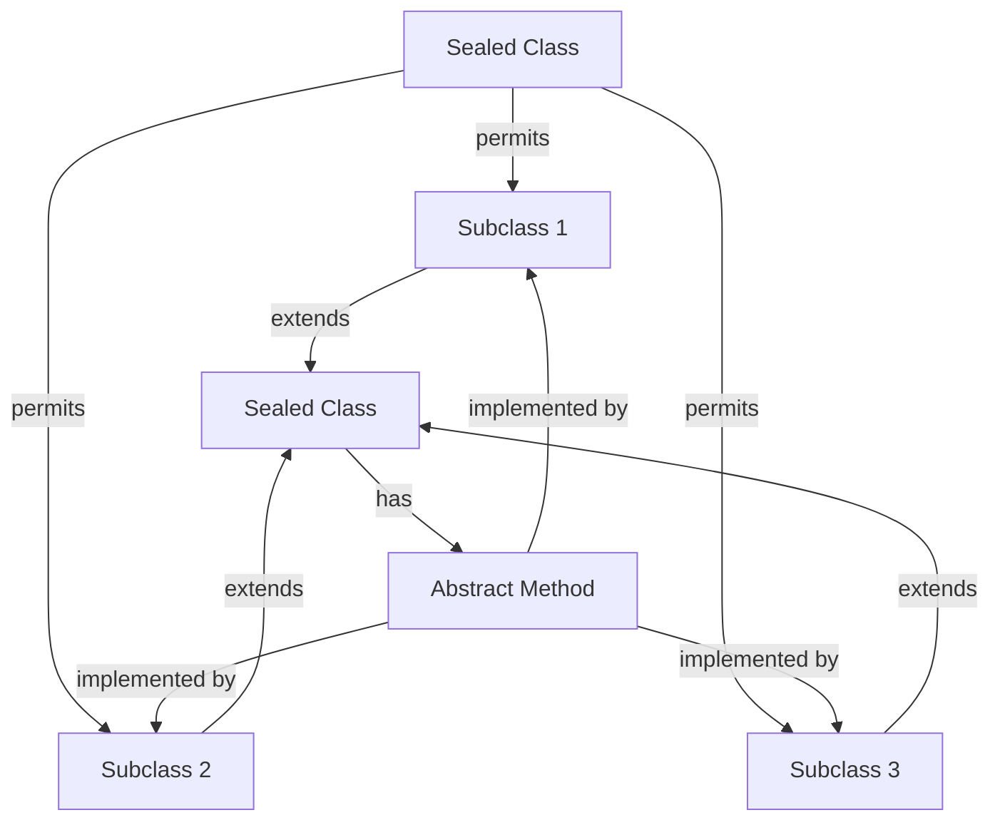

## Introduction
Java 17+ **Sealed Classes** are a feature introduced in Java 15 as a preview and became a standard feature in Java 17. They are used to restrict which classes can extend or implement a sealed class or interface. This feature is useful for modeling a fixed set of subclasses, making the code more expressive, and preventing unintended subclassing. In this article, we will explore sealed classes in depth, including their syntax, usage, and best practices.

> **Note:** Sealed classes are a powerful tool for writing more expressive and maintainable code. They help to ensure that only intended subclasses are created, reducing the risk of errors and improving code readability.

## Core Concepts
A sealed class is a class that can be extended only by its direct subclasses, which are declared in the same file or in a separate file using the `permits` keyword. The subclasses can be either `final`, `sealed`, or `non-sealed`. A `final` subclass cannot be extended further, while a `sealed` subclass can be extended only by its direct subclasses, which are declared in the same file or in a separate file using the `permits` keyword. A `non-sealed` subclass can be extended by any class.

The key terminology related to sealed classes includes:
- **Sealed class**: A class that can be extended only by its direct subclasses.
- **Subclass**: A class that extends a sealed class.
- **Permits**: A keyword used to declare the subclasses of a sealed class.
- **Final subclass**: A subclass that cannot be extended further.
- **Non-sealed subclass**: A subclass that can be extended by any class.

> **Tip:** Sealed classes can be used to model a fixed set of subclasses, making the code more expressive and maintainable.

## How It Works Internally
When a sealed class is compiled, the Java compiler checks that all its subclasses are declared in the same file or in a separate file using the `permits` keyword. If a subclass is not declared in the same file or in a separate file using the `permits` keyword, the compiler will throw an error.

The step-by-step process of how sealed classes work internally is as follows:
1. The Java compiler checks the declaration of the sealed class and its subclasses.
2. The compiler verifies that all subclasses are declared in the same file or in a separate file using the `permits` keyword.
3. If a subclass is not declared in the same file or in a separate file using the `permits` keyword, the compiler throws an error.
4. If all subclasses are declared correctly, the compiler generates the bytecode for the sealed class and its subclasses.

> **Warning:** Sealed classes can lead to more verbose code if not used carefully, as they require explicit declaration of all subclasses.

## Code Examples
### Example 1: Basic Sealed Class
```java
// Declare a sealed class
public sealed class Vehicle permits Car, Truck {
    public void print() {
        System.out.println("Vehicle");
    }
}

// Declare a subclass of the sealed class
public final class Car extends Vehicle {
    public void print() {
        System.out.println("Car");
    }
}

// Declare another subclass of the sealed class
public non-sealed class Truck extends Vehicle {
    public void print() {
        System.out.println("Truck");
    }
}
```
This example demonstrates the basic syntax of a sealed class and its subclasses.

### Example 2: Advanced Sealed Class
```java
// Declare a sealed class
public sealed class Shape permits Circle, Rectangle {
    public abstract void print();
}

// Declare a subclass of the sealed class
public final class Circle extends Shape {
    private double radius;

    public Circle(double radius) {
        this.radius = radius;
    }

    @Override
    public void print() {
        System.out.println("Circle with radius " + radius);
    }
}

// Declare another subclass of the sealed class
public non-sealed class Rectangle extends Shape {
    private double width;
    private double height;

    public Rectangle(double width, double height) {
        this.width = width;
        this.height = height;
    }

    @Override
    public void print() {
        System.out.println("Rectangle with width " + width + " and height " + height);
    }
}
```
This example demonstrates the use of sealed classes to model a fixed set of subclasses with abstract methods.

### Example 3: Sealed Class with Multiple Subclasses
```java
// Declare a sealed class
public sealed class Color permits Red, Green, Blue {
    public abstract void print();
}

// Declare a subclass of the sealed class
public final class Red extends Color {
    @Override
    public void print() {
        System.out.println("Red");
    }
}

// Declare another subclass of the sealed class
public final class Green extends Color {
    @Override
    public void print() {
        System.out.println("Green");
    }
}

// Declare another subclass of the sealed class
public final class Blue extends Color {
    @Override
    public void print() {
        System.out.println("Blue");
    }
}
```
This example demonstrates the use of sealed classes to model a fixed set of subclasses with abstract methods.

> **Interview:** What is the purpose of sealed classes in Java, and how do they differ from final classes?

## Visual Diagram

This diagram illustrates the relationship between a sealed class and its subclasses.

## Comparison
| Approach | Time Complexity | Space Complexity | Pros | Cons | Best For |
|----------|----------------|-----------------|------|------|----------|
| Sealed Classes | O(1) | O(1) | Provides a fixed set of subclasses, making the code more expressive and maintainable | Can lead to more verbose code if not used carefully | Modeling a fixed set of subclasses with abstract methods |
| Final Classes | O(1) | O(1) | Provides a way to prevent subclassing, making the code more secure | Can limit the flexibility of the code | Preventing subclassing of a class |
| Abstract Classes | O(1) | O(1) | Provides a way to define abstract methods and state, making the code more expressive and maintainable | Can lead to more complex code if not used carefully | Defining abstract methods and state |
| Interfaces | O(1) | O(1) | Provides a way to define a contract, making the code more expressive and maintainable | Can lead to more complex code if not used carefully | Defining a contract |

> **Tip:** Sealed classes are best used when modeling a fixed set of subclasses with abstract methods.

## Real-world Use Cases
1. **Java API Design**: Sealed classes can be used to design Java APIs that provide a fixed set of subclasses with abstract methods.
2. **Game Development**: Sealed classes can be used to model game objects with a fixed set of subclasses, making the code more expressive and maintainable.
3. **Financial Modeling**: Sealed classes can be used to model financial instruments with a fixed set of subclasses, making the code more expressive and maintainable.

> **Warning:** Sealed classes can lead to more complex code if not used carefully, as they require explicit declaration of all subclasses.

## Common Pitfalls
1. **Incorrect Subclass Declaration**: Failing to declare a subclass in the same file or in a separate file using the `permits` keyword can lead to compiler errors.
2. **Overuse of Sealed Classes**: Using sealed classes excessively can lead to more verbose code and limit the flexibility of the code.
3. **Incorrect Use of Abstract Methods**: Failing to implement abstract methods in subclasses can lead to compiler errors.
4. **Overriding Final Methods**: Attempting to override final methods in subclasses can lead to compiler errors.

> **Interview:** What are some common pitfalls to avoid when using sealed classes in Java?

## Interview Tips
1. **Define Sealed Classes**: Be able to define sealed classes and explain their purpose in Java.
2. **Explain Subclass Declaration**: Be able to explain how to declare subclasses of sealed classes using the `permits` keyword.
3. **Discuss Abstract Methods**: Be able to discuss the use of abstract methods in sealed classes and how to implement them in subclasses.

> **Tip:** Be prepared to provide examples of how sealed classes can be used in real-world scenarios.

## Key Takeaways
* Sealed classes provide a fixed set of subclasses, making the code more expressive and maintainable.
* Sealed classes can be used to model a fixed set of subclasses with abstract methods.
* The `permits` keyword is used to declare subclasses of sealed classes.
* Sealed classes can lead to more verbose code if not used carefully.
* Sealed classes are best used when modeling a fixed set of subclasses with abstract methods.
* Sealed classes can be used in Java API design, game development, and financial modeling.
* Common pitfalls to avoid include incorrect subclass declaration, overuse of sealed classes, incorrect use of abstract methods, and overriding final methods.