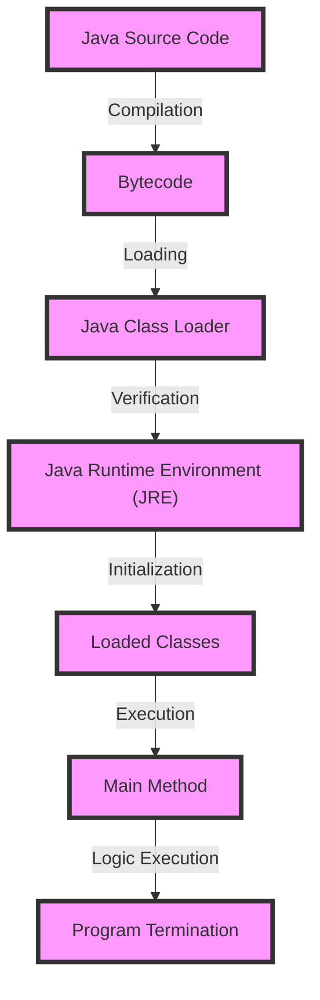

## Introduction
Java is a high-level, object-oriented programming language that has become a standard for developing large-scale applications. At the heart of Java programming lies the Java program structure, which comprises of packages, imports, classes, and the main method. Understanding this structure is crucial for any Java developer, as it provides the foundation for building robust, maintainable, and efficient applications. In this section, we will explore the importance of Java program structure, its real-world relevance, and why every engineer needs to know this.

Java program structure is essential because it allows developers to organize their code in a logical and modular way. This modularity enables code reuse, reduces complexity, and makes it easier to maintain large applications. Moreover, a well-structured Java program is easier to read, understand, and debug, which is critical for collaborative development and knowledge sharing.

## Core Concepts
To understand Java program structure, it is essential to grasp the core concepts of packages, imports, classes, and the main method.

*   **Packages**: A package is a collection of related classes and interfaces that are organized together to provide a specific functionality. Packages are used to avoid naming conflicts, group related classes, and provide access control.
*   **Imports**: An import statement is used to bring a package or a specific class into the current scope, allowing the developer to use its classes and interfaces without fully qualifying their names.
*   **Classes**: A class is the fundamental building block of a Java program, representing a blueprint for creating objects. Classes define the properties and behavior of an object, including its fields, methods, and constructors.
*   **Main Method**: The main method is the entry point of a Java application, where the program starts execution. It is the method that is called when the program is launched, and it is responsible for initiating the application's logic.

> **Tip:** When creating a new Java project, it is a good practice to organize your code into logical packages, each containing related classes and interfaces.

## How It Works Internally
When a Java program is executed, the following steps occur internally:

1.  **Compilation**: The Java compiler (javac) compiles the Java source code into bytecode, which is platform-independent.
2.  **Loading**: The Java class loader loads the compiled bytecode into memory.
3.  **Verification**: The Java runtime environment (JRE) verifies the loaded bytecode to ensure that it is correct and safe to execute.
4.  **Initialization**: The JRE initializes the loaded classes, which involves executing their static initializers.
5.  **Execution**: The JRE executes the main method, which starts the program's logic.

> **Note:** The Java class loader is responsible for loading classes into memory, and it follows a specific order: bootstrap classes, extension classes, and user-defined classes.

## Code Examples
Here are three complete and runnable code examples that demonstrate the Java program structure:

### Example 1: Basic Java Program
```java
// Define a package
package com.example.basic;

// Import the java.util package
import java.util.Scanner;

// Define a class
public class BasicProgram {
    // Define the main method
    public static void main(String[] args) {
        // Create a Scanner object
        Scanner scanner = new Scanner(System.in);

        // Prompt the user for their name
        System.out.print("Enter your name: ");
        String name = scanner.nextLine();

        // Print a greeting message
        System.out.println("Hello, " + name + "!");
    }
}
```

### Example 2: Java Program with Multiple Classes
```java
// Define a package
package com.example.multipleclasses;

// Import the java.util package
import java.util.Scanner;

// Define a class
public class MainClass {
    // Define the main method
    public static void main(String[] args) {
        // Create a Scanner object
        Scanner scanner = new Scanner(System.in);

        // Prompt the user for their name
        System.out.print("Enter your name: ");
        String name = scanner.nextLine();

        // Create an instance of the GreetingClass
        GreetingClass greetingClass = new GreetingClass(name);

        // Call the printGreeting method
        greetingClass.printGreeting();
    }
}

// Define another class
class GreetingClass {
    // Define a field
    private String name;

    // Define a constructor
    public GreetingClass(String name) {
        this.name = name;
    }

    // Define a method
    public void printGreeting() {
        System.out.println("Hello, " + name + "!");
    }
}
```

### Example 3: Java Program with Inheritance
```java
// Define a package
package com.example.inheritance;

// Import the java.util package
import java.util.Scanner;

// Define a class
public class MainClass {
    // Define the main method
    public static void main(String[] args) {
        // Create a Scanner object
        Scanner scanner = new Scanner(System.in);

        // Prompt the user for their name
        System.out.print("Enter your name: ");
        String name = scanner.nextLine();

        // Create an instance of the EmployeeClass
        EmployeeClass employeeClass = new EmployeeClass(name, "Software Engineer");

        // Call the printDetails method
        employeeClass.printDetails();
    }
}

// Define a superclass
class PersonClass {
    // Define a field
    private String name;

    // Define a constructor
    public PersonClass(String name) {
        this.name = name;
    }

    // Define a method
    public void printName() {
        System.out.println("Name: " + name);
    }
}

// Define a subclass
class EmployeeClass extends PersonClass {
    // Define a field
    private String position;

    // Define a constructor
    public EmployeeClass(String name, String position) {
        super(name);
        this.position = position;
    }

    // Define a method
    public void printDetails() {
        printName();
        System.out.println("Position: " + position);
    }
}
```

## Visual Diagram


The above diagram illustrates the internal workings of a Java program, from compilation to execution.

## Comparison
| Approach | Time Complexity | Space Complexity | Pros | Cons | Best For |
| --- | --- | --- | --- | --- | --- |
| **Single-Class Approach** | O(1) | O(1) | Simple, easy to implement | Limited scalability, tight coupling | Small-scale applications |
| **Multi-Class Approach** | O(n) | O(n) | Modular, scalable, maintainable | Complex, higher overhead | Large-scale applications |
| **Inheritance-Based Approach** | O(n) | O(n) | Promotes code reuse, reduces duplication | Tight coupling, fragile base class problem | Applications with complex hierarchies |
| **Composition-Based Approach** | O(n) | O(n) | Loose coupling, flexible, scalable | Higher overhead, complex implementation | Applications with dynamic relationships |

> **Warning:** Avoid using the single-class approach for large-scale applications, as it can lead to tight coupling and limited scalability.

## Real-world Use Cases
Here are three real-world examples of Java program structure in action:

1.  **Android Apps**: Android apps are built using Java, and they follow a specific program structure. Each app has a main activity that serves as the entry point, and it is responsible for initiating the app's logic.
2.  **Web Applications**: Java-based web applications, such as those built using Spring or Hibernate, follow a similar program structure. They have a main class that serves as the entry point, and it is responsible for initiating the application's logic.
3.  **Enterprise Software**: Large-scale enterprise software, such as those built using Java EE, follow a complex program structure. They have multiple classes, interfaces, and packages that work together to provide a specific functionality.

## Common Pitfalls
Here are four common mistakes that developers make when working with Java program structure:

1.  **Tight Coupling**: Developers often make the mistake of tightly coupling classes together, which can lead to limited scalability and maintainability.
2.  **God Object**: Developers sometimes create a god object that has too many responsibilities, which can lead to complexity and fragility.
3.  **Deep Inheritance Hierarchies**: Developers often create deep inheritance hierarchies, which can lead to tight coupling and the fragile base class problem.
4.  **Overuse of Static Methods**: Developers sometimes overuse static methods, which can lead to tight coupling and limited scalability.

> **Tip:** Use dependency injection to decouple classes and promote loose coupling.

## Interview Tips
Here are three common interview questions related to Java program structure, along with sample answers:

1.  **What is the difference between a class and an object?**
    *   Weak answer: "A class is a blueprint, and an object is an instance of the class."
    *   Strong answer: "A class is a template that defines the properties and behavior of an object, while an object is an instance of the class that has its own set of attributes and methods. Classes are used to define the structure and behavior of objects, and objects are used to represent real-world entities."
2.  **How do you organize your code in a large-scale Java application?**
    *   Weak answer: "I use packages and classes to organize my code."
    *   Strong answer: "I use a combination of packages, classes, and interfaces to organize my code. I also use design patterns and principles, such as the single responsibility principle and the open-closed principle, to ensure that my code is modular, scalable, and maintainable."
3.  **What is the purpose of the main method in a Java program?**
    *   Weak answer: "The main method is the entry point of the program."
    *   Strong answer: "The main method is the entry point of the program, and it is responsible for initiating the program's logic. It is the method that is called when the program is launched, and it is used to create objects, call methods, and perform other tasks that are necessary to execute the program."

> **Interview:** Be prepared to answer questions about your experience with Java program structure, and be sure to provide specific examples from your own projects or experiences.

## Key Takeaways
Here are ten key takeaways related to Java program structure:

*   **Use packages to organize related classes and interfaces**: Packages help to avoid naming conflicts and promote code reuse.
*   **Use imports to bring classes and interfaces into scope**: Imports allow you to use classes and interfaces without fully qualifying their names.
*   **Define classes to represent real-world entities**: Classes are the fundamental building blocks of a Java program, and they represent real-world entities, such as objects and concepts.
*   **Use the main method as the entry point of the program**: The main method is the entry point of the program, and it is responsible for initiating the program's logic.
*   **Follow design principles and patterns to ensure modularity and scalability**: Design principles, such as the single responsibility principle and the open-closed principle, help to ensure that your code is modular, scalable, and maintainable.
*   **Avoid tight coupling and promote loose coupling**: Tight coupling can lead to limited scalability and maintainability, while loose coupling promotes flexibility and scalability.
*   **Use dependency injection to decouple classes**: Dependency injection helps to decouple classes and promote loose coupling.
*   **Avoid deep inheritance hierarchies**: Deep inheritance hierarchies can lead to tight coupling and the fragile base class problem.
*   **Use composition instead of inheritance**: Composition promotes loose coupling and flexibility, while inheritance can lead to tight coupling and fragility.
*   **Follow best practices for coding and testing**: Following best practices for coding and testing helps to ensure that your code is reliable, maintainable, and efficient.