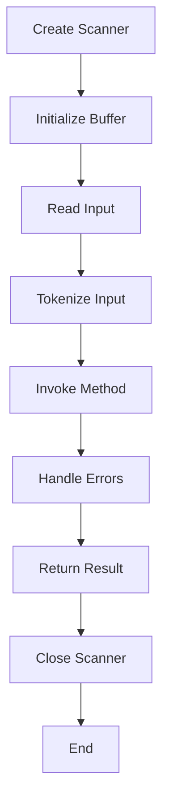

## Introduction
The **Scanner** class in Java is a fundamental component for reading input from various sources, such as the console, files, or network connections. It provides a simple and efficient way to parse and process input data, making it a crucial tool for building robust and interactive applications. In this section, we will delve into the world of Scanners, exploring their importance, real-world relevance, and why every Java developer should master this essential skill.
> **Note:** The Scanner class is a part of the **java.util** package and is widely used in Java programming.

## Core Concepts
To understand how Scanners work, we need to grasp the following core concepts:
* **Tokenization**: The process of breaking input data into individual tokens, such as words, numbers, or symbols.
* **Delimiter**: A character or sequence of characters that separates tokens.
* **Input source**: The source of the input data, such as the console, a file, or a network connection.
* **Scanner methods**: A set of methods provided by the Scanner class to read and parse input data, such as **next()**, **nextInt()**, and **nextDouble()**.
> **Tip:** Understanding the core concepts of Scanners is essential for building efficient and effective input processing systems.

## How It Works Internally
When we create a Scanner object, it is initialized with an input source, such as **System.in** for console input. The Scanner then uses a buffer to store the input data and provides methods to read and parse the data. Here is a step-by-step breakdown of how Scanners work internally:
1. **Buffering**: The Scanner reads input data from the source and stores it in a buffer.
2. **Tokenization**: The Scanner breaks the input data into individual tokens based on the delimiter.
3. **Method invocation**: The Scanner provides methods to read and parse the tokens, such as **next()** or **nextInt()**.
4. **Error handling**: The Scanner handles errors and exceptions, such as **InputMismatchException** or **NoSuchElementException**.
> **Warning:** Incorrect use of Scanners can lead to errors and exceptions, so it is essential to handle them properly.

## Code Examples
Here are three complete and runnable code examples that demonstrate the use of Scanners:
### Example 1: Basic Usage
```java
import java.util.Scanner;

public class ScannerExample {
    public static void main(String[] args) {
        Scanner scanner = new Scanner(System.in);
        System.out.println("Enter your name: ");
        String name = scanner.next();
        System.out.println("Hello, " + name);
        scanner.close();
    }
}
```
This example demonstrates the basic usage of Scanners to read input from the console.
### Example 2: Reading Numbers
```java
import java.util.Scanner;

public class ScannerExample {
    public static void main(String[] args) {
        Scanner scanner = new Scanner(System.in);
        System.out.println("Enter a number: ");
        int number = scanner.nextInt();
        System.out.println("You entered: " + number);
        scanner.close();
    }
}
```
This example shows how to use Scanners to read numbers from the console.
### Example 3: Reading Lines
```java
import java.util.Scanner;

public class ScannerExample {
    public static void main(String[] args) {
        Scanner scanner = new Scanner(System.in);
        System.out.println("Enter a line of text: ");
        String line = scanner.nextLine();
        System.out.println("You entered: " + line);
        scanner.close();
    }
}
```
This example demonstrates how to use Scanners to read lines of text from the console.
> **Interview:** Can you explain the difference between **next()** and **nextLine()** in Scanners?

## Visual Diagram

This diagram illustrates the internal workflow of Scanners, from creation to closure.
> **Note:** Understanding the internal workflow of Scanners is essential for building efficient and effective input processing systems.

## Comparison
Here is a comparison table that highlights the differences between various input processing methods:
| Method | Time Complexity | Space Complexity | Pros | Cons |
| --- | --- | --- | --- | --- |
| Scanner | O(n) | O(n) | Easy to use, flexible | Limited control over input |
| BufferedReader | O(n) | O(n) | Fast, efficient | More complex to use |
| DataInputStream | O(n) | O(n) | Fast, efficient | Limited to binary data |
| InputStreamReader | O(n) | O(n) | Fast, efficient | Limited to character data |
> **Tip:** Choosing the right input processing method depends on the specific requirements of your application.

## Real-world Use Cases
Here are three real-world use cases that demonstrate the importance of Scanners:
* **Console applications**: Scanners are widely used in console applications to read input from users.
* **File processing**: Scanners can be used to read and process data from files.
* **Network programming**: Scanners can be used to read and process data from network connections.
> **Note:** Scanners are a fundamental component of many real-world applications, including console applications, file processing systems, and network programming.

## Common Pitfalls
Here are four common pitfalls to avoid when using Scanners:
* **InputMismatchException**: This exception occurs when the input data does not match the expected type.
* **NoSuchElementException**: This exception occurs when there is no more input data to read.
* **Resource leak**: Failing to close the Scanner can lead to resource leaks.
* **Incorrect delimiter**: Using the wrong delimiter can lead to incorrect tokenization.
> **Warning:** Avoiding these pitfalls is essential for building robust and efficient input processing systems.

## Interview Tips
Here are three common interview questions related to Scanners:
* **What is the difference between next() and nextLine()?**: The correct answer should explain the difference between the two methods and provide examples.
* **How do you handle InputMismatchException?**: The correct answer should explain how to handle this exception and provide code examples.
* **What is the purpose of the Scanner class?**: The correct answer should explain the purpose of the Scanner class and provide examples of its use.
> **Interview:** Can you explain how to use Scanners to read input from a file?

## Key Takeaways
Here are ten key takeaways to remember:
* **Scanners are a fundamental component of Java programming**: Scanners provide a simple and efficient way to read and process input data.
* **Understanding core concepts is essential**: Understanding tokenization, delimiters, and input sources is crucial for building efficient input processing systems.
* **Scanners have a internal workflow**: Scanners follow a specific workflow, from creation to closure.
* **Choosing the right input processing method is important**: The choice of input processing method depends on the specific requirements of the application.
* **Avoiding common pitfalls is essential**: Avoiding InputMismatchException, NoSuchElementException, resource leaks, and incorrect delimiters is crucial for building robust input processing systems.
* **Scanners are widely used in real-world applications**: Scanners are used in console applications, file processing systems, and network programming.
* **The Scanner class provides various methods**: The Scanner class provides methods such as next(), nextInt(), and nextLine() to read and process input data.
* **Handling errors is important**: Handling errors and exceptions, such as InputMismatchException, is essential for building robust input processing systems.
* **Closing the Scanner is essential**: Closing the Scanner is essential to avoid resource leaks.
* **Practicing with code examples is essential**: Practicing with code examples is essential to master the use of Scanners.