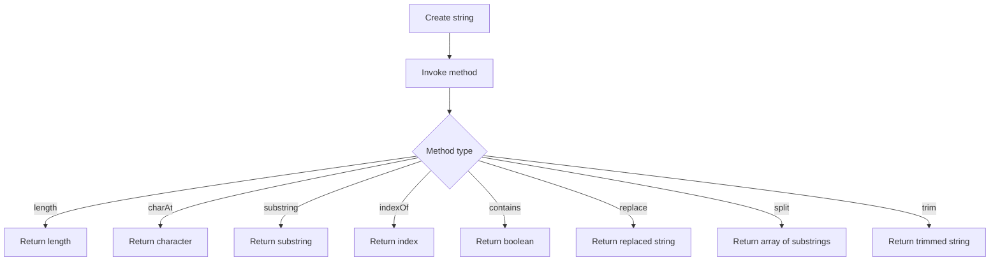

## Introduction
String methods are a crucial part of any programming language, and Java is no exception. Java provides a wide range of string methods that can be used to manipulate and process strings. In this section, we will explore the most commonly used string methods in Java, including `length`, `charAt`, `substring`, `indexOf`, `contains`, `replace`, `split`, and `trim`. These methods are used in various real-world applications, such as text processing, data validation, and string manipulation.

> **Note:** Understanding string methods is essential for any Java developer, as they are used extensively in various applications, including web development, mobile app development, and desktop applications.

## Core Concepts
Before we dive into the details of each string method, let's define some core concepts:

* **String:** A sequence of characters, such as "hello" or "java".
* **Index:** A position in a string, starting from 0. For example, the index of the first character in the string "hello" is 0.
* **Substring:** A part of a string, starting from a specified index and ending at another specified index.

Some key terminology to keep in mind:

* **Length:** The number of characters in a string.
* **Character:** A single unit of text, such as a letter or a symbol.

## How It Works Internally
When you create a string in Java, it is stored in memory as a sequence of characters. Each character is represented by a Unicode code point, which is a unique number that identifies the character.

Here is a step-by-step breakdown of how string methods work internally:

1. **String creation:** When you create a string, Java allocates memory for the string and stores the characters in memory.
2. **Method invocation:** When you invoke a string method, such as `length()` or `charAt()`, Java calls the corresponding method implementation.
3. **Method implementation:** The method implementation performs the necessary operations, such as returning the length of the string or the character at a specified index.

> **Warning:** Be careful when using string methods, as they can throw exceptions if the input is invalid. For example, if you try to access a character at an index that is out of bounds, Java will throw a `StringIndexOutOfBoundsException`.

## Code Examples
Here are three complete and runnable code examples that demonstrate the use of string methods:

### Example 1: Basic usage
```java
public class StringMethodsExample {
    public static void main(String[] args) {
        String str = "hello";
        System.out.println("Length: " + str.length());
        System.out.println("Char at index 0: " + str.charAt(0));
        System.out.println("Substring from index 1 to 3: " + str.substring(1, 3));
    }
}
```
This example demonstrates the use of the `length()`, `charAt()`, and `substring()` methods.

### Example 2: Real-world pattern
```java
public class StringMethodsExample {
    public static void main(String[] args) {
        String str = "hello world";
        int index = str.indexOf("world");
        if (index != -1) {
            System.out.println("Found 'world' at index " + index);
        } else {
            System.out.println("Did not find 'world'");
        }
    }
}
```
This example demonstrates the use of the `indexOf()` method to search for a substring in a string.

### Example 3: Advanced usage
```java
public class StringMethodsExample {
    public static void main(String[] args) {
        String str = "hello world";
        String[] words = str.split(" ");
        for (String word : words) {
            System.out.println(word);
        }
    }
}
```
This example demonstrates the use of the `split()` method to split a string into an array of substrings.

> **Tip:** Use the `trim()` method to remove whitespace from the beginning and end of a string.

## Visual Diagram

This diagram illustrates the different string methods and their return types.

## Comparison
Here is a comparison table of the different string methods:

| Method | Time Complexity | Space Complexity | Pros | Cons |
| --- | --- | --- | --- | --- |
| length() | O(1) | O(1) | Returns the length of the string | None |
| charAt() | O(1) | O(1) | Returns the character at a specified index | Throws exception if index is out of bounds |
| substring() | O(n) | O(n) | Returns a substring of the original string | Throws exception if index is out of bounds |
| indexOf() | O(n) | O(1) | Returns the index of a substring in the original string | Returns -1 if substring is not found |
| contains() | O(n) | O(1) | Returns a boolean indicating whether a substring is contained in the original string | None |
| replace() | O(n) | O(n) | Returns a new string with all occurrences of a substring replaced | None |
| split() | O(n) | O(n) | Returns an array of substrings split by a specified delimiter | None |
| trim() | O(n) | O(1) | Returns a new string with whitespace removed from the beginning and end | None |

> **Interview:** Be prepared to answer questions about the time and space complexity of different string methods.

## Real-world Use Cases
Here are three real-world use cases for string methods:

1. **Text processing:** String methods are used extensively in text processing applications, such as word processors and text editors.
2. **Data validation:** String methods are used to validate user input data, such as checking for invalid characters or formatting.
3. **Web development:** String methods are used in web development to manipulate and process strings, such as extracting data from HTML pages.

Companies that use string methods include:

* Google (search engine)
* Microsoft (Office suite)
* Facebook (social media platform)

## Common Pitfalls
Here are four common pitfalls to watch out for when using string methods:

1. **Index out of bounds:** Be careful when using the `charAt()` or `substring()` methods, as they can throw exceptions if the index is out of bounds.
2. **Null pointer exception:** Be careful when using string methods on null strings, as they can throw null pointer exceptions.
3. **Incorrect usage:** Be careful when using string methods, as incorrect usage can lead to unexpected results or exceptions.
4. **Performance issues:** Be careful when using string methods that have high time or space complexity, as they can lead to performance issues.

> **Warning:** Always check for null strings before using string methods.

## Interview Tips
Here are three common interview questions related to string methods:

1. **What is the time complexity of the `indexOf()` method?**
	* Weak answer: "I'm not sure."
	* Strong answer: "The time complexity of the `indexOf()` method is O(n), where n is the length of the string."
2. **How do you split a string into an array of substrings?**
	* Weak answer: "I'm not sure."
	* Strong answer: "You can use the `split()` method to split a string into an array of substrings."
3. **What is the difference between the `contains()` and `indexOf()` methods?**
	* Weak answer: "I'm not sure."
	* Strong answer: "The `contains()` method returns a boolean indicating whether a substring is contained in the original string, while the `indexOf()` method returns the index of the substring in the original string."

> **Tip:** Practice answering interview questions related to string methods to improve your chances of getting hired.

## Key Takeaways
Here are ten key takeaways to remember:

* **Length:** The `length()` method returns the length of a string.
* **Char at index:** The `charAt()` method returns the character at a specified index in a string.
* **Substring:** The `substring()` method returns a substring of the original string.
* **Index of:** The `indexOf()` method returns the index of a substring in the original string.
* **Contains:** The `contains()` method returns a boolean indicating whether a substring is contained in the original string.
* **Replace:** The `replace()` method returns a new string with all occurrences of a substring replaced.
* **Split:** The `split()` method returns an array of substrings split by a specified delimiter.
* **Trim:** The `trim()` method returns a new string with whitespace removed from the beginning and end.
* **Time complexity:** The time complexity of string methods can vary, but most have a time complexity of O(n), where n is the length of the string.
* **Space complexity:** The space complexity of string methods can vary, but most have a space complexity of O(n), where n is the length of the string.

> **Note:** Understanding string methods is essential for any Java developer, as they are used extensively in various applications.