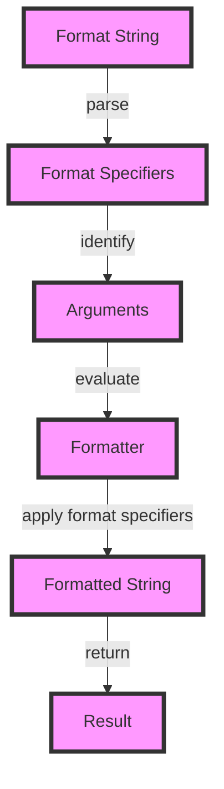

## Introduction
**String formatting** is a crucial aspect of programming in Java, allowing developers to create human-readable and well-structured output. The `String.format()` and `printf()` methods are two of the most commonly used string formatting techniques in Java. These methods enable developers to insert values into a string template, making it easier to create dynamic and informative output. In this section, we will explore the basics of string formatting, its importance, and its real-world applications.

String formatting is essential in various scenarios, such as logging, reporting, and user interface development. It helps to create a clear and concise representation of data, making it easier for users to understand and analyze the information. For instance, in a banking application, string formatting can be used to generate account statements, where the account balance, transaction history, and other relevant details are inserted into a predefined template.

> **Note:** String formatting is not limited to Java; it is a fundamental concept in programming, and most programming languages provide their own string formatting mechanisms.

## Core Concepts
To understand string formatting in Java, it is essential to grasp the following core concepts:

* **Format specifiers**: These are special characters or symbols that define the format of the output. For example, `%d` is used to format decimal integers, while `%f` is used to format floating-point numbers.
* **Format strings**: These are the templates that contain the format specifiers. The format string is used to define the structure of the output.
* **Arguments**: These are the values that are inserted into the format string. The arguments can be variables, literals, or expressions.

Some common format specifiers in Java include:

* `%d`: decimal integer
* `%f`: floating-point number
* `%s`: string
* `%c`: character
* `%b`: boolean

> **Tip:** It is essential to choose the correct format specifier to ensure that the output is accurate and meaningful.

## How It Works Internally
The `String.format()` method works by parsing the format string and replacing the format specifiers with the corresponding arguments. The method uses a **Formatter** object to perform the formatting. The **Formatter** object is responsible for parsing the format string and applying the format specifiers to the arguments.

Here is a step-by-step breakdown of how the `String.format()` method works:

1. The format string is parsed, and the format specifiers are identified.
2. The arguments are evaluated, and their values are obtained.
3. The **Formatter** object applies the format specifiers to the arguments, replacing the format specifiers with the formatted values.
4. The formatted string is returned as the result.

The `printf()` method, on the other hand, uses the `PrintStream` class to perform the formatting. The `PrintStream` class provides a `printf()` method that takes a format string and arguments as input.

> **Warning:** The `printf()` method can throw a `java.util.IllegalFormatConversionException` if the format specifier is incompatible with the argument type.

## Code Examples
Here are three complete and runnable code examples that demonstrate the use of `String.format()` and `printf()`:

### Example 1: Basic Usage
```java
public class StringFormattingExample {
    public static void main(String[] args) {
        String name = "John Doe";
        int age = 30;
        String formattedString = String.format("My name is %s, and I am %d years old.", name, age);
        System.out.println(formattedString);
    }
}
```

### Example 2: Real-World Pattern
```java
public class BankStatement {
    public static void main(String[] args) {
        String accountNumber = "1234567890";
        double balance = 1000.50;
        String statement = String.format("Account Number: %s\nBalance: $%.2f", accountNumber, balance);
        System.out.println(statement);
    }
}
```

### Example 3: Advanced Usage
```java
public class AdvancedStringFormatting {
    public static void main(String[] args) {
        String name = "Jane Doe";
        int age = 25;
        double height = 175.5;
        String formattedString = String.format("My name is %s, I am %d years old, and I am %.2f cm tall.", name, age, height);
        System.out.println(formattedString);
    }
}
```

## Visual Diagram

The diagram illustrates the step-by-step process of string formatting using the `String.format()` method. The format string is parsed, and the format specifiers are identified. The arguments are evaluated, and the **Formatter** object applies the format specifiers to the arguments, producing the formatted string.

> **Note:** The diagram provides a high-level overview of the string formatting process. The actual implementation may vary depending on the programming language and the specific requirements of the application.

## Comparison
The following table compares the `String.format()` and `printf()` methods:

| Method | Description | Time Complexity | Space Complexity |
| --- | --- | --- | --- |
| `String.format()` | Formats a string using a format string and arguments | O(n) | O(n) |
| `printf()` | Prints a formatted string to the console | O(n) | O(1) |
| `StringBuilder` | Builds a string incrementally using a buffer | O(n) | O(n) |
| `StringBuffer` | Builds a string incrementally using a synchronized buffer | O(n) | O(n) |

> **Tip:** The choice of method depends on the specific requirements of the application. The `String.format()` method is suitable for most use cases, while the `printf()` method is useful for printing formatted strings to the console.

## Real-world Use Cases
Here are three real-world use cases for string formatting:

1. **Banking Application**: A banking application uses string formatting to generate account statements, where the account balance, transaction history, and other relevant details are inserted into a predefined template.
2. **E-commerce Website**: An e-commerce website uses string formatting to display product information, such as product name, price, and description, in a formatted string.
3. **Logging Framework**: A logging framework uses string formatting to generate log messages, where the log level, timestamp, and log message are inserted into a predefined template.

> **Note:** String formatting is a fundamental concept in programming, and its applications are diverse and widespread.

## Common Pitfalls
Here are four common pitfalls to avoid when using string formatting:

1. **Incorrect Format Specifier**: Using an incorrect format specifier can result in incorrect or unexpected output.
```java
String name = "John Doe";
int age = 30;
String formattedString = String.format("My name is %d, and I am %s years old.", name, age); // incorrect format specifier
```
2. **Insufficient Arguments**: Providing insufficient arguments can result in an `java.util.IllegalFormatConversionException`.
```java
String name = "John Doe";
String formattedString = String.format("My name is %s, and I am %d years old.", name); // insufficient arguments
```
3. **Incorrect Argument Type**: Providing an argument of the incorrect type can result in an `java.util.IllegalFormatConversionException`.
```java
String name = "John Doe";
double age = 30.5;
String formattedString = String.format("My name is %s, and I am %d years old.", name, age); // incorrect argument type
```
4. **Format String Syntax Error**: A syntax error in the format string can result in a `java.util.IllegalFormatConversionException`.
```java
String name = "John Doe";
int age = 30;
String formattedString = String.format("My name is %s, and I am %d year% old.", name, age); // format string syntax error
```

> **Warning:** It is essential to carefully review the format string and arguments to avoid common pitfalls and ensure accurate and meaningful output.

## Interview Tips
Here are three common interview questions related to string formatting:

1. **What is the difference between `String.format()` and `printf()`?**
	* Weak answer: "They are both used for string formatting, but I'm not sure what the difference is."
	* Strong answer: "The `String.format()` method returns a formatted string, while the `printf()` method prints a formatted string to the console. The `String.format()` method is suitable for most use cases, while the `printf()` method is useful for printing formatted strings to the console."
2. **How do you handle incorrect format specifiers in a format string?**
	* Weak answer: "I'm not sure, I would probably just try to debug the code and figure it out."
	* Strong answer: "I would review the format string and arguments carefully to identify the incorrect format specifier. I would then correct the format specifier to ensure accurate and meaningful output."
3. **What are some common pitfalls to avoid when using string formatting?**
	* Weak answer: "I'm not sure, I would probably just try to avoid making mistakes."
	* Strong answer: "Some common pitfalls to avoid when using string formatting include using incorrect format specifiers, providing insufficient arguments, providing arguments of the incorrect type, and syntax errors in the format string. I would carefully review the format string and arguments to avoid these common pitfalls and ensure accurate and meaningful output."

> **Interview:** Be prepared to answer questions related to string formatting, such as the difference between `String.format()` and `printf()`, how to handle incorrect format specifiers, and common pitfalls to avoid.

## Key Takeaways
Here are ten key takeaways to remember when using string formatting:

* **Use the correct format specifier**: Choose the correct format specifier to ensure accurate and meaningful output.
* **Provide sufficient arguments**: Provide sufficient arguments to avoid an `java.util.IllegalFormatConversionException`.
* **Use the correct argument type**: Use the correct argument type to avoid an `java.util.IllegalFormatConversionException`.
* **Review the format string carefully**: Review the format string carefully to avoid syntax errors and ensure accurate and meaningful output.
* **Use `String.format()` for most use cases**: Use the `String.format()` method for most use cases, as it returns a formatted string.
* **Use `printf()` for printing formatted strings to the console**: Use the `printf()` method for printing formatted strings to the console.
* **Avoid common pitfalls**: Avoid common pitfalls, such as using incorrect format specifiers, providing insufficient arguments, providing arguments of the incorrect type, and syntax errors in the format string.
* **Test and debug carefully**: Test and debug carefully to ensure accurate and meaningful output.
* **Use string formatting for logging and reporting**: Use string formatting for logging and reporting to create clear and concise output.
* **Use string formatting for user interface development**: Use string formatting for user interface development to create dynamic and informative output.

> **Note:** By following these key takeaways, you can use string formatting effectively and efficiently in your Java applications.