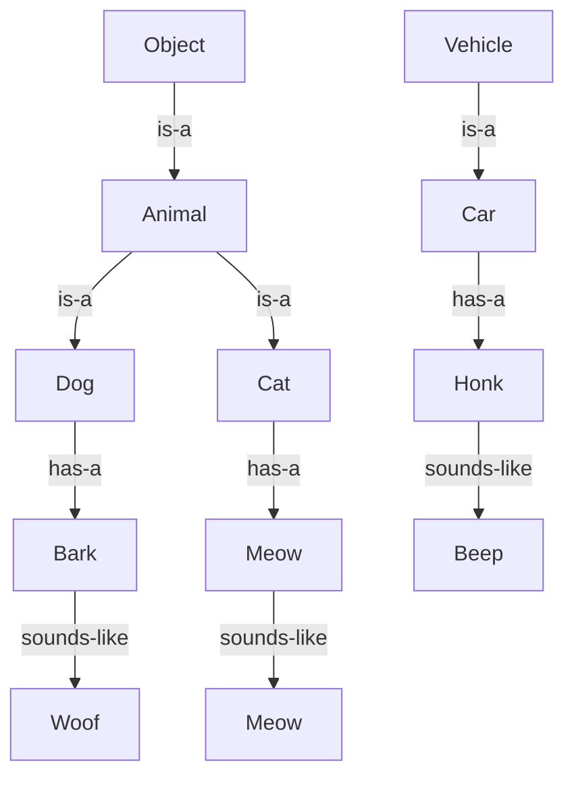

## Introduction
Type casting is a fundamental concept in Java programming that allows developers to convert an object of one type into another type. This is essential in Java because it is a statically typed language, which means that the data type of a variable is known at compile time. Type casting can be either **widening** (also known as upcasting) or **narrowing** (also known as downcasting). In this study guide, we will delve into the world of type casting, exploring its core concepts, internal mechanics, and real-world applications. Every engineer needs to understand type casting because it is a crucial aspect of Java programming that can help prevent type-related errors and improve code maintainability.

## Core Concepts
To understand type casting, we need to grasp the following key concepts:
- **Widening**: This occurs when we cast an object of a subtype to its supertype. For example, casting an `Integer` to an `Object`.
- **Narrowing**: This occurs when we cast an object of a supertype to its subtype. For example, casting an `Object` to an `Integer`.
- **Inheritance**: This is the mechanism by which one class can inherit the properties and behavior of another class. Inheritance is the foundation of type casting.
- **Polymorphism**: This is the ability of an object to take on multiple forms. Polymorphism is closely related to type casting, as it allows objects of different types to be treated as objects of a common supertype.

> **Note:** Type casting is not the same as **autoboxing**, which is the automatic conversion of primitive types to their corresponding object wrapper classes.

## How It Works Internally
When we perform type casting, the Java compiler checks whether the cast is valid at compile time. If the cast is valid, the compiler generates bytecode that performs the cast at runtime. The Java Virtual Machine (JVM) then checks the type of the object being cast and throws a `ClassCastException` if the cast is not valid.

Here's a step-by-step breakdown of the type casting process:
1. The Java compiler checks the type of the object being cast and the type to which it is being cast.
2. If the cast is widening, the compiler generates bytecode that performs the cast.
3. If the cast is narrowing, the compiler generates bytecode that checks the type of the object being cast at runtime.
4. At runtime, the JVM checks the type of the object being cast and throws a `ClassCastException` if the cast is not valid.

## Code Examples
### Example 1: Basic Widening
```java
// Define a subclass
class Animal {
    public void sound() {
        System.out.println("The animal makes a sound");
    }
}

// Define a subclass
class Dog extends Animal {
    public void bark() {
        System.out.println("The dog barks");
    }
}

public class Main {
    public static void main(String[] args) {
        // Create a Dog object
        Dog dog = new Dog();
        
        // Cast the Dog object to an Animal
        Animal animal = dog; // Widening cast
        
        // Call the sound method on the Animal object
        animal.sound(); // Output: The animal makes a sound
    }
}
```
### Example 2: Real-World Narrowing
```java
// Define a superclass
class Vehicle {
    public void drive() {
        System.out.println("The vehicle is driving");
    }
}

// Define a subclass
class Car extends Vehicle {
    public void honk() {
        System.out.println("The car honks");
    }
}

public class Main {
    public static void main(String[] args) {
        // Create a Vehicle object
        Vehicle vehicle = new Car();
        
        // Cast the Vehicle object to a Car
        Car car = (Car) vehicle; // Narrowing cast
        
        // Call the honk method on the Car object
        car.honk(); // Output: The car honks
    }
}
```
### Example 3: Advanced Narrowing with try-catch
```java
// Define a superclass
class Shape {
    public void draw() {
        System.out.println("The shape is drawn");
    }
}

// Define a subclass
class Circle extends Shape {
    public void circumscribe() {
        System.out.println("The circle is circumscribed");
    }
}

public class Main {
    public static void main(String[] args) {
        // Create a Shape object
        Shape shape = new Circle();
        
        try {
            // Cast the Shape object to a Circle
            Circle circle = (Circle) shape; // Narrowing cast
            
            // Call the circumscribe method on the Circle object
            circle.circumscribe(); // Output: The circle is circumscribed
        } catch (ClassCastException e) {
            System.out.println("The shape is not a circle");
        }
    }
}
```
> **Warning:** Always use try-catch blocks when performing narrowing casts to catch any potential `ClassCastException`.

## Visual Diagram

The above diagram illustrates the concept of inheritance and polymorphism, which are essential to understanding type casting.

## Comparison
| Approach | Time Complexity | Space Complexity | Pros | Cons | Best For |
|----------|----------------|-----------------|------|------|----------|
| Widening | O(1) | O(1) | Safe, efficient | Limited flexibility | Upcasting to a supertype |
| Narrowing | O(1) | O(1) | Flexible, powerful | Risk of `ClassCastException` | Downcasting to a subtype |
| Autoboxing | O(1) | O(1) | Convenient, efficient | Limited control | Converting primitives to objects |
| Manual Casting | O(1) | O(1) | Flexible, customizable | Error-prone | Custom type conversions |

> **Tip:** Use widening casts whenever possible, as they are safer and more efficient than narrowing casts.

## Real-world Use Cases
1. **Android App Development**: In Android, type casting is used extensively to convert between different types of views, such as `View` to `Button` or `TextView` to `EditText`.
2. **Java Web Development**: In Java web development, type casting is used to convert between different types of HTTP requests and responses, such as `HttpServletRequest` to `HttpServletResponse`.
3. **Game Development**: In game development, type casting is used to convert between different types of game objects, such as `GameObject` to `Player` or `Enemy`.

## Common Pitfalls
1. **ClassCastException**: This exception occurs when a narrowing cast fails at runtime. To avoid this, always use try-catch blocks when performing narrowing casts.
2. **Incompatible Types**: This error occurs when trying to cast an object to an incompatible type. To avoid this, always check the type of the object being cast before attempting to cast it.
3. **Loss of Information**: This occurs when casting an object to a supertype, resulting in the loss of subtype-specific information. To avoid this, always use widening casts whenever possible.
4. **Unnecessary Casting**: This occurs when casting an object to a type that is already known at compile time. To avoid this, always use the `instanceof` operator to check the type of the object before attempting to cast it.

> **Interview:** What is the difference between widening and narrowing casts? How do you avoid `ClassCastException`?

## Interview Tips
1. **Widening vs Narrowing**: Be prepared to explain the difference between widening and narrowing casts, including the risks and benefits of each.
2. **Type Safety**: Be prepared to discuss the importance of type safety in Java and how type casting can help prevent type-related errors.
3. **Best Practices**: Be prepared to discuss best practices for using type casting, including the use of try-catch blocks and the `instanceof` operator.

## Key Takeaways
* Type casting is a fundamental concept in Java programming that allows developers to convert an object of one type into another type.
* Widening casts are safer and more efficient than narrowing casts.
* Always use try-catch blocks when performing narrowing casts to catch any potential `ClassCastException`.
* Use the `instanceof` operator to check the type of an object before attempting to cast it.
* Type casting can help prevent type-related errors and improve code maintainability.
* Autoboxing is a convenient and efficient way to convert primitives to objects, but it can also lead to loss of control and flexibility.
* Manual casting provides flexibility and customizability, but it can also be error-prone and require more effort to maintain.