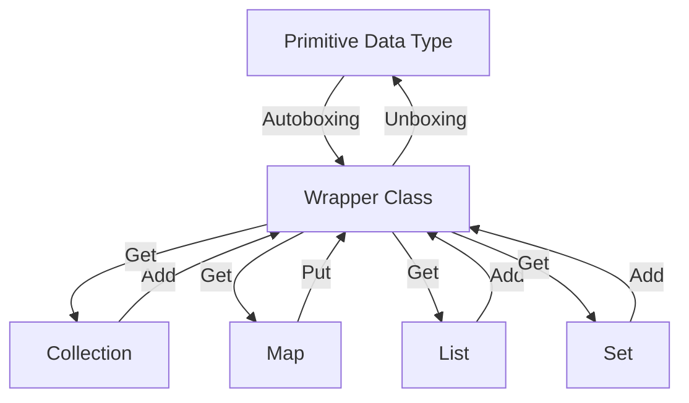

## Introduction
**Wrapper classes** in Java are used to convert primitive data types into objects and vice versa. They are essential in Java programming as they provide a way to treat primitive data types as objects, allowing them to be used in collections and other data structures that only accept objects. The most commonly used wrapper classes in Java are `Integer`, `Long`, `Double`, `Boolean`, and `Character`. These classes provide a way to work with primitive data types in an object-oriented way, making it easier to write Java code that is both efficient and easy to maintain.

## Core Concepts
The core concept behind wrapper classes is to provide a way to convert primitive data types into objects and vice versa. This is achieved through the use of **autoboxing** and **unboxing**, which are processes that automatically convert between primitive data types and their corresponding wrapper classes. For example, the `Integer` class is used to wrap the `int` primitive data type, while the `Double` class is used to wrap the `double` primitive data type.

> **Note:** The main reason for using wrapper classes is to treat primitive data types as objects, allowing them to be used in collections and other data structures that only accept objects.

## How It Works Internally
Wrapper classes work internally by providing a set of methods that allow you to convert between primitive data types and their corresponding wrapper classes. For example, the `Integer` class provides a `intValue()` method that returns the primitive `int` value of the `Integer` object, while the `Double` class provides a `doubleValue()` method that returns the primitive `double` value of the `Double` object.

Here are the steps involved in using wrapper classes:
1. Create a wrapper class object by passing a primitive data type to the constructor.
2. Use the wrapper class object as an object, rather than a primitive data type.
3. Convert the wrapper class object back to a primitive data type using the corresponding method (e.g., `intValue()` or `doubleValue()`).

> **Tip:** When using wrapper classes, it's essential to remember that they are objects, not primitive data types. This means that you need to use methods to access and manipulate their values.

## Code Examples
### Example 1: Basic Usage
```java
// Create an Integer object from a primitive int value
Integer integer = new Integer(10);
// Print the value of the Integer object
System.out.println("Integer value: " + integer.intValue());

// Create a Double object from a primitive double value
Double doubleValue = new Double(20.5);
// Print the value of the Double object
System.out.println("Double value: " + doubleValue.doubleValue());
```

### Example 2: Autoboxing and Unboxing
```java
// Autoboxing: Convert a primitive int value to an Integer object
Integer autoboxedInteger = 10;
// Unboxing: Convert an Integer object to a primitive int value
int unboxedInteger = autoboxedInteger;

// Print the values
System.out.println("Autoboxed Integer value: " + autoboxedInteger);
System.out.println("Unboxed Integer value: " + unboxedInteger);

// Autoboxing: Convert a primitive double value to a Double object
Double autoboxedDouble = 20.5;
// Unboxing: Convert a Double object to a primitive double value
double unboxedDouble = autoboxedDouble;

// Print the values
System.out.println("Autoboxed Double value: " + autoboxedDouble);
System.out.println("Unboxed Double value: " + unboxedDouble);
```

### Example 3: Advanced Usage
```java
// Create a list of Integer objects
List<Integer> integers = new ArrayList<>();
integers.add(10);
integers.add(20);
integers.add(30);

// Print the values in the list
for (Integer integer : integers) {
    System.out.println("Integer value: " + integer);
}

// Create a map of String keys to Double values
Map<String, Double> doubles = new HashMap<>();
doubles.put("one", 10.5);
doubles.put("two", 20.5);
doubles.put("three", 30.5);

// Print the values in the map
for (Map.Entry<String, Double> entry : doubles.entrySet()) {
    System.out.println("Key: " + entry.getKey() + ", Value: " + entry.getValue());
}
```

## Visual Diagram

This diagram illustrates the relationship between primitive data types, wrapper classes, and collections. It shows how autoboxing and unboxing allow you to convert between primitive data types and wrapper classes, and how wrapper classes can be used in collections.

## Comparison
| Approach | Time Complexity | Space Complexity | Pros | Cons | Best For |
|----------|----------------|-----------------|------|------|----------|
| Primitive Data Type | O(1) | O(1) | Fast, efficient | Limited functionality | Simple arithmetic operations |
| Wrapper Class | O(1) | O(n) | Provides additional functionality, can be used in collections | Slower than primitive data types, more memory-intensive | Complex operations, collections, and data structures |
| Autoboxing | O(1) | O(n) | Convenient, easy to use | Can lead to performance issues if not used carefully | Simple conversions between primitive data types and wrapper classes |
| Unboxing | O(1) | O(1) | Fast, efficient | Can lead to performance issues if not used carefully | Simple conversions between wrapper classes and primitive data types |

> **Warning:** When using wrapper classes, be aware of the potential performance issues that can arise from autoboxing and unboxing. These operations can be slower and more memory-intensive than using primitive data types directly.

## Real-world Use Cases
1. **Android App Development**: In Android app development, wrapper classes are used extensively to store and manipulate data in collections and data structures. For example, the `Integer` wrapper class is used to store integer values in a `ListView`.
2. **Web Development**: In web development, wrapper classes are used to store and manipulate data in web applications. For example, the `Double` wrapper class is used to store double values in a web form.
3. **Scientific Computing**: In scientific computing, wrapper classes are used to store and manipulate large datasets. For example, the `Double` wrapper class is used to store double values in a numerical simulation.

## Common Pitfalls
1. **Performance Issues**: Using wrapper classes can lead to performance issues if not used carefully. For example, autoboxing and unboxing can be slower and more memory-intensive than using primitive data types directly.
2. **Memory Leaks**: Using wrapper classes can lead to memory leaks if not used carefully. For example, if a wrapper class object is not properly garbage collected, it can lead to memory leaks.
3. **Null Pointer Exceptions**: Using wrapper classes can lead to null pointer exceptions if not used carefully. For example, if a wrapper class object is null, calling a method on it can lead to a null pointer exception.
4. **Inconsistent Behavior**: Using wrapper classes can lead to inconsistent behavior if not used carefully. For example, if a wrapper class object is used in a collection, its behavior may be different than if it were used as a primitive data type.

> **Tip:** To avoid these pitfalls, use wrapper classes judiciously and be aware of their potential limitations and performance implications.

## Interview Tips
1. **What is the difference between a primitive data type and a wrapper class?**: A primitive data type is a basic data type that is built into the language, while a wrapper class is a class that wraps a primitive data type to provide additional functionality.
2. **What is autoboxing and unboxing?**: Autoboxing is the process of converting a primitive data type to a wrapper class, while unboxing is the process of converting a wrapper class to a primitive data type.
3. **What are the benefits and drawbacks of using wrapper classes?**: The benefits of using wrapper classes include providing additional functionality and being able to use them in collections and data structures. The drawbacks include potential performance issues and memory leaks.

> **Interview:** When answering questions about wrapper classes, be sure to emphasize their benefits and drawbacks, as well as their usage in real-world scenarios.

## Key Takeaways
* **Wrapper classes** provide a way to treat primitive data types as objects, allowing them to be used in collections and other data structures that only accept objects.
* **Autoboxing** and **unboxing** are processes that automatically convert between primitive data types and their corresponding wrapper classes.
* **Performance issues** can arise from using wrapper classes, including slower performance and increased memory usage.
* **Memory leaks** can occur if wrapper class objects are not properly garbage collected.
* **Null pointer exceptions** can occur if wrapper class objects are null.
* **Inconsistent behavior** can occur if wrapper classes are used in collections or other data structures.
* **Wrapper classes** are commonly used in Android app development, web development, and scientific computing.
* **Time complexity** of wrapper classes is O(1), while **space complexity** is O(n).
* **Benefits** of using wrapper classes include providing additional functionality and being able to use them in collections and data structures.
* **Drawbacks** of using wrapper classes include potential performance issues and memory leaks.