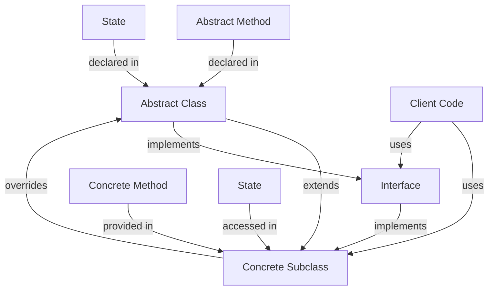

## Introduction
**Abstract classes** are a fundamental concept in object-oriented programming (OOP) that allows developers to define a blueprint for other classes to follow. They provide a way to encapsulate common behavior and state that can be shared among related classes. In Java, abstract classes are denoted by the `abstract` keyword. Abstract classes are particularly useful when you want to provide a basic implementation of a class, but also want to allow subclasses to customize or extend the behavior. For instance, you might have an abstract `Vehicle` class with concrete subclasses like `Car`, `Truck`, and `Motorcycle`. Each of these subclasses can inherit the common attributes and methods from `Vehicle` and then add their own specific features.

In real-world applications, abstract classes are used extensively. For example, in a banking system, you might have an abstract `Account` class with concrete subclasses like `CheckingAccount`, `SavingsAccount`, and `CreditCardAccount`. Each of these subclasses can inherit the common attributes and methods from `Account`, such as `accountNumber`, `balance`, and `deposit()`, and then add their own specific features, like `interestRate` for `SavingsAccount` or `creditLimit` for `CreditCardAccount`.

## Core Concepts
To understand abstract classes, you need to grasp the following core concepts:
- **Abstract class**: A class that cannot be instantiated on its own and is designed to be inherited by other classes.
- **Concrete class**: A class that can be instantiated on its own and is not abstract.
- **Inheritance**: The process by which one class can inherit the properties and behavior of another class.
- **Polymorphism**: The ability of an object to take on multiple forms, depending on the context in which it is used.
- **Abstract method**: A method that is declared in an abstract class but does not have an implementation. Subclasses must provide an implementation for abstract methods.

> **Note:** Abstract classes are often used to provide a way to group related classes together and to provide a common interface for them to implement.

## How It Works Internally
When you define an abstract class in Java, the compiler will generate a `.class` file for it, just like it would for a concrete class. However, the abstract class cannot be instantiated on its own, and any attempt to do so will result in a compiler error. Instead, you must create a concrete subclass that extends the abstract class and provides an implementation for any abstract methods.

Here's a step-by-step breakdown of how abstract classes work internally:
1. **Class loading**: The Java Virtual Machine (JVM) loads the abstract class into memory.
2. **Verification**: The JVM verifies that the abstract class is properly defined and that all abstract methods are declared correctly.
3. **Initialization**: The JVM initializes the abstract class, which involves setting up its internal state and any static variables.
4. **Instantiation**: When a concrete subclass is instantiated, the JVM creates a new object and calls the subclass's constructor.
5. **Method invocation**: When a method is invoked on the subclass object, the JVM resolves the method call to the correct implementation, whether it's in the subclass or in the abstract class.

## Code Examples
### Example 1: Basic Abstract Class
```java
// Define an abstract class called "Vehicle"
public abstract class Vehicle {
    // Declare an abstract method called "startEngine"
    public abstract void startEngine();
    
    // Provide a concrete method called "accelerate"
    public void accelerate() {
        System.out.println("Accelerating...");
    }
}

// Create a concrete subclass called "Car"
public class Car extends Vehicle {
    // Provide an implementation for the "startEngine" abstract method
    @Override
    public void startEngine() {
        System.out.println("Starting car engine...");
    }
    
    public static void main(String[] args) {
        // Create a new Car object and call its methods
        Car car = new Car();
        car.startEngine();
        car.accelerate();
    }
}
```
### Example 2: Abstract Class with State
```java
// Define an abstract class called "BankAccount"
public abstract class BankAccount {
    // Declare a protected field called "accountNumber"
    protected int accountNumber;
    
    // Declare an abstract method called "deposit"
    public abstract void deposit(int amount);
    
    // Provide a concrete method called "getAccountNumber"
    public int getAccountNumber() {
        return accountNumber;
    }
}

// Create a concrete subclass called "CheckingAccount"
public class CheckingAccount extends BankAccount {
    // Provide an implementation for the "deposit" abstract method
    @Override
    public void deposit(int amount) {
        System.out.println("Depositing " + amount + " into checking account...");
    }
    
    // Provide a constructor to initialize the account number
    public CheckingAccount(int accountNumber) {
        this.accountNumber = accountNumber;
    }
    
    public static void main(String[] args) {
        // Create a new CheckingAccount object and call its methods
        CheckingAccount checkingAccount = new CheckingAccount(12345);
        checkingAccount.deposit(100);
        System.out.println("Account number: " + checkingAccount.getAccountNumber());
    }
}
```
### Example 3: Advanced Abstract Class with Polymorphism
```java
// Define an abstract class called "Shape"
public abstract class Shape {
    // Declare an abstract method called "area"
    public abstract double area();
    
    // Declare an abstract method called "perimeter"
    public abstract double perimeter();
}

// Create concrete subclasses called "Circle", "Rectangle", and "Triangle"
public class Circle extends Shape {
    private double radius;
    
    // Provide an implementation for the "area" abstract method
    @Override
    public double area() {
        return Math.PI * radius * radius;
    }
    
    // Provide an implementation for the "perimeter" abstract method
    @Override
    public double perimeter() {
        return 2 * Math.PI * radius;
    }
    
    public Circle(double radius) {
        this.radius = radius;
    }
}

public class Rectangle extends Shape {
    private double width;
    private double height;
    
    // Provide an implementation for the "area" abstract method
    @Override
    public double area() {
        return width * height;
    }
    
    // Provide an implementation for the "perimeter" abstract method
    @Override
    public double perimeter() {
        return 2 * (width + height);
    }
    
    public Rectangle(double width, double height) {
        this.width = width;
        this.height = height;
    }
}

public class Triangle extends Shape {
    private double base;
    private double height;
    
    // Provide an implementation for the "area" abstract method
    @Override
    public double area() {
        return 0.5 * base * height;
    }
    
    // Provide an implementation for the "perimeter" abstract method
    @Override
    public double perimeter() {
        // Calculate the hypotenuse using the Pythagorean theorem
        double hypotenuse = Math.sqrt(base * base + height * height);
        return base + height + hypotenuse;
    }
    
    public Triangle(double base, double height) {
        this.base = base;
        this.height = height;
    }
}

// Create a method that takes a Shape object as an argument and calls its methods
public class ShapeCalculator {
    public static void calculateShapeProperties(Shape shape) {
        System.out.println("Area: " + shape.area());
        System.out.println("Perimeter: " + shape.perimeter());
    }
    
    public static void main(String[] args) {
        // Create Circle, Rectangle, and Triangle objects and pass them to the calculateShapeProperties method
        Circle circle = new Circle(5);
        Rectangle rectangle = new Rectangle(4, 6);
        Triangle triangle = new Triangle(3, 4);
        
        calculateShapeProperties(circle);
        calculateShapeProperties(rectangle);
        calculateShapeProperties(triangle);
    }
}
```
> **Warning:** When using abstract classes, be careful not to create objects of the abstract class itself, as this will result in a compiler error. Instead, create objects of concrete subclasses that extend the abstract class.

## Visual Diagram

The diagram illustrates the relationships between abstract classes, concrete subclasses, interfaces, and client code. It shows how an abstract class can be extended by a concrete subclass, which overrides the abstract methods and provides its own implementation. The diagram also shows how an interface can be implemented by a concrete subclass, and how client code can use both the abstract class and the interface.

## Comparison
| Approach | Time Complexity | Space Complexity | Pros | Cons | Best For |
| --- | --- | --- | --- | --- | --- |
| Abstract Class | O(1) | O(1) | Provides a way to group related classes together, allows for code reuse | Cannot be instantiated on its own, requires concrete subclass | When you want to provide a common interface for related classes |
| Interface | O(1) | O(1) | Provides a way to define a contract that must be implemented, allows for multiple inheritance | Cannot provide implementation for methods, requires concrete class | When you want to define a contract that must be implemented by multiple classes |
| Concrete Class | O(1) | O(1) | Can be instantiated on its own, provides a complete implementation | Does not allow for code reuse or polymorphism | When you want to create a standalone class that does not require inheritance or polymorphism |
| Inheritance | O(1) | O(1) | Allows for code reuse and polymorphism, provides a way to create a hierarchy of classes | Can lead to tight coupling and fragility, requires careful design | When you want to create a hierarchy of classes that share common attributes and behavior |

> **Tip:** When deciding between an abstract class and an interface, consider whether you need to provide a basic implementation or just define a contract. If you need to provide a basic implementation, use an abstract class. If you just need to define a contract, use an interface.

## Real-world Use Cases
1. **Banking System**: An abstract `Account` class can be used to provide a common interface for different types of accounts, such as `CheckingAccount`, `SavingsAccount`, and `CreditCardAccount`.
2. **Graphical User Interface (GUI) Framework**: An abstract `Component` class can be used to provide a common interface for different types of GUI components, such as `Button`, `Label`, and `TextField`.
3. **Game Development**: An abstract `GameEntity` class can be used to provide a common interface for different types of game entities, such as `Player`, `Enemy`, and `Obstacle`.

## Common Pitfalls
1. **Instantiating an Abstract Class**: Attempting to instantiate an abstract class will result in a compiler error.
2. **Not Providing an Implementation for Abstract Methods**: Failing to provide an implementation for abstract methods in a concrete subclass will result in a compiler error.
3. **Using an Abstract Class as a Concrete Class**: Using an abstract class as a concrete class can lead to tight coupling and fragility.
4. **Not Using Interfaces**: Not using interfaces can limit the flexibility and extensibility of your code.

> **Interview:** When asked about abstract classes, be prepared to explain their purpose, how they are used, and the benefits they provide. Be able to provide examples of how abstract classes can be used in real-world applications.

## Interview Tips
1. **Be prepared to explain the difference between an abstract class and an interface**. Make sure you understand the key differences and can provide examples to illustrate your points.
2. **Be able to provide examples of how abstract classes can be used in real-world applications**. Think about how abstract classes can be used to provide a common interface for related classes, and how they can help to promote code reuse and polymorphism.
3. **Be prepared to discuss the benefits and drawbacks of using abstract classes**. Consider the trade-offs between using abstract classes and other design approaches, such as interfaces or concrete classes.

## Key Takeaways
* Abstract classes provide a way to group related classes together and provide a common interface for them to implement.
* Abstract classes cannot be instantiated on their own and require a concrete subclass to provide an implementation for abstract methods.
* Interfaces provide a way to define a contract that must be implemented by multiple classes.
* Inheritance allows for code reuse and polymorphism, but can lead to tight coupling and fragility if not used carefully.
* Abstract classes can be used to promote code reuse and polymorphism, but can also lead to tight coupling if not used carefully.
* Interfaces can provide a way to define a contract that must be implemented by multiple classes, but do not provide a way to share implementation code.
* The choice between an abstract class and an interface depends on whether you need to provide a basic implementation or just define a contract.