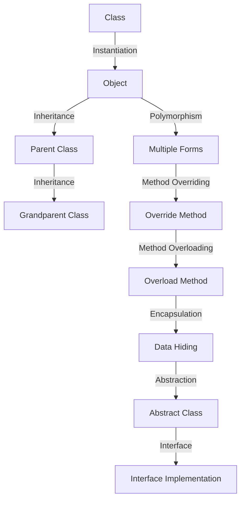

## Introduction
**Classes and objects** are fundamental concepts in object-oriented programming (OOP). A class is a blueprint or template that defines the properties and behavior of an object, while an object is an instance of a class. In this section, we will delve into the world of classes and objects, exploring their definitions, internal mechanics, and real-world applications. Every engineer needs to understand these concepts, as they form the foundation of OOP and are essential for building robust, scalable, and maintainable software systems.

> **Note:** Classes and objects are not unique to Java; they are a fundamental part of OOP and can be found in various programming languages, including C++, Python, and C#.

## Core Concepts
To grasp classes and objects, we need to understand the following key concepts:
* **Class**: A class is a blueprint or template that defines the properties and behavior of an object. It is essentially a design pattern or a template that defines the characteristics of an object.
* **Object**: An object is an instance of a class. It has its own set of attributes (data) and methods (functions).
* **Inheritance**: Inheritance is the process by which one class can inherit the properties and behavior of another class.
* **Polymorphism**: Polymorphism is the ability of an object to take on multiple forms, depending on the context in which it is used.
* **Encapsulation**: Encapsulation is the concept of bundling data and methods that operate on that data within a single unit, making it harder for other parts of the program to access or modify the data directly.

> **Warning:** A common mistake is to confuse classes and objects. Remember that a class is a template, while an object is an instance of that template.

## How It Works Internally
When we create a class, the Java compiler generates a new class file with the same name as the class. This class file contains the compiled code for the class, including its methods and variables. When we create an object, the Java Virtual Machine (JVM) allocates memory for the object and initializes its variables.

Here's a step-by-step breakdown of how it works:
1. The Java compiler reads the class file and generates a new class file with the same name.
2. The JVM loads the class file into memory.
3. The JVM creates a new object by allocating memory for the object and initializing its variables.
4. The JVM calls the constructor method to initialize the object.
5. The object is now ready to use, and we can call its methods and access its variables.

> **Tip:** To improve performance, the JVM uses a technique called **just-in-time (JIT) compilation**, which compiles the class file into native machine code at runtime.

## Code Examples
### Example 1: Basic Class and Object
```java
// Define a simple class called "Person"
public class Person {
    private String name;
    private int age;

    // Constructor method
    public Person(String name, int age) {
        this.name = name;
        this.age = age;
    }

    // Method to print the person's details
    public void printDetails() {
        System.out.println("Name: " + name);
        System.out.println("Age: " + age);
    }

    public static void main(String[] args) {
        // Create a new object called "john"
        Person john = new Person("John Doe", 30);

        // Call the printDetails method
        john.printDetails();
    }
}
```
### Example 2: Inheritance and Polymorphism
```java
// Define a parent class called "Animal"
public class Animal {
    private String name;

    // Constructor method
    public Animal(String name) {
        this.name = name;
    }

    // Method to make a sound
    public void makeSound() {
        System.out.println("The animal makes a sound");
    }

    public static void main(String[] args) {
        // Create a new object called "dog"
        Dog dog = new Dog("Buddy");

        // Call the makeSound method
        dog.makeSound();
    }
}

// Define a child class called "Dog" that inherits from "Animal"
class Dog extends Animal {
    // Constructor method
    public Dog(String name) {
        super(name);
    }

    // Override the makeSound method
    @Override
    public void makeSound() {
        System.out.println("The dog barks");
    }
}
```
### Example 3: Encapsulation
```java
// Define a class called "BankAccount" that encapsulates data and methods
public class BankAccount {
    private double balance;

    // Constructor method
    public BankAccount(double balance) {
        this.balance = balance;
    }

    // Method to deposit money
    public void deposit(double amount) {
        balance += amount;
    }

    // Method to withdraw money
    public void withdraw(double amount) {
        if (balance >= amount) {
            balance -= amount;
        } else {
            System.out.println("Insufficient funds");
        }
    }

    // Method to get the balance
    public double getBalance() {
        return balance;
    }

    public static void main(String[] args) {
        // Create a new object called "account"
        BankAccount account = new BankAccount(1000.0);

        // Deposit money
        account.deposit(500.0);

        // Withdraw money
        account.withdraw(200.0);

        // Get the balance
        System.out.println("Balance: " + account.getBalance());
    }
}
```
## Visual Diagram

The diagram illustrates the relationships between classes, objects, inheritance, polymorphism, encapsulation, abstraction, and interfaces.

> **Interview:** Can you explain the difference between a class and an object? How do you instantiate an object from a class?

## Comparison
| Approach | Time Complexity | Space Complexity | Pros | Cons | Best For |
| --- | --- | --- | --- | --- | --- |
| Composition | O(1) | O(1) | Flexible, reusable | Complex, harder to understand | Building complex objects from simpler ones |
| Inheritance | O(1) | O(1) | Easy to understand, reusable | Tight coupling, fragile base class problem | Building a hierarchy of related classes |
| Interfaces | O(1) | O(1) | Loose coupling, flexible | Verbose, harder to understand | Defining contracts between classes |
| Abstract Classes | O(1) | O(1) | Easy to understand, reusable | Tight coupling, harder to extend | Building a hierarchy of related classes with shared behavior |

## Real-world Use Cases
1. **Android Apps**: Android apps use classes and objects to define the user interface, handle user input, and store data. For example, the `Activity` class is a base class that provides a set of methods for managing the app's lifecycle.
2. **Web Applications**: Web applications use classes and objects to define the business logic, handle user requests, and store data. For example, the `Servlet` class is a base class that provides a set of methods for handling HTTP requests.
3. **Games**: Games use classes and objects to define the game logic, handle user input, and store game state. For example, the `Game` class is a base class that provides a set of methods for managing the game's lifecycle.

> **Tip:** When designing classes and objects, consider the **Single Responsibility Principle (SRP)**, which states that a class should have only one reason to change.

## Common Pitfalls
1. **Tight Coupling**: Tight coupling occurs when classes are tightly coupled, making it harder to modify or extend the code. To avoid tight coupling, use interfaces and composition instead of inheritance.
2. **Fragile Base Class Problem**: The fragile base class problem occurs when a base class is modified, causing unexpected changes to its subclasses. To avoid this problem, use abstract classes and interfaces instead of concrete classes.
3. **God Object**: The God object is an object that knows too much and does too much, making it harder to maintain and extend. To avoid the God object, break down the object into smaller, more focused classes.
4. **Over-Engineering**: Over-engineering occurs when classes and objects are overly complex, making it harder to understand and maintain the code. To avoid over-engineering, keep classes and objects simple and focused.

> **Warning:** Avoid using **static** methods and variables, as they can lead to tight coupling and make the code harder to test and maintain.

## Interview Tips
1. **What is the difference between a class and an object?**: A class is a blueprint or template, while an object is an instance of that template.
2. **How do you instantiate an object from a class?**: You instantiate an object by calling the constructor method of the class.
3. **What is inheritance?**: Inheritance is the process by which one class can inherit the properties and behavior of another class.

> **Interview:** Can you explain the concept of polymorphism? How does it work in Java?

## Key Takeaways
* Classes and objects are fundamental concepts in OOP.
* Classes define the properties and behavior of objects.
* Objects are instances of classes.
* Inheritance is the process by which one class can inherit the properties and behavior of another class.
* Polymorphism is the ability of an object to take on multiple forms.
* Encapsulation is the concept of bundling data and methods that operate on that data within a single unit.
* Composition is a design pattern that allows objects to be built from smaller, more focused objects.
* Interfaces define contracts between classes.
* Abstract classes provide a way to define shared behavior between classes.
* The Single Responsibility Principle (SRP) states that a class should have only one reason to change.
* Tight coupling, fragile base class problem, God object, and over-engineering are common pitfalls to avoid when designing classes and objects.