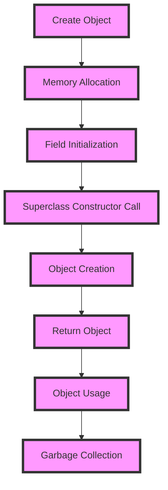

## Introduction
Constructors are a fundamental concept in object-oriented programming (OOP) that allows developers to create objects with specific properties and behaviors. In Java, constructors are special methods that are used to initialize objects when they are created. They have the same name as the class and do not have a return type, not even void. Constructors are essential because they enable developers to set the initial state of an object, which is crucial for ensuring the object's behavior and functionality. For example, in a banking system, a constructor can be used to initialize a `BankAccount` object with a specific account number, balance, and owner name.

> **Note:** Constructors are called when an object is created using the `new` keyword, and they are responsible for allocating memory for the object and initializing its fields.

## Core Concepts
In Java, there are three types of constructors: default, parameterized, and copy. A **default constructor** is a constructor that takes no parameters and is used to create an object with default values. A **parameterized constructor** is a constructor that takes one or more parameters and is used to create an object with specific values. A **copy constructor** is a constructor that takes an object of the same class as a parameter and is used to create a copy of the object.

*   **Default Constructor:** A constructor with no parameters.
*   **Parameterized Constructor:** A constructor with one or more parameters.
*   **Copy Constructor:** A constructor that creates a copy of an existing object.

> **Tip:** It's a good practice to include a default constructor in your class to ensure that objects can be created without specifying any parameters.

## How It Works Internally
When a constructor is called, the following steps occur:

1.  **Memory Allocation:** The Java Virtual Machine (JVM) allocates memory for the object on the heap.
2.  **Field Initialization:** The constructor initializes the object's fields with the specified values.
3.  **Superclass Constructor Call:** If the class has a superclass, the constructor calls the superclass's constructor using the `super` keyword.
4.  **Object Creation:** The constructor returns the newly created object.

The time complexity of constructor calls is O(1), as it only involves a constant number of operations. However, the space complexity depends on the size of the object being created.

## Code Examples
### Example 1: Basic Constructor
```java
public class Person {
    private String name;
    private int age;

    // Default constructor
    public Person() {
        this.name = "John";
        this.age = 30;
    }

    // Parameterized constructor
    public Person(String name, int age) {
        this.name = name;
        this.age = age;
    }

    public static void main(String[] args) {
        Person person1 = new Person();
        Person person2 = new Person("Jane", 25);

        System.out.println("Person 1: " + person1.name + ", " + person1.age);
        System.out.println("Person 2: " + person2.name + ", " + person2.age);
    }
}
```

### Example 2: Copy Constructor
```java
public class BankAccount {
    private String accountNumber;
    private double balance;

    // Default constructor
    public BankAccount() {
        this.accountNumber = "12345";
        this.balance = 1000.0;
    }

    // Parameterized constructor
    public BankAccount(String accountNumber, double balance) {
        this.accountNumber = accountNumber;
        this.balance = balance;
    }

    // Copy constructor
    public BankAccount(BankAccount account) {
        this.accountNumber = account.accountNumber;
        this.balance = account.balance;
    }

    public static void main(String[] args) {
        BankAccount account1 = new BankAccount();
        BankAccount account2 = new BankAccount("67890", 500.0);
        BankAccount account3 = new BankAccount(account1);

        System.out.println("Account 1: " + account1.accountNumber + ", " + account1.balance);
        System.out.println("Account 2: " + account2.accountNumber + ", " + account2.balance);
        System.out.println("Account 3: " + account3.accountNumber + ", " + account3.balance);
    }
}
```

### Example 3: Advanced Constructor with Validation
```java
public class User {
    private String username;
    private String password;

    // Default constructor
    public User() {
        this.username = "guest";
        this.password = "password123";
    }

    // Parameterized constructor with validation
    public User(String username, String password) {
        if (username == null || username.isEmpty()) {
            throw new IllegalArgumentException("Username cannot be empty");
        }
        if (password == null || password.isEmpty() || password.length() < 8) {
            throw new IllegalArgumentException("Password must be at least 8 characters long");
        }
        this.username = username;
        this.password = password;
    }

    public static void main(String[] args) {
        User user1 = new User();
        try {
            User user2 = new User("john", "short");
            System.out.println("User 2: " + user2.username + ", " + user2.password);
        } catch (IllegalArgumentException e) {
            System.out.println(e.getMessage());
        }
        try {
            User user3 = new User("jane", "longenough");
            System.out.println("User 3: " + user3.username + ", " + user3.password);
        } catch (IllegalArgumentException e) {
            System.out.println(e.getMessage());
        }
    }
}
```

## Visual Diagram

This diagram illustrates the process of creating an object in Java, including memory allocation, field initialization, superclass constructor call, object creation, and garbage collection.

## Comparison
| Approach | Time Complexity | Space Complexity | Pros | Cons | Best For |
| --- | --- | --- | --- | --- | --- |
| Default Constructor | O(1) | O(1) | Simple, easy to implement | Limited flexibility | Simple objects with default values |
| Parameterized Constructor | O(1) | O(1) | Flexible, allows for customization | More complex to implement | Objects with specific values |
| Copy Constructor | O(1) | O(1) | Allows for object copying | Can be slow for large objects | Objects that need to be copied |
| Factory Method | O(1) | O(1) | Allows for polymorphism, flexible | More complex to implement | Objects that need to be created using polymorphism |

> **Warning:** Using a copy constructor can be slow for large objects, as it involves creating a new copy of the entire object.

## Real-world Use Cases
1.  **Banking System:** A banking system can use constructors to create `BankAccount` objects with specific account numbers, balances, and owners.
2.  **E-commerce Platform:** An e-commerce platform can use constructors to create `Product` objects with specific names, prices, and descriptions.
3.  **Social Media Platform:** A social media platform can use constructors to create `User` objects with specific usernames, passwords, and profiles.

> **Tip:** Constructors can be used to create objects with specific values, making it easier to manage complex data structures.

## Common Pitfalls
1.  **Missing Default Constructor:** Failing to include a default constructor can make it difficult to create objects without specifying any parameters.
2.  **Incorrect Field Initialization:** Initializing fields with incorrect values can lead to unexpected behavior and errors.
3.  **Superclass Constructor Call:** Failing to call the superclass constructor can lead to unexpected behavior and errors.
4.  **Object Creation:** Failing to return the newly created object can lead to unexpected behavior and errors.

> **Interview:** Can you explain the difference between a default constructor and a parameterized constructor? How would you implement a copy constructor in Java?

## Interview Tips
1.  **Constructor Types:** Be prepared to explain the different types of constructors in Java, including default, parameterized, and copy constructors.
2.  **Constructor Implementation:** Be prepared to implement constructors in Java, including field initialization and superclass constructor calls.
3.  **Object Creation:** Be prepared to explain the process of creating objects in Java, including memory allocation and garbage collection.

> **Note:** Constructors are an essential part of object-oriented programming in Java, and understanding how to use them effectively is crucial for creating robust and efficient software systems.

## Key Takeaways
*   Constructors are special methods in Java that are used to initialize objects when they are created.
*   There are three types of constructors in Java: default, parameterized, and copy.
*   Constructors have the same name as the class and do not have a return type, not even void.
*   Constructors are called when an object is created using the `new` keyword.
*   The time complexity of constructor calls is O(1), and the space complexity depends on the size of the object being created.
*   Constructors can be used to create objects with specific values, making it easier to manage complex data structures.
*   Failing to include a default constructor can make it difficult to create objects without specifying any parameters.
*   Incorrect field initialization can lead to unexpected behavior and errors.
*   Failing to call the superclass constructor can lead to unexpected behavior and errors.
*   Failing to return the newly created object can lead to unexpected behavior and errors.