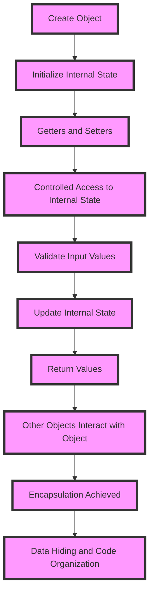

## Introduction
**Encapsulation** is a fundamental concept in object-oriented programming (OOP) that binds data and methods that manipulate that data into a single unit, called a **class** or **object**. This helps to protect the data from external interference and misuse, promoting **data hiding** and **code organization**. In Java, encapsulation is achieved using **getters** and **setters**, which control access to an object's internal state. Every engineer needs to know this concept to write robust, maintainable, and efficient code.

> **Note:** Encapsulation is essential for building complex systems, as it allows developers to modify or extend the internal implementation of an object without affecting other parts of the system.

## Core Concepts
- **Encapsulation**: The process of hiding the internal implementation details of an object from the outside world and only exposing a public interface through which other objects can interact with it.
- **Getters**: Methods that provide access to an object's internal state, allowing other objects to retrieve the values of its properties.
- **Setters**: Methods that allow other objects to modify an object's internal state by setting the values of its properties.
- **Access Modifiers**: Keywords like **public**, **private**, and **protected** that control the visibility and accessibility of an object's properties and methods.

> **Tip:** Use **private** access modifiers for properties and **public** access modifiers for getters and setters to achieve encapsulation.

## How It Works Internally
When an object is created, its internal state is initialized with default values. The getters and setters provide a controlled interface for other objects to interact with the object's internal state. Here's a step-by-step breakdown:

1. An object is created, and its internal state is initialized.
2. A getter method is called to retrieve the value of a property.
3. The getter method returns the value of the property.
4. A setter method is called to modify the value of a property.
5. The setter method validates the input value (if necessary) and updates the property's value.

> **Warning:** Failing to validate input values in setter methods can lead to data corruption or security vulnerabilities.

## Code Examples
### Example 1: Basic Encapsulation
```java
public class Person {
    private String name;
    private int age;

    public Person(String name, int age) {
        this.name = name;
        this.age = age;
    }

    public String getName() {
        return name;
    }

    public void setName(String name) {
        this.name = name;
    }

    public int getAge() {
        return age;
    }

    public void setAge(int age) {
        this.age = age;
    }
}

public class Main {
    public static void main(String[] args) {
        Person person = new Person("John", 30);
        System.out.println(person.getName()); // Output: John
        person.setAge(31);
        System.out.println(person.getAge()); // Output: 31
    }
}
```
### Example 2: Real-world Pattern
```java
public class BankAccount {
    private double balance;

    public BankAccount(double initialBalance) {
        this.balance = initialBalance;
    }

    public double getBalance() {
        return balance;
    }

    public void deposit(double amount) {
        if (amount > 0) {
            balance += amount;
        } else {
            throw new IllegalArgumentException("Invalid deposit amount");
        }
    }

    public void withdraw(double amount) {
        if (amount > 0 && amount <= balance) {
            balance -= amount;
        } else {
            throw new IllegalArgumentException("Invalid withdrawal amount");
        }
    }
}

public class Main {
    public static void main(String[] args) {
        BankAccount account = new BankAccount(1000.0);
        System.out.println(account.getBalance()); // Output: 1000.0
        account.deposit(500.0);
        System.out.println(account.getBalance()); // Output: 1500.0
        account.withdraw(200.0);
        System.out.println(account.getBalance()); // Output: 1300.0
    }
}
```
### Example 3: Advanced Encapsulation
```java
public class Employee {
    private String name;
    private double salary;
    private Department department;

    public Employee(String name, double salary, Department department) {
        this.name = name;
        this.salary = salary;
        this.department = department;
    }

    public String getName() {
        return name;
    }

    public void setName(String name) {
        this.name = name;
    }

    public double getSalary() {
        return salary;
    }

    public void setSalary(double salary) {
        this.salary = salary;
    }

    public Department getDepartment() {
        return department;
    }

    public void setDepartment(Department department) {
        this.department = department;
    }
}

public enum Department {
    SALES, MARKETING, IT
}

public class Main {
    public static void main(String[] args) {
        Employee employee = new Employee("Jane", 50000.0, Department.SALES);
        System.out.println(employee.getName()); // Output: Jane
        System.out.println(employee.getDepartment()); // Output: SALES
        employee.setDepartment(Department.MARKETING);
        System.out.println(employee.getDepartment()); // Output: MARKETING
    }
}
```
## Visual Diagram

The diagram illustrates the process of encapsulation, from creating an object to achieving controlled access to its internal state.

## Comparison
| Approach | Time Complexity | Space Complexity | Pros | Cons | Best For |
| --- | --- | --- | --- | --- | --- |
| Public Fields | O(1) | O(1) | Simple, fast access | No data hiding, no validation | Simple, small-scale applications |
| Getters and Setters | O(1) | O(1) | Encapsulation, data hiding, validation | More code, slower access | Medium to large-scale applications |
| Immutable Objects | O(1) | O(1) | Thread-safe, no validation needed | More memory usage, slower creation | Multithreaded, concurrent applications |
| Aspect-Oriented Programming | O(1) | O(1) | Decoupling, flexibility | Steeper learning curve, more complex | Large-scale, distributed systems |

> **Interview:** What is the main advantage of using getters and setters over public fields? Answer: Encapsulation, which provides data hiding and validation, making the code more robust and maintainable.

## Real-world Use Cases
1. **Banking Systems**: Encapsulation is used to protect sensitive customer data, such as account balances and transaction history.
2. **E-commerce Platforms**: Getters and setters are used to manage product information, such as prices and inventory levels.
3. **Social Media Platforms**: Encapsulation is used to protect user data, such as profile information and friend lists.

> **Tip:** Use encapsulation to protect sensitive data in real-world applications, ensuring the security and integrity of the system.

## Common Pitfalls
1. **Inconsistent Validation**: Failing to validate input values consistently across all setters can lead to data corruption or security vulnerabilities.
2. **Overuse of Getters and Setters**: Using getters and setters excessively can lead to tight coupling and make the code harder to maintain.
3. **Ignoring Encapsulation**: Failing to use encapsulation can expose internal implementation details and make the code more prone to errors.
4. **Not Using Access Modifiers**: Failing to use access modifiers, such as **private** and **public**, can compromise encapsulation and data hiding.

> **Warning:** Avoid these common pitfalls to ensure the effectiveness of encapsulation in your code.

## Interview Tips
1. **Define Encapsulation**: Be able to define encapsulation and explain its importance in OOP.
2. **Explain Getters and Setters**: Be able to explain the purpose of getters and setters and how they achieve encapsulation.
3. **Describe a Real-world Example**: Be able to describe a real-world example of encapsulation, such as a banking system or e-commerce platform.

> **Note:** Be prepared to answer behavioral questions, such as how you would handle a situation where encapsulation is not being used effectively.

## Key Takeaways
* Encapsulation is a fundamental concept in OOP that binds data and methods into a single unit.
* Getters and setters are used to achieve encapsulation and provide controlled access to an object's internal state.
* Access modifiers, such as **private** and **public**, are used to control the visibility and accessibility of an object's properties and methods.
* Encapsulation provides data hiding and validation, making the code more robust and maintainable.
* Common pitfalls, such as inconsistent validation and overuse of getters and setters, can compromise encapsulation.
* Real-world examples, such as banking systems and e-commerce platforms, demonstrate the importance of encapsulation in protecting sensitive data.
* Time complexity: O(1) for getters and setters, O(1) for public fields.
* Space complexity: O(1) for getters and setters, O(1) for public fields.