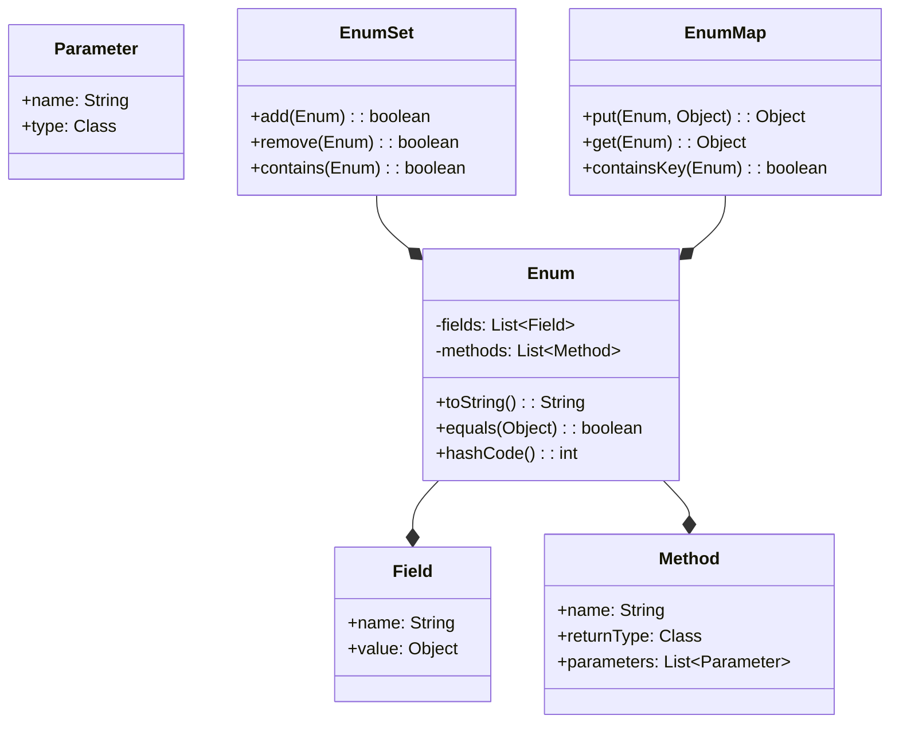

## Introduction
**Enums** (short for "enumerations") are a fundamental concept in Java, allowing developers to define a set of named values that have underlying types. Enums are used to represent a fixed set of distinct values, making the code more readable, maintainable, and efficient. They are especially useful when working with constants, flags, or states that have a specific meaning in the context of the application. In real-world scenarios, enums can be found in various domains, such as game development, where they can represent different game states (e.g., `STARTED`, `PAUSED`, `GAME_OVER`), or in e-commerce platforms, where they can represent order statuses (e.g., `PENDING`, `SHIPPED`, `DELIVERED`).

## Core Concepts
*   An **enum** is a special type of class that represents a fixed set of constants.
*   **Enum fields** are the values defined within an enum, which can be thought of as instances of the enum class.
*   **Enum methods** are the functions that can be applied to enum fields, allowing for more complex logic and behavior.
*   **Enum constructors** are used to initialize enum fields with specific values or properties.
*   **EnumSet** is a specialized set implementation for enums, providing an efficient way to store and manipulate enum values.
*   **EnumMap** is a specialized map implementation for enums, allowing for efficient mapping of enum values to other objects.

## How It Works Internally
When an enum is defined, the Java compiler generates a corresponding class with the enum fields as static final instances. The enum class also inherits from the `java.lang.Enum` class, which provides common methods like `toString()`, `equals()`, and `hashCode()`. Here's a step-by-step breakdown of how enums work internally:

1.  **Enum compilation**: The Java compiler generates a class for the enum, with the enum fields as static final instances.
2.  **Enum initialization**: When the enum class is loaded, the enum fields are initialized using the enum constructor.
3.  **Enum method invocation**: When an enum method is called on an enum field, the corresponding method is invoked on the enum class.
4.  **EnumSet and EnumMap creation**: When an EnumSet or EnumMap is created, the corresponding implementation is instantiated, using the enum class as the underlying type.

## Code Examples
### Example 1: Basic Enum
```java
// Define a simple enum for days of the week
public enum Day {
    MONDAY, TUESDAY, WEDNESDAY, THURSDAY, FRIDAY, SATURDAY, SUNDAY
}

// Usage:
Day today = Day.MONDAY;
System.out.println(today); // Output: MONDAY
```

### Example 2: Enum with Fields and Methods
```java
// Define an enum for colors with fields and methods
public enum Color {
    RED(255, 0, 0),
    GREEN(0, 255, 0),
    BLUE(0, 0, 255);

    private final int red;
    private final int green;
    private final int blue;

    Color(int red, int green, int blue) {
        this.red = red;
        this.green = green;
        this.blue = blue;
    }

    public int getRed() {
        return red;
    }

    public int getGreen() {
        return green;
    }

    public int getBlue() {
        return blue;
    }
}

// Usage:
Color color = Color.GREEN;
System.out.println("Red: " + color.getRed() + ", Green: " + color.getGreen() + ", Blue: " + color.getBlue());
// Output: Red: 0, Green: 255, Blue: 0
```

### Example 3: EnumSet and EnumMap
```java
import java.util.EnumMap;
import java.util.EnumSet;

// Define an enum for days of the week
public enum Day {
    MONDAY, TUESDAY, WEDNESDAY, THURSDAY, FRIDAY, SATURDAY, SUNDAY
}

// Usage:
EnumSet<Day> weekend = EnumSet.of(Day.SATURDAY, Day.SUNDAY);
System.out.println(weekend); // Output: [SATURDAY, SUNDAY]

EnumMap<Day, String> dayMap = new EnumMap<>(Day.class);
dayMap.put(Day.MONDAY, "Monday");
dayMap.put(Day.TUESDAY, "Tuesday");
System.out.println(dayMap); // Output: {MONDAY=Monday, TUESDAY=Tuesday}
```

## Visual Diagram

The diagram illustrates the relationships between enums, fields, methods, EnumSet, and EnumMap. Enums have fields and methods, and EnumSet and EnumMap are used to store and manipulate enum values.

## Comparison
| Approach | Time Complexity | Space Complexity | Pros | Cons | Best For |
| --- | --- | --- | --- | --- | --- |
| Enum | O(1) | O(1) | Efficient, readable, and maintainable | Limited to fixed set of values | Representing a fixed set of distinct values |
| EnumSet | O(1) | O(n) | Efficient storage and manipulation of enum values | Limited to enum values | Storing and manipulating enum values |
| EnumMap | O(1) | O(n) | Efficient mapping of enum values to objects | Limited to enum values | Mapping enum values to objects |
| Switch Statement | O(1) | O(1) | Simple and straightforward | Limited to simple cases, not scalable | Handling simple cases with a fixed set of values |
| If-Else Statement | O(n) | O(1) | Flexible and adaptable | Inefficient and hard to maintain | Handling complex cases with a large set of values |

## Real-world Use Cases
1.  **Game development**: Enums can be used to represent different game states, such as `STARTED`, `PAUSED`, `GAME_OVER`.
2.  **E-commerce platforms**: Enums can be used to represent order statuses, such as `PENDING`, `SHIPPED`, `DELIVERED`.
3.  **Financial systems**: Enums can be used to represent transaction types, such as `DEPOSIT`, `WITHDRAWAL`, `TRANSFER`.

## Common Pitfalls
1.  **Using enums as integers**: Using enums as integers can lead to bugs and make the code harder to understand.
    *   Wrong: `int day = Day.MONDAY.ordinal();`
    *   Right: `Day day = Day.MONDAY;`
2.  **Not handling enum values**: Not handling all enum values can lead to bugs and make the code harder to maintain.
    *   Wrong: `switch (day) { case MONDAY: break; }`
    *   Right: `switch (day) { case MONDAY: break; case TUESDAY: break; ... }`
3.  **Using enums with large datasets**: Using enums with large datasets can lead to performance issues and make the code harder to maintain.
    *   Wrong: `EnumSet<Day> days = EnumSet.allOf(Day.class);`
    *   Right: `Set<Day> days = new HashSet<>();`
4.  **Not using EnumSet and EnumMap**: Not using EnumSet and EnumMap can lead to performance issues and make the code harder to maintain.
    *   Wrong: `Set<Day> days = new HashSet<>();`
    *   Right: `EnumSet<Day> days = EnumSet.noneOf(Day.class);`

## Interview Tips
1.  **What is an enum?**: An enum is a special type of class that represents a fixed set of constants.
    *   Weak answer: "An enum is a type of class."
    *   Strong answer: "An enum is a special type of class that represents a fixed set of constants, making the code more readable, maintainable, and efficient."
2.  **How do you use enums?**: Enums can be used to represent a fixed set of distinct values, making the code more readable, maintainable, and efficient.
    *   Weak answer: "You can use enums to represent a fixed set of values."
    *   Strong answer: "You can use enums to represent a fixed set of distinct values, making the code more readable, maintainable, and efficient. For example, you can use enums to represent days of the week, colors, or transaction types."
3.  **What is the difference between EnumSet and EnumMap?**: EnumSet is a specialized set implementation for enums, providing an efficient way to store and manipulate enum values. EnumMap is a specialized map implementation for enums, allowing for efficient mapping of enum values to other objects.
    *   Weak answer: "EnumSet is a set and EnumMap is a map."
    *   Strong answer: "EnumSet is a specialized set implementation for enums, providing an efficient way to store and manipulate enum values. EnumMap is a specialized map implementation for enums, allowing for efficient mapping of enum values to other objects. For example, you can use EnumSet to store a set of days of the week and EnumMap to map days of the week to their corresponding names."

## Key Takeaways
*   **Enums are a special type of class**: Enums are a special type of class that represents a fixed set of constants, making the code more readable, maintainable, and efficient.
*   **Enums have fields and methods**: Enums can have fields and methods, allowing for more complex logic and behavior.
*   **EnumSet and EnumMap are efficient implementations**: EnumSet and EnumMap are specialized implementations for enums, providing an efficient way to store and manipulate enum values.
*   **Enums are useful for representing a fixed set of distinct values**: Enums are useful for representing a fixed set of distinct values, making the code more readable, maintainable, and efficient.
*   **Enums can be used with large datasets**: Enums can be used with large datasets, but it's essential to consider performance issues and use EnumSet and EnumMap accordingly.
*   **Enums can be used with other data structures**: Enums can be used with other data structures, such as sets, maps, and lists, to provide more flexibility and efficiency.
*   **Enums are not limited to simple cases**: Enums are not limited to simple cases and can be used in complex scenarios, such as game development, e-commerce platforms, and financial systems.
*   **Enums are a powerful tool in Java**: Enums are a powerful tool in Java, providing a way to represent a fixed set of distinct values and make the code more readable, maintainable, and efficient.