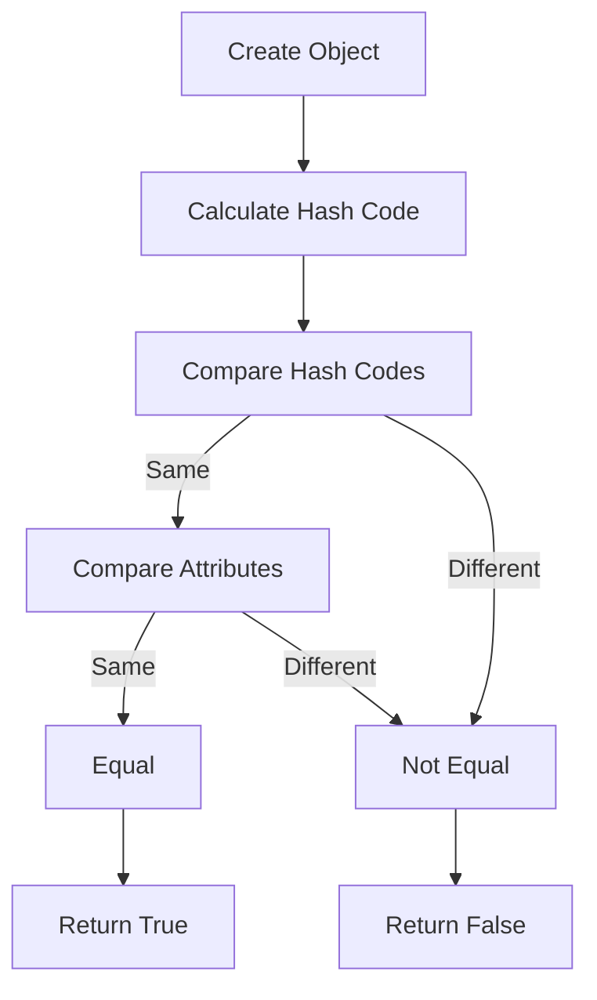

## Introduction
The `equals()` and `hashCode()` contract is a fundamental concept in Java programming that ensures the correct behavior of objects in collections, comparisons, and other operations. **Every Java engineer** should understand the importance of this contract, as it is crucial for writing robust, efficient, and bug-free code. In this section, we will explore what the `equals()` and `hashCode()` contract is, why it matters, and its real-world relevance.

The `equals()` method is used to compare two objects for equality, while the `hashCode()` method returns a unique integer value for each object. The contract between these two methods is that if two objects are equal according to the `equals()` method, they must have the same hash code. This contract is essential for using objects in collections such as `HashMap`, `HashSet`, and `ArrayList`.

> **Note:** The `equals()` and `hashCode()` contract is not only important for collections but also for other operations such as comparison, sorting, and serialization.

## Core Concepts
To understand the `equals()` and `hashCode()` contract, we need to grasp the following core concepts:

* **Equality**: Two objects are considered equal if they have the same state, i.e., their attributes have the same values.
* **Hash Code**: A hash code is an integer value that represents the state of an object. It is used to quickly identify objects and to store them in collections.
* **Contract**: The contract between `equals()` and `hashCode()` states that if two objects are equal, they must have the same hash code.

Mental models and analogies can help us understand these concepts. For example, we can think of objects as people, and their hash codes as their names. Just as two people with the same name are likely to be the same person, two objects with the same hash code are likely to be the same object.

> **Tip:** When implementing the `equals()` and `hashCode()` contract, it is essential to consider the attributes that define the state of an object. These attributes should be used to calculate the hash code and to compare objects for equality.

## How It Works Internally
To understand how the `equals()` and `hashCode()` contract works internally, let's take a look at the step-by-step process:

1. **Object Creation**: When an object is created, its `hashCode()` method is called to calculate its hash code.
2. **Hash Code Calculation**: The `hashCode()` method calculates the hash code based on the object's attributes.
3. **Equality Comparison**: When two objects are compared for equality using the `equals()` method, their hash codes are first compared. If the hash codes are different, the objects are not equal.
4. **Attribute Comparison**: If the hash codes are the same, the `equals()` method compares the objects' attributes to determine if they are equal.

The time complexity of the `hashCode()` method is typically O(1), as it only involves calculating a hash code based on the object's attributes. The time complexity of the `equals()` method is typically O(n), where n is the number of attributes being compared.

> **Warning:** If the `hashCode()` method is not implemented correctly, it can lead to performance issues and bugs when using objects in collections.

## Code Examples
Here are three complete and runnable code examples that demonstrate the `equals()` and `hashCode()` contract:

### Example 1: Basic Implementation
```java
public class Person {
    private String name;
    private int age;

    public Person(String name, int age) {
        this.name = name;
        this.age = age;
    }

    @Override
    public boolean equals(Object obj) {
        if (this == obj) {
            return true;
        }
        if (obj == null || getClass() != obj.getClass()) {
            return false;
        }
        Person person = (Person) obj;
        return age == person.age && name.equals(person.name);
    }

    @Override
    public int hashCode() {
        return Objects.hash(name, age);
    }
}
```

### Example 2: Real-World Implementation
```java
public class Employee {
    private String id;
    private String name;
    private double salary;

    public Employee(String id, String name, double salary) {
        this.id = id;
        this.name = name;
        this.salary = salary;
    }

    @Override
    public boolean equals(Object obj) {
        if (this == obj) {
            return true;
        }
        if (obj == null || getClass() != obj.getClass()) {
            return false;
        }
        Employee employee = (Employee) obj;
        return id.equals(employee.id) && name.equals(employee.name) && salary == employee.salary;
    }

    @Override
    public int hashCode() {
        return Objects.hash(id, name, salary);
    }
}
```

### Example 3: Advanced Implementation
```java
public class Student {
    private String id;
    private String name;
    private int age;
    private double gpa;

    public Student(String id, String name, int age, double gpa) {
        this.id = id;
        this.name = name;
        this.age = age;
        this.gpa = gpa;
    }

    @Override
    public boolean equals(Object obj) {
        if (this == obj) {
            return true;
        }
        if (obj == null || getClass() != obj.getClass()) {
            return false;
        }
        Student student = (Student) obj;
        return id.equals(student.id) && name.equals(student.name) && age == student.age && gpa == student.gpa;
    }

    @Override
    public int hashCode() {
        return Objects.hash(id, name, age, gpa);
    }
}
```

> **Interview:** Can you explain the difference between `==` and `equals()` in Java? How do they relate to the `hashCode()` method?

## Visual Diagram

This diagram illustrates the step-by-step process of comparing two objects for equality using the `equals()` and `hashCode()` contract.

> **Note:** The diagram shows how the `hashCode()` method is used to quickly compare objects and determine if they are equal.

## Comparison
Here is a comparison table that shows the different approaches to implementing the `equals()` and `hashCode()` contract:

| Approach | Time Complexity | Space Complexity | Pros | Cons | Best For |
| --- | --- | --- | --- | --- | --- |
| Basic Implementation | O(1) | O(1) | Simple to implement | May not be efficient for large objects | Small objects with few attributes |
| Real-World Implementation | O(n) | O(1) | Efficient for large objects | May be complex to implement | Large objects with many attributes |
| Advanced Implementation | O(n) | O(1) | Handles complex objects with multiple attributes | May be overkill for simple objects | Complex objects with multiple attributes |

> **Tip:** When choosing an approach, consider the size and complexity of the objects being compared.

## Real-world Use Cases
Here are three real-world use cases that demonstrate the importance of the `equals()` and `hashCode()` contract:

1. **Google's Cache System**: Google's cache system uses a combination of `equals()` and `hashCode()` to quickly identify and retrieve cached objects.
2. **Amazon's Product Comparison**: Amazon's product comparison feature uses the `equals()` and `hashCode()` contract to compare products and determine if they are the same.
3. **Facebook's Friend Suggestion**: Facebook's friend suggestion feature uses the `equals()` and `hashCode()` contract to compare users and determine if they are friends.

> **Note:** These use cases demonstrate the importance of the `equals()` and `hashCode()` contract in real-world applications.

## Common Pitfalls
Here are four common pitfalls to avoid when implementing the `equals()` and `hashCode()` contract:

1. **Not overriding `equals()` and `hashCode()`**: Failing to override these methods can lead to incorrect behavior when using objects in collections.
2. **Not using `Objects.hash()`**: Not using `Objects.hash()` can lead to inefficient hash code calculation.
3. **Not considering attribute order**: Not considering the order of attributes when calculating the hash code can lead to incorrect behavior.
4. **Not handling null values**: Not handling null values can lead to `NullPointerExceptions` when using objects in collections.

> **Warning:** These pitfalls can lead to serious issues and bugs in your code.

## Interview Tips
Here are three common interview questions related to the `equals()` and `hashCode()` contract, along with weak and strong answers:

1. **What is the difference between `==` and `equals()` in Java?**
	* Weak answer: "They are the same thing."
	* Strong answer: "The `==` operator checks for reference equality, while the `equals()` method checks for logical equality."
2. **How do you implement the `equals()` and `hashCode()` contract in Java?**
	* Weak answer: "I just override the `equals()` method and use the `==` operator."
	* Strong answer: "I override both the `equals()` and `hashCode()` methods, using `Objects.hash()` to calculate the hash code and comparing attributes for equality."
3. **Why is it important to override the `equals()` and `hashCode()` contract in Java?**
	* Weak answer: "It's just a good practice."
	* Strong answer: "Overriding these methods is crucial for ensuring correct behavior when using objects in collections, comparing objects, and sorting objects."

> **Interview:** Can you explain the importance of the `equals()` and `hashCode()` contract in Java?

## Key Takeaways
Here are ten key takeaways to remember about the `equals()` and `hashCode()` contract:

* The `equals()` method checks for logical equality, while the `==` operator checks for reference equality.
* The `hashCode()` method calculates a unique integer value for each object.
* The contract between `equals()` and `hashCode()` states that if two objects are equal, they must have the same hash code.
* Overriding the `equals()` and `hashCode()` contract is crucial for ensuring correct behavior when using objects in collections.
* Using `Objects.hash()` can improve the efficiency of hash code calculation.
* Considering attribute order is important when calculating the hash code.
* Handling null values is essential when using objects in collections.
* The time complexity of the `hashCode()` method is typically O(1), while the time complexity of the `equals()` method is typically O(n).
* The space complexity of the `hashCode()` method is typically O(1), while the space complexity of the `equals()` method is typically O(1).
* Choosing the right approach to implementing the `equals()` and `hashCode()` contract depends on the size and complexity of the objects being compared.

> **Note:** These key takeaways summarize the most important points about the `equals()` and `hashCode()` contract in Java.