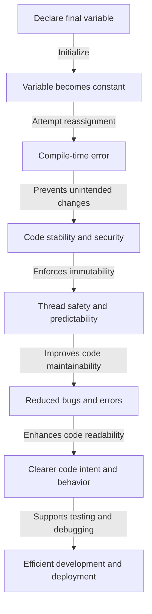

## Introduction
The concept of **final** in Java is a fundamental aspect of Object-Oriented Programming (OOP) that ensures the integrity and security of variables, methods, and classes. In Java, **final** is a keyword that can be applied to variables, methods, and classes to restrict their modification or extension. This feature is crucial in preventing unintended changes to code, reducing bugs, and improving code maintainability. Real-world relevance of **final** can be seen in numerous Java-based systems, such as Android apps, web applications, and enterprise software, where code stability and security are of utmost importance. Every engineer should understand the concept of **final** to write robust, efficient, and scalable code.

## Core Concepts
- **Final Variables:** A variable declared with the **final** keyword cannot be reassigned once it is initialized. This ensures that the variable's value remains constant throughout its lifetime.
- **Final Methods:** A method declared with the **final** keyword cannot be overridden by any subclass. This guarantees that the method's implementation remains unchanged.
- **Final Classes:** A class declared with the **final** keyword cannot be subclassed. This prevents any modification to the class's behavior through inheritance.
> **Tip:** Use **final** variables, methods, and classes to enforce immutability and prevent unintended modifications.

## How It Works Internally
When a variable, method, or class is declared as **final**, the Java compiler and runtime environment take specific measures to enforce the **final** contract:
1. **Final Variables:** The compiler checks that the variable is initialized only once. At runtime, any attempt to reassign the variable results in a compile-time error.
2. **Final Methods:** The compiler checks that the method is not overridden in any subclass. At runtime, the method invocation is resolved using the class's method table, which ensures that the **final** method is called.
3. **Final Classes:** The compiler checks that the class is not subclassed. At runtime, any attempt to create a subclass of a **final** class results in a compile-time error.

## Code Examples
### Example 1: Basic **final** Variable Usage
```java
public class FinalVariableExample {
    // Declare a final variable
    private final int MAX_SIZE = 10;

    public void printMaxSize() {
        // Attempting to reassign a final variable results in a compile-time error
        // MAX_SIZE = 20; // Uncommenting this line will cause a compile-time error
        System.out.println("Max Size: " + MAX_SIZE);
    }

    public static void main(String[] args) {
        FinalVariableExample example = new FinalVariableExample();
        example.printMaxSize();
    }
}
```
### Example 2: **final** Method in a Class Hierarchy
```java
// Declare a class with a final method
class Animal {
    public final void sound() {
        System.out.println("The animal makes a sound");
    }
}

// Attempt to override the final method in a subclass
class Dog extends Animal {
    // Uncommenting the following line will cause a compile-time error
    // @Override
    // public void sound() {
    //     System.out.println("The dog barks");
    // }
}

public class FinalMethodExample {
    public static void main(String[] args) {
        Dog dog = new Dog();
        dog.sound();
    }
}
```
### Example 3: **final** Class and Its Implications
```java
// Declare a final class
final class Calculator {
    public int add(int a, int b) {
        return a + b;
    }
}

// Attempt to subclass the final class
// Uncommenting the following line will cause a compile-time error
// class AdvancedCalculator extends Calculator {
//     public int multiply(int a, int b) {
//         return a * b;
//     }
// }

public class FinalClassExample {
    public static void main(String[] args) {
        Calculator calculator = new Calculator();
        System.out.println("Sum: " + calculator.add(5, 7));
    }
}
```
> **Warning:** Misusing **final** can lead to unnecessary restrictions on code flexibility and reuse.

## Visual Diagram

The diagram illustrates the benefits of using **final** variables, which include code stability, security, immutability, thread safety, and predictability.

## Comparison
| Approach | Time Complexity | Space Complexity | Pros | Cons | Best For |
|----------|----------------|-----------------|------|------|----------|
| **final** variables | O(1) | O(1) | Prevents unintended changes, improves code stability and security | Restricts code flexibility | Critical sections of code, sensitive data handling |
| **final** methods | O(1) | O(1) | Ensures method implementation remains unchanged, prevents overriding | Limits code extensibility | Performance-critical methods, security-sensitive operations |
| **final** classes | O(1) | O(1) | Prevents subclassing, ensures class behavior remains intact | Restricts code reuse and inheritance | Classes with sensitive data, critical system components |
| Non-**final** variables | O(1) | O(1) | Allows code flexibility and reuse | May lead to unintended changes, reduces code stability | Non-critical sections of code, internal implementation details |

## Real-world Use Cases
1. **Android Apps:** Google's Android operating system relies heavily on Java, and **final** variables, methods, and classes are used extensively to ensure code stability and security.
2. **Web Applications:** Java-based web frameworks like Spring and Hibernate utilize **final** to prevent unintended changes to critical components and ensure thread safety.
3. **Enterprise Software:** Large-scale enterprise systems, such as those used in banking and finance, employ **final** to guarantee code integrity and security.

## Common Pitfalls
1. **Misusing **final****: Incorrectly applying **final** to variables, methods, or classes can lead to unnecessary restrictions on code flexibility and reuse.
2. **Overusing **final****: Excessive use of **final** can make code rigid and difficult to maintain.
3. **Ignoring **final****: Failing to use **final** when necessary can result in unintended changes, reducing code stability and security.
4. **Misunderstanding **final****: Not understanding the implications of **final** on code behavior and performance can lead to suboptimal design choices.

## Interview Tips
1. **What is the purpose of **final** in Java?**: A strong answer should explain the benefits of using **final**, including code stability, security, and immutability.
2. **How does **final** affect method overriding?**: A weak answer might state that **final** prevents method overriding, while a strong answer should elaborate on the implications of **final** on method overriding and code extensibility.
3. **Can you provide an example of using **final** in a real-world scenario?**: A strong answer should provide a concrete example, such as using **final** variables in a critical section of code or **final** methods in a performance-critical operation.
> **Interview:** Be prepared to explain the trade-offs between using **final** and non-**final** variables, methods, and classes, and provide examples of when to use each approach.

## Key Takeaways
* **Final** variables, methods, and classes ensure code stability, security, and immutability.
* **Final** variables prevent unintended changes and ensure thread safety.
* **Final** methods guarantee method implementation remains unchanged and prevent overriding.
* **Final** classes prevent subclassing and ensure class behavior remains intact.
* Misusing **final** can lead to unnecessary restrictions on code flexibility and reuse.
* Overusing **final** can make code rigid and difficult to maintain.
* Ignoring **final** can result in unintended changes, reducing code stability and security.
* Understanding the implications of **final** on code behavior and performance is crucial for optimal design choices.