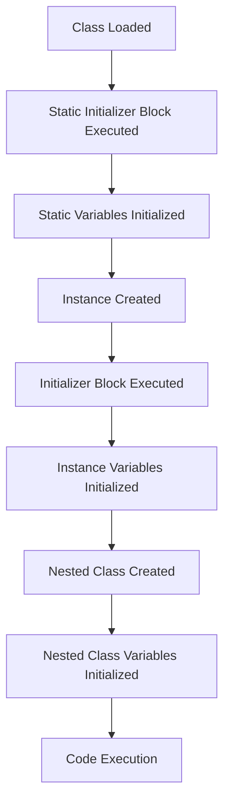

## Introduction
**Static members**, **initializer blocks**, and **nested classes** are fundamental concepts in Java that help developers design and implement efficient, maintainable, and scalable software systems. These concepts are crucial in object-oriented programming (OOP) as they enable developers to create robust, reusable, and modular code. In this study guide, we will delve into the world of static members, initializer blocks, and nested classes, exploring their definitions, internal workings, and practical applications. 
> **Note:** Understanding these concepts is essential for any Java developer, as they are used extensively in real-world applications, such as Android app development, web development, and enterprise software development.

## Core Concepts
- **Static members**: These are variables or methods that belong to a class, rather than an instance of the class. They are shared by all instances of the class and can be accessed using the class name.
- **Initializer blocks**: These are blocks of code that are executed when an object is created. They are used to initialize variables and perform other setup tasks.
- **Nested classes**: These are classes that are defined inside another class. They can be used to group related classes together and to create more modular code.
> **Tip:** When designing classes, consider using static members, initializer blocks, and nested classes to improve code organization, reduce coupling, and increase maintainability.

## How It Works Internally
When a Java class is loaded, the JVM (Java Virtual Machine) executes the **static initializer block**, which is a special block of code that is used to initialize static variables. The static initializer block is executed only once, when the class is first loaded.
```java
public class MyClass {
    public static int myStaticVar;
    static {
        myStaticVar = 10;
        System.out.println("Static initializer block executed");
    }
}
```
> **Warning:** Be careful when using static variables, as they can lead to thread-safety issues in multi-threaded environments.

## Code Examples
### Example 1: Basic Static Member Usage
```java
public class MyClass {
    public static int myStaticVar = 10;
    public int myInstanceVar = 20;
    
    public static void main(String[] args) {
        System.out.println(MyClass.myStaticVar); // prints 10
        MyClass obj = new MyClass();
        System.out.println(obj.myInstanceVar); // prints 20
    }
}
```
### Example 2: Initializer Block Usage
```java
public class MyClass {
    public int myVar;
    
    {
        myVar = 10;
        System.out.println("Initializer block executed");
    }
    
    public static void main(String[] args) {
        MyClass obj = new MyClass();
        System.out.println(obj.myVar); // prints 10
    }
}
```
### Example 3: Nested Class Usage
```java
public class OuterClass {
    public class InnerClass {
        public int myVar = 10;
    }
    
    public static void main(String[] args) {
        OuterClass outer = new OuterClass();
        OuterClass.InnerClass inner = outer.new InnerClass();
        System.out.println(inner.myVar); // prints 10
    }
}
```
> **Interview:** Be prepared to explain the differences between static and instance variables, as well as the use cases for initializer blocks and nested classes.

## Visual Diagram

This diagram illustrates the order of operations when a Java class is loaded and an instance is created.

## Comparison
| Approach | Time Complexity | Space Complexity | Pros | Cons | Best For |
|----------|----------------|-----------------|------|------|----------|
| Static Members | O(1) | O(1) | Shared by all instances, efficient | Thread-safety issues, limited flexibility | Utility classes, constants |
| Initializer Blocks | O(1) | O(1) | Flexible, can be used for complex initialization | Limited control, can be error-prone | Complex object initialization |
| Nested Classes | O(1) | O(1) | Encapsulates related classes, improves modularity | Can lead to tight coupling, harder to debug | Grouping related classes, creating modular code |

## Real-world Use Cases
- **Android app development**: Static members and initializer blocks are used extensively in Android app development to create efficient, modular code.
- **Web development**: Nested classes are used in web development to create complex, modular web applications.
- **Enterprise software development**: Static members, initializer blocks, and nested classes are used in enterprise software development to create robust, scalable software systems.

## Common Pitfalls
- **Thread-safety issues**: Using static variables can lead to thread-safety issues in multi-threaded environments.
- **Tight coupling**: Using nested classes can lead to tight coupling between classes, making it harder to maintain and modify code.
- **Error-prone initializer blocks**: Initializer blocks can be error-prone if not used carefully, leading to unexpected behavior.
- **Inefficient code**: Using static members and initializer blocks can lead to inefficient code if not used judiciously.

## Interview Tips
- **What is the difference between static and instance variables?**: Be prepared to explain the differences between static and instance variables, including their scope, accessibility, and usage.
- **How do you use initializer blocks?**: Be prepared to explain the use cases for initializer blocks, including complex object initialization and setup tasks.
- **What are the benefits and drawbacks of using nested classes?**: Be prepared to explain the benefits and drawbacks of using nested classes, including encapsulation, modularity, and tight coupling.

## Key Takeaways
* **Static members** are shared by all instances of a class and can be accessed using the class name.
* **Initializer blocks** are used to initialize variables and perform setup tasks when an object is created.
* **Nested classes** are used to group related classes together and improve modularity.
* **Thread-safety issues** can arise when using static variables in multi-threaded environments.
* **Tight coupling** can occur when using nested classes, making it harder to maintain and modify code.
* **Error-prone initializer blocks** can lead to unexpected behavior if not used carefully.
* **Inefficient code** can result from using static members and initializer blocks if not used judiciously.