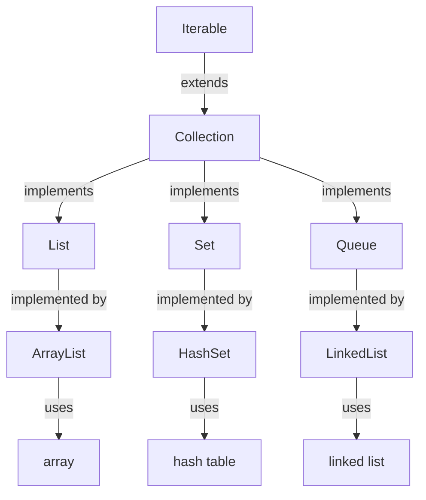

## Introduction
The Java Collections Framework is a set of classes and interfaces that provide a unified architecture for representing and manipulating collections. It is a fundamental part of Java programming and is essential for any software developer. At its core, the collection hierarchy is based on the **Iterable** interface, which is the root of all collections. The **Collection** interface extends **Iterable** and provides additional methods for manipulating collections. The **List**, **Set**, and **Queue** interfaces extend **Collection** and provide specific implementations for each type of collection. In this study guide, we will delve into the details of the collection hierarchy, exploring its core concepts, internal mechanics, and real-world applications.

> **Note:** Understanding the collection hierarchy is crucial for any Java developer, as it provides a foundation for working with data structures and algorithms.

## Core Concepts
The collection hierarchy is based on the following core concepts:

* **Iterable**: The root interface of the collection hierarchy, which provides a way to iterate over a collection.
* **Collection**: The interface that extends **Iterable** and provides additional methods for manipulating collections, such as **add**, **remove**, and **contains**.
* **List**: An ordered collection of elements, which extends **Collection** and provides methods for accessing and manipulating elements by index.
* **Set**: An unordered collection of unique elements, which extends **Collection** and provides methods for adding and removing elements.
* **Queue**: A collection that follows the First-In-First-Out (FIFO) principle, which extends **Collection** and provides methods for adding and removing elements.

> **Tip:** When working with collections, it's essential to understand the trade-offs between different data structures and choose the most suitable one for the problem at hand.

## How It Works Internally
The collection hierarchy is implemented using a variety of data structures, including arrays, linked lists, and hash tables. Each collection interface is implemented by a specific class, such as **ArrayList** for **List**, **HashSet** for **Set**, and **LinkedList** for **Queue**. The internal mechanics of the collection hierarchy involve the following steps:

1. **Initialization**: The collection is initialized with a specific capacity or size.
2. **Element addition**: Elements are added to the collection using methods such as **add** or **offer**.
3. **Element removal**: Elements are removed from the collection using methods such as **remove** or **poll**.
4. **Iteration**: The collection is iterated over using methods such as **iterator** or **forEach**.

> **Warning:** When working with collections, it's essential to be aware of the potential for **NullPointerExceptions** and **ConcurrentModificationExceptions**.

## Code Examples
### Example 1: Basic List Usage
```java
import java.util.ArrayList;
import java.util.List;

public class BasicListUsage {
    public static void main(String[] args) {
        // Create a new list
        List<String> list = new ArrayList<>();

        // Add elements to the list
        list.add("Apple");
        list.add("Banana");
        list.add("Cherry");

        // Print the list
        System.out.println(list);
    }
}
```
### Example 2: Real-World Set Usage
```java
import java.util.HashSet;
import java.util.Set;

public class RealWorldSetUsage {
    public static void main(String[] args) {
        // Create a new set
        Set<String> set = new HashSet<>();

        // Add elements to the set
        set.add("John");
        set.add("Jane");
        set.add("John"); // Duplicate element is ignored

        // Print the set
        System.out.println(set);
    }
}
```
### Example 3: Advanced Queue Usage
```java
import java.util.LinkedList;
import java.util.Queue;

public class AdvancedQueueUsage {
    public static void main(String[] args) {
        // Create a new queue
        Queue<String> queue = new LinkedList<>();

        // Add elements to the queue
        queue.offer("Apple");
        queue.offer("Banana");
        queue.offer("Cherry");

        // Remove elements from the queue
        System.out.println(queue.poll());
        System.out.println(queue.poll());
        System.out.println(queue.poll());
    }
}
```
> **Interview:** Can you explain the difference between a **List** and a **Set**? How would you choose between the two in a real-world scenario?

## Visual Diagram

The diagram illustrates the collection hierarchy, showing the relationships between the different interfaces and classes.

> **Note:** The collection hierarchy is a fundamental concept in Java programming, and understanding its internal mechanics is essential for working with data structures and algorithms.

## Comparison
| Collection | Time Complexity | Space Complexity | Pros | Cons |
| --- | --- | --- | --- | --- |
| List | O(1) for access, O(n) for insertion/deletion | O(n) | Ordered, allows duplicates | Slower insertion/deletion |
| Set | O(1) for access, O(1) for insertion/deletion | O(n) | Unordered, unique elements | No duplicates allowed |
| Queue | O(1) for access, O(1) for insertion/deletion | O(n) | FIFO order, allows duplicates | Limited access to elements |

> **Tip:** When choosing a collection, consider the trade-offs between time complexity, space complexity, and the specific requirements of your use case.

## Real-world Use Cases
1. **Google's Search Engine**: Google uses a combination of **List** and **Set** collections to store and retrieve search results.
2. **Amazon's Product Catalog**: Amazon uses a **Queue** collection to manage product orders and fulfillments.
3. **Facebook's News Feed**: Facebook uses a **List** collection to store and display news feed items.

> **Note:** Real-world use cases often involve complex data structures and algorithms, and understanding the collection hierarchy is essential for working with large-scale data sets.

## Common Pitfalls
1. **NullPointerException**: Failing to initialize a collection before using it can result in a **NullPointerException**.
2. **ConcurrentModificationException**: Modifying a collection while iterating over it can result in a **ConcurrentModificationException**.
3. **Incorrect Collection Choice**: Choosing the wrong collection for a specific use case can result in poor performance or incorrect results.
4. **Duplicate Elements**: Failing to check for duplicate elements in a **Set** collection can result in incorrect results.

> **Warning:** When working with collections, it's essential to be aware of the potential pitfalls and take steps to avoid them.

## Interview Tips
1. **What is the difference between a List and a Set?**: A **List** is an ordered collection of elements, while a **Set** is an unordered collection of unique elements.
2. **How do you choose between a List and a Set?**: Choose a **List** when you need to maintain the order of elements, and choose a **Set** when you need to ensure uniqueness of elements.
3. **What is the time complexity of adding an element to a List?**: The time complexity of adding an element to a **List** is O(1) for access, but O(n) for insertion/deletion.

> **Interview:** Can you explain the trade-offs between different collection types and how you would choose between them in a real-world scenario?

## Key Takeaways
* The collection hierarchy is based on the **Iterable** interface and includes **Collection**, **List**, **Set**, and **Queue** interfaces.
* Each collection interface has its own strengths and weaknesses, and choosing the right one depends on the specific use case.
* Understanding the internal mechanics of the collection hierarchy is essential for working with data structures and algorithms.
* Real-world use cases often involve complex data structures and algorithms, and understanding the collection hierarchy is essential for working with large-scale data sets.
* Common pitfalls include **NullPointerException**, **ConcurrentModificationException**, and incorrect collection choice.
* When choosing a collection, consider the trade-offs between time complexity, space complexity, and the specific requirements of your use case.