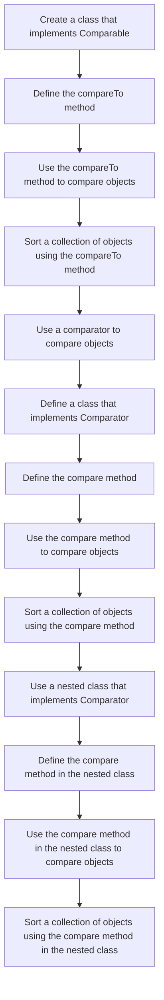

## Introduction
The **Comparable** and **Comparator** interfaces in Java are used for comparing objects. They are essential components of the Java Collections Framework, which provides a set of classes and interfaces for managing collections of objects. Understanding these interfaces is crucial for any Java developer, as they are used extensively in various applications, including data processing, sorting, and searching. In this section, we will delve into the world of **Comparable** and **Comparator**, exploring their definitions, uses, and importance in real-world applications.

> **Note:** The Java Collections Framework is a powerful tool for managing collections of objects, and **Comparable** and **Comparator** are two of its most important components. Mastering these interfaces is essential for any Java developer.

## Core Concepts
The **Comparable** interface is used to compare two objects of the same class. It provides a single method, `compareTo(T o)`, which returns an integer value indicating the result of the comparison. The **Comparator** interface, on the other hand, is used to compare two objects of different classes. It provides two methods, `compare(T o1, T o2)` and `equals(Object obj)`, which are used to compare two objects and check for equality, respectively.

> **Tip:** When implementing the **Comparable** interface, it's essential to ensure that the `compareTo` method is consistent with the `equals` method, meaning that if `a.compareTo(b) == 0`, then `a.equals(b)` should return `true`.

The key terminology related to **Comparable** and **Comparator** includes:

* **Natural ordering**: The ordering of objects based on their natural characteristics, such as alphabetical order for strings or numerical order for integers.
* **Comparator**: An object that compares two objects and returns an integer value indicating the result of the comparison.
* **Comparable**: An object that can be compared to another object of the same class using the `compareTo` method.

## How It Works Internally
When you implement the **Comparable** interface, you are providing a way for objects of your class to be compared to each other. The `compareTo` method is called when you try to sort a collection of objects, and it returns an integer value indicating the result of the comparison. A negative value indicates that the first object is less than the second object, a positive value indicates that the first object is greater than the second object, and zero indicates that the objects are equal.

> **Warning:** When implementing the **Comparable** interface, it's essential to ensure that the `compareTo` method is transitive, meaning that if `a.compareTo(b) < 0` and `b.compareTo(c) < 0`, then `a.compareTo(c) < 0`.

The **Comparator** interface works similarly, but it is used to compare objects of different classes. The `compare` method is called when you try to sort a collection of objects, and it returns an integer value indicating the result of the comparison.

## Code Examples
### Example 1: Basic Usage of Comparable
```java
// Define a class that implements Comparable
public class Person implements Comparable<Person> {
    private String name;
    private int age;

    public Person(String name, int age) {
        this.name = name;
        this.age = age;
    }

    @Override
    public int compareTo(Person other) {
        // Compare people based on their age
        return Integer.compare(this.age, other.age);
    }

    public static void main(String[] args) {
        // Create a list of people
        List<Person> people = new ArrayList<>();
        people.add(new Person("John", 25));
        people.add(new Person("Alice", 30));
        people.add(new Person("Bob", 20));

        // Sort the list of people
        Collections.sort(people);

        // Print the sorted list
        for (Person person : people) {
            System.out.println(person.name + ": " + person.age);
        }
    }
}
```

### Example 2: Using Comparator to Compare Objects
```java
// Define a class that represents a person
public class Person {
    private String name;
    private int age;

    public Person(String name, int age) {
        this.name = name;
        this.age = age;
    }

    public String getName() {
        return name;
    }

    public int getAge() {
        return age;
    }
}

// Define a comparator that compares people based on their name
public class PersonComparator implements Comparator<Person> {
    @Override
    public int compare(Person p1, Person p2) {
        // Compare people based on their name
        return p1.getName().compareTo(p2.getName());
    }
}

public class Main {
    public static void main(String[] args) {
        // Create a list of people
        List<Person> people = new ArrayList<>();
        people.add(new Person("John", 25));
        people.add(new Person("Alice", 30));
        people.add(new Person("Bob", 20));

        // Sort the list of people using the comparator
        Collections.sort(people, new PersonComparator());

        // Print the sorted list
        for (Person person : people) {
            System.out.println(person.getName() + ": " + person.getAge());
        }
    }
}
```

### Example 3: Advanced Usage of Comparable and Comparator
```java
// Define a class that implements Comparable and has a nested class that implements Comparator
public class Person implements Comparable<Person> {
    private String name;
    private int age;

    public Person(String name, int age) {
        this.name = name;
        this.age = age;
    }

    @Override
    public int compareTo(Person other) {
        // Compare people based on their age
        return Integer.compare(this.age, other.age);
    }

    public static class PersonComparator implements Comparator<Person> {
        @Override
        public int compare(Person p1, Person p2) {
            // Compare people based on their name
            return p1.name.compareTo(p2.name);
        }
    }

    public static void main(String[] args) {
        // Create a list of people
        List<Person> people = new ArrayList<>();
        people.add(new Person("John", 25));
        people.add(new Person("Alice", 30));
        people.add(new Person("Bob", 20));

        // Sort the list of people using the comparator
        Collections.sort(people, new Person.PersonComparator());

        // Print the sorted list
        for (Person person : people) {
            System.out.println(person.name + ": " + person.age);
        }
    }
}
```

## Visual Diagram

The diagram illustrates the process of creating a class that implements **Comparable**, defining the `compareTo` method, and using it to compare objects. It also shows how to use a **Comparator** to compare objects and how to define a nested class that implements **Comparator**.

## Comparison
| Approach | Time Complexity | Space Complexity | Pros | Cons | Best For |
| --- | --- | --- | --- | --- | --- |
| **Comparable** | O(n log n) | O(1) | Easy to implement, natural ordering | Limited flexibility | Simple sorting tasks |
| **Comparator** | O(n log n) | O(1) | Flexible, can be used for custom sorting | More complex to implement | Custom sorting tasks |
| **Nested Comparator** | O(n log n) | O(1) | Flexible, can be used for custom sorting, encapsulated | More complex to implement | Custom sorting tasks with encapsulation |
| **Lambda Expression** | O(n log n) | O(1) | Concise, flexible, easy to implement | Limited reuse | Simple sorting tasks with lambda expressions |

> **Tip:** When choosing between **Comparable** and **Comparator**, consider the complexity of the sorting task and the flexibility required.

## Real-world Use Cases
1. **Google's Search Engine**: Google's search engine uses a custom sorting algorithm to rank web pages based on their relevance to the search query. This algorithm uses a combination of **Comparable** and **Comparator** to compare web pages and rank them accordingly.
2. **Amazon's Product Sorting**: Amazon's product sorting algorithm uses a **Comparator** to compare products based on their price, rating, and other attributes. This allows customers to sort products in a variety of ways, including by price, rating, and relevance.
3. **Facebook's News Feed**: Facebook's news feed algorithm uses a combination of **Comparable** and **Comparator** to compare posts and rank them based on their relevance to the user. This includes factors such as the user's interactions with the post, the post's engagement, and the user's preferences.

## Common Pitfalls
1. **Inconsistent Comparison**: When implementing **Comparable**, it's essential to ensure that the `compareTo` method is consistent with the `equals` method. If this is not the case, the sorting algorithm may produce incorrect results.
2. **Null Pointer Exceptions**: When using **Comparator**, it's essential to check for null pointer exceptions when comparing objects. If one of the objects is null, the comparison will throw a null pointer exception.
3. **Inefficient Sorting**: When using **Comparable** or **Comparator**, it's essential to choose an efficient sorting algorithm. Some sorting algorithms, such as bubble sort, have a time complexity of O(n^2), which can be inefficient for large datasets.
4. **Lack of Encapsulation**: When using a **Comparator**, it's essential to encapsulate the comparison logic within the comparator class. This helps to prevent modifications to the comparison logic from affecting other parts of the code.

## Interview Tips
1. **Be prepared to explain the difference between Comparable and Comparator**: The interviewer may ask you to explain the difference between **Comparable** and **Comparator**, including their use cases and advantages.
2. **Be prepared to write a Comparator implementation**: The interviewer may ask you to write a **Comparator** implementation to compare objects based on a specific attribute.
3. **Be prepared to discuss sorting algorithms**: The interviewer may ask you to discuss sorting algorithms, including their time and space complexity, and their advantages and disadvantages.

> **Interview:** Can you explain the difference between **Comparable** and **Comparator**, and provide an example of when you would use each?

## Key Takeaways
* **Comparable** is used to compare objects of the same class, while **Comparator** is used to compare objects of different classes.
* **Comparable** provides a natural ordering of objects, while **Comparator** provides a custom ordering.
* **Comparator** can be used to compare objects based on multiple attributes.
* **Comparable** and **Comparator** can be used together to provide a flexible and efficient sorting algorithm.
* **Comparable** and **Comparator** are essential components of the Java Collections Framework.
* **Comparable** and **Comparator** can be used to sort collections of objects in a variety of ways, including by attribute, by relevance, and by priority.
* **Comparable** and **Comparator** can be used to improve the performance of sorting algorithms by reducing the number of comparisons required.
* **Comparable** and **Comparator** can be used to provide a custom sorting algorithm that meets the specific needs of an application.
* **Comparable** and **Comparator** are widely used in real-world applications, including search engines, e-commerce platforms, and social media platforms.