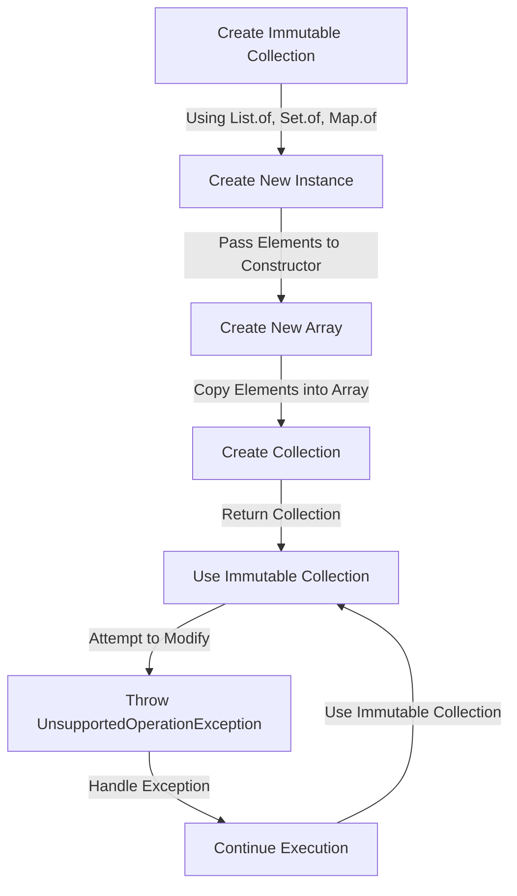

## Introduction
Immutable collections are a crucial aspect of programming in Java, providing a way to create collections that cannot be modified once created. This is particularly useful in multi-threaded environments, where shared mutable state can lead to concurrency issues. In this section, we will explore the importance of immutable collections, their real-world relevance, and why every engineer needs to know about them.

Immutable collections are essential in Java because they provide a thread-safe way to share data between threads. When working with mutable collections, there is a risk of one thread modifying the collection while another thread is iterating over it, leading to a `ConcurrentModificationException`. By using immutable collections, we can avoid this issue altogether.

> **Note:** Immutable collections are not the same as unmodifiable collections. Unmodifiable collections can still be modified through their underlying collection, whereas immutable collections cannot be modified at all.

## Core Concepts
In this section, we will delve into the core concepts of immutable collections, including their precise definitions, mental models, and key terminology.

* **Immutable:** An object that cannot be modified once created.
* **Unmodifiable:** An object that cannot be modified through a specific interface, but may still be modified through its underlying collection.
* **List.of:** A method that returns an immutable list containing the specified elements.
* **Set.of:** A method that returns an immutable set containing the specified elements.
* **Map.of:** A method that returns an immutable map containing the specified key-value pairs.

> **Tip:** When working with immutable collections, it's essential to remember that they are not just unmodifiable, but also cannot be modified through their underlying collection.

## How It Works Internally
In this section, we will explore the under-the-hood mechanics of immutable collections, including their step-by-step creation process.

When creating an immutable collection using `List.of`, `Set.of`, or `Map.of`, the Java runtime creates a new instance of the respective collection class, passing the specified elements to the constructor. The constructor then creates a new array to store the elements, and the collection is created.

Here is a high-level overview of the creation process:

1. The `List.of`, `Set.of`, or `Map.of` method is called with the specified elements.
2. A new instance of the respective collection class is created.
3. The constructor creates a new array to store the elements.
4. The elements are copied into the new array.
5. The collection is created and returned.

> **Warning:** Attempting to modify an immutable collection will result in an `UnsupportedOperationException`.

## Code Examples
In this section, we will explore three complete and runnable examples of using immutable collections in Java.

### Example 1: Basic Usage
```java
import java.util.List;
import java.util.Set;
import java.util.Map;

public class ImmutableCollectionsExample {
    public static void main(String[] args) {
        // Create an immutable list
        List<String> immutableList = List.of("Apple", "Banana", "Cherry");
        
        // Create an immutable set
        Set<String> immutableSet = Set.of("Apple", "Banana", "Cherry");
        
        // Create an immutable map
        Map<String, Integer> immutableMap = Map.of("Apple", 1, "Banana", 2, "Cherry", 3);
        
        System.out.println("Immutable List: " + immutableList);
        System.out.println("Immutable Set: " + immutableSet);
        System.out.println("Immutable Map: " + immutableMap);
    }
}
```

### Example 2: Real-World Pattern
```java
import java.util.List;
import java.util.Set;
import java.util.Map;

public class ImmutableCollectionsExample {
    public static void main(String[] args) {
        // Create an immutable list of employees
        List<String> employees = List.of("John Doe", "Jane Doe", "Bob Smith");
        
        // Create an immutable set of unique employee IDs
        Set<String> employeeIds = Set.of("12345", "67890", "11111");
        
        // Create an immutable map of employee IDs to employee names
        Map<String, String> employeeMap = Map.of("12345", "John Doe", "67890", "Jane Doe", "11111", "Bob Smith");
        
        System.out.println("Employees: " + employees);
        System.out.println("Employee IDs: " + employeeIds);
        System.out.println("Employee Map: " + employeeMap);
    }
}
```

### Example 3: Advanced Usage
```java
import java.util.List;
import java.util.Set;
import java.util.Map;

public class ImmutableCollectionsExample {
    public static void main(String[] args) {
        // Create an immutable list of employees with multiple attributes
        List<Employee> employees = List.of(
            new Employee("John Doe", 30, "Software Engineer"),
            new Employee("Jane Doe", 25, "Data Scientist"),
            new Employee("Bob Smith", 40, "DevOps Engineer")
        );
        
        // Create an immutable set of unique employee IDs
        Set<String> employeeIds = Set.of("12345", "67890", "11111");
        
        // Create an immutable map of employee IDs to employee objects
        Map<String, Employee> employeeMap = Map.of(
            "12345", employees.get(0),
            "67890", employees.get(1),
            "11111", employees.get(2)
        );
        
        System.out.println("Employees: " + employees);
        System.out.println("Employee IDs: " + employeeIds);
        System.out.println("Employee Map: " + employeeMap);
    }
}

class Employee {
    private String name;
    private int age;
    private String occupation;
    
    public Employee(String name, int age, String occupation) {
        this.name = name;
        this.age = age;
        this.occupation = occupation;
    }
    
    @Override
    public String toString() {
        return "Employee{" +
                "name='" + name + '\'' +
                ", age=" + age +
                ", occupation='" + occupation + '\'' +
                '}';
    }
}
```

## Visual Diagram

The above diagram illustrates the creation process of an immutable collection, including the creation of a new instance, passing elements to the constructor, creating a new array, copying elements into the array, and returning the collection. It also shows what happens when attempting to modify an immutable collection, including throwing an `UnsupportedOperationException` and handling the exception.

## Comparison
| Approach | Time Complexity | Space Complexity | Pros | Cons | Best For |
| --- | --- | --- | --- | --- | --- |
| Immutable Collections | O(1) | O(n) | Thread-safe, efficient | Limited functionality | Multi-threaded environments |
| Unmodifiable Collections | O(1) | O(n) | Limited functionality | Not thread-safe | Single-threaded environments |
| Mutable Collections | O(1) | O(n) | Full functionality | Not thread-safe | Single-threaded environments |
| Synchronized Collections | O(n) | O(n) | Thread-safe | Performance overhead | Multi-threaded environments |

> **Interview:** What is the difference between an immutable collection and an unmodifiable collection?

## Real-world Use Cases
Immutable collections are used in various real-world applications, including:

1. **Google's Guava Library:** Guava provides a range of immutable collection classes, including `ImmutableList`, `ImmutableSet`, and `ImmutableMap`.
2. **Apache Commons:** Apache Commons provides a range of immutable collection classes, including `ImmutableList` and `ImmutableSet`.
3. **Java 8's Stream API:** The Stream API uses immutable collections to represent intermediate results.

## Common Pitfalls
Here are some common pitfalls to watch out for when working with immutable collections:

1. **Modifying an Immutable Collection:** Attempting to modify an immutable collection will result in an `UnsupportedOperationException`.
2. **Using an Unmodifiable Collection:** Using an unmodifiable collection in a multi-threaded environment can lead to concurrency issues.
3. **Not Handling Exceptions:** Not handling exceptions thrown by immutable collections can lead to unexpected behavior.

> **Warning:** Always handle exceptions thrown by immutable collections to ensure predictable behavior.

## Interview Tips
Here are some common interview questions related to immutable collections, along with weak and strong answers:

1. **What is the difference between an immutable collection and an unmodifiable collection?**
	* Weak answer: "They are the same thing."
	* Strong answer: "An immutable collection is a collection that cannot be modified once created, whereas an unmodifiable collection is a collection that cannot be modified through a specific interface, but may still be modified through its underlying collection."
2. **How do you create an immutable collection in Java?**
	* Weak answer: "You use the `Collections.unmodifiableCollection()` method."
	* Strong answer: "You use the `List.of()`, `Set.of()`, or `Map.of()` method to create an immutable collection."
3. **What is the benefit of using immutable collections in a multi-threaded environment?**
	* Weak answer: "They are faster."
	* Strong answer: "They provide thread safety and prevent concurrency issues."

## Key Takeaways
Here are the key takeaways from this section:

* Immutable collections are thread-safe and provide a way to share data between threads without fear of concurrency issues.
* Immutable collections are created using the `List.of()`, `Set.of()`, or `Map.of()` method.
* Attempting to modify an immutable collection will result in an `UnsupportedOperationException`.
* Unmodifiable collections are not the same as immutable collections.
* Immutable collections provide a range of benefits, including thread safety, efficiency, and predictability.
* Immutable collections are used in various real-world applications, including Google's Guava Library and Apache Commons.
* Common pitfalls to watch out for when working with immutable collections include modifying an immutable collection, using an unmodifiable collection, and not handling exceptions.
* Interview questions related to immutable collections include the difference between an immutable collection and an unmodifiable collection, how to create an immutable collection, and the benefits of using immutable collections in a multi-threaded environment.