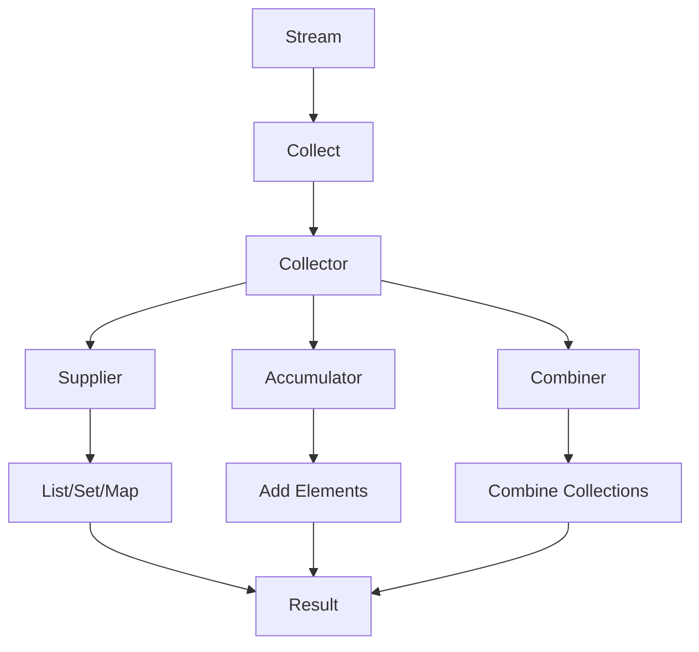

## Introduction
Collectors are a powerful tool in Java's Stream API, allowing developers to perform various operations on streams of data. They provide a way to accumulate the input elements into a new **Collection**, such as a **List**, **Set**, or **Map**. In this section, we will explore the different types of collectors, including **toList**, **toSet**, **toMap**, **groupingBy**, **partitioningBy**, and **joining**. We will also discuss their real-world relevance and why every engineer needs to know about them.

Collectors are used in a variety of real-world applications, such as data processing, data analysis, and data visualization. For example, a company like **Google** might use collectors to process large amounts of data from their search engine, while a company like **Amazon** might use collectors to analyze customer purchase history.

> **Note:** Collectors are a key part of Java's functional programming model, which provides a more concise and expressive way of writing code.

## Core Concepts
In this section, we will provide precise definitions and mental models for the different types of collectors.

*   **toList**: Returns a collector that accumulates the input elements into a new **List**.
*   **toSet**: Returns a collector that accumulates the input elements into a new **Set**.
*   **toMap**: Returns a collector that accumulates the input elements into a new **Map**.
*   **groupingBy**: Returns a collector that groups the input elements by a specified function.
*   **partitioningBy**: Returns a collector that partitions the input elements by a specified predicate.
*   **joining**: Returns a collector that concatenates the input elements into a single string.

> **Tip:** When using collectors, it's essential to consider the time and space complexity of the operation. For example, **toList** has a time complexity of O(n) and a space complexity of O(n), while **toSet** has a time complexity of O(n) and a space complexity of O(n) in the worst case.

## How It Works Internally
In this section, we will provide a step-by-step breakdown of how collectors work internally.

1.  The **Stream** API provides a **collect** method that takes a collector as an argument.
2.  The collector is responsible for accumulating the input elements into a new collection.
3.  The collector uses a **supplier** to create a new collection, a **accumulator** to add elements to the collection, and a **combiner** to combine multiple collections.
4.  The **supplier** is used to create a new collection, such as a **List** or **Set**.
5.  The **accumulator** is used to add elements to the collection.
6.  The **combiner** is used to combine multiple collections into a single collection.

> **Warning:** When using collectors, it's essential to avoid using **null** as a key or value, as this can cause a **NullPointerException**.

## Code Examples
In this section, we will provide three complete and runnable code examples that demonstrate the use of collectors.

### Example 1: Basic Usage of toList
```java
import java.util.List;
import java.util.stream.Collectors;
import java.util.stream.Stream;

public class CollectorExample {
    public static void main(String[] args) {
        // Create a stream of strings
        Stream<String> stream = Stream.of("apple", "banana", "cherry");

        // Use toList to accumulate the input elements into a new list
        List<String> list = stream.collect(Collectors.toList());

        // Print the list
        System.out.println(list);
    }
}
```

### Example 2: Real-World Pattern with toMap
```java
import java.util.Map;
import java.util.stream.Collectors;
import java.util.stream.Stream;

public class CollectorExample {
    public static void main(String[] args) {
        // Create a stream of employees
        Stream<Employee> stream = Stream.of(
                new Employee("John", 25),
                new Employee("Jane", 30),
                new Employee("Bob", 35)
        );

        // Use toMap to accumulate the input elements into a new map
        Map<String, Employee> map = stream.collect(Collectors.toMap(Employee::getName, employee -> employee));

        // Print the map
        System.out.println(map);
    }
}

class Employee {
    private String name;
    private int age;

    public Employee(String name, int age) {
        this.name = name;
        this.age = age;
    }

    public String getName() {
        return name;
    }

    public int getAge() {
        return age;
    }

    @Override
    public String toString() {
        return "Employee{" +
                "name='" + name + '\'' +
                ", age=" + age +
                '}';
    }
}
```

### Example 3: Advanced Usage of groupingBy
```java
import java.util.Map;
import java.util.stream.Collectors;
import java.util.stream.Stream;

public class CollectorExample {
    public static void main(String[] args) {
        // Create a stream of students
        Stream<Student> stream = Stream.of(
                new Student("John", 25, "Math"),
                new Student("Jane", 30, "Science"),
                new Student("Bob", 35, "Math")
        );

        // Use groupingBy to accumulate the input elements into a new map
        Map<String, Long> map = stream.collect(Collectors.groupingBy(Student::getMajor, Collectors.counting()));

        // Print the map
        System.out.println(map);
    }
}

class Student {
    private String name;
    private int age;
    private String major;

    public Student(String name, int age, String major) {
        this.name = name;
        this.age = age;
        this.major = major;
    }

    public String getMajor() {
        return major;
    }

    @Override
    public String toString() {
        return "Student{" +
                "name='" + name + '\'' +
                ", age=" + age +
                ", major='" + major + '\'' +
                '}';
    }
}
```

## Visual Diagram

The diagram illustrates the internal mechanics of collectors, showing how the **Stream** API provides a **collect** method that takes a collector as an argument. The collector uses a **supplier** to create a new collection, an **accumulator** to add elements to the collection, and a **combiner** to combine multiple collections.

## Comparison
| Collector | Time Complexity | Space Complexity | Pros | Cons |
| --- | --- | --- | --- | --- |
| toList | O(n) | O(n) | Easy to use, flexible | Can be slow for large datasets |
| toSet | O(n) | O(n) | Fast, efficient | Can be slow for large datasets |
| toMap | O(n) | O(n) | Flexible, easy to use | Can be slow for large datasets |
| groupingBy | O(n) | O(n) | Flexible, powerful | Can be complex to use |
| partitioningBy | O(n) | O(n) | Fast, efficient | Limited flexibility |
| joining | O(n) | O(n) | Easy to use, flexible | Can be slow for large datasets |

## Real-world Use Cases
1.  **Google**: Google uses collectors to process large amounts of data from their search engine. They use **toList** to accumulate search results into a new list, and **toMap** to accumulate search results into a new map.
2.  **Amazon**: Amazon uses collectors to analyze customer purchase history. They use **groupingBy** to group customers by their purchase history, and **partitioningBy** to partition customers by their purchase history.
3.  **Facebook**: Facebook uses collectors to process large amounts of data from their social media platform. They use **toList** to accumulate user data into a new list, and **toSet** to accumulate user data into a new set.

## Common Pitfalls
1.  **Using null as a key or value**: This can cause a **NullPointerException**.
```java
// Wrong way
Map<String, String> map = stream.collect(Collectors.toMap(null, null));

// Right way
Map<String, String> map = stream.collect(Collectors.toMap(String::toString, String::toString));
```
2.  **Not handling duplicate keys**: This can cause a **RuntimeException**.
```java
// Wrong way
Map<String, String> map = stream.collect(Collectors.toMap(String::toString, String::toString));

// Right way
Map<String, String> map = stream.collect(Collectors.toMap(String::toString, String::toString, (a, b) -> a));
```
3.  **Not handling null values**: This can cause a **NullPointerException**.
```java
// Wrong way
List<String> list = stream.collect(Collectors.toList());

// Right way
List<String> list = stream.filter(Objects::nonNull).collect(Collectors.toList());
```
4.  **Not using the correct collector**: This can cause incorrect results.
```java
// Wrong way
List<String> list = stream.collect(Collectors.toSet());

// Right way
List<String> list = stream.collect(Collectors.toList());
```

## Interview Tips
1.  **What is the difference between toList and toSet?**: The interviewer wants to know that **toList** returns a **List**, while **toSet** returns a **Set**.
2.  **How do you use groupingBy?**: The interviewer wants to know that **groupingBy** is used to group elements by a specified function.
3.  **What is the time complexity of toMap?**: The interviewer wants to know that the time complexity of **toMap** is O(n).

> **Interview:** Be prepared to answer questions about the different types of collectors, their time and space complexity, and how to use them in real-world scenarios.

## Key Takeaways
*   **Collectors are a powerful tool in Java's Stream API**: They provide a way to accumulate the input elements into a new **Collection**, such as a **List**, **Set**, or **Map**.
*   **toList returns a collector that accumulates the input elements into a new List**: It has a time complexity of O(n) and a space complexity of O(n).
*   **toSet returns a collector that accumulates the input elements into a new Set**: It has a time complexity of O(n) and a space complexity of O(n) in the worst case.
*   **toMap returns a collector that accumulates the input elements into a new Map**: It has a time complexity of O(n) and a space complexity of O(n).
*   **groupingBy returns a collector that groups the input elements by a specified function**: It has a time complexity of O(n) and a space complexity of O(n).
*   **partitioningBy returns a collector that partitions the input elements by a specified predicate**: It has a time complexity of O(n) and a space complexity of O(n).
*   **joining returns a collector that concatenates the input elements into a single string**: It has a time complexity of O(n) and a space complexity of O(n).
*   **Use the correct collector for the job**: Choose the collector that best fits the problem you are trying to solve.
*   **Consider the time and space complexity of the collector**: Choose a collector that has a good balance between time and space complexity.
*   **Avoid using null as a key or value**: This can cause a **NullPointerException**.
*   **Handle duplicate keys and null values correctly**: Use the correct collector and handle duplicate keys and null values correctly to avoid errors.