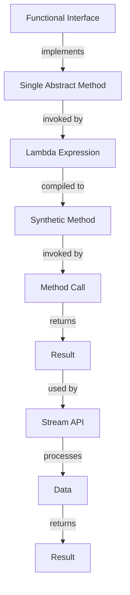

## Introduction
**Functional Interfaces** are a fundamental concept in Java, introduced in Java 8. They are interfaces that have a single abstract method (SAM), which can be implemented using a lambda expression or a method reference. This allows for more concise and expressive code, making it easier to work with functional programming concepts. In this section, we will explore the different types of functional interfaces, including **Predicate**, **Function**, **Consumer**, **Supplier**, and **BiFunction**.

> **Note:** Functional interfaces are used extensively in Java 8's Stream API, which provides a more declarative way of processing data.

## Core Concepts
The five main functional interfaces in Java are:
- **Predicate**: represents a boolean-valued function of one argument.
- **Function**: represents a function that accepts one argument and returns a result.
- **Consumer**: represents a function that accepts one argument and returns no result.
- **Supplier**: represents a function that accepts no arguments and returns a result.
- **BiFunction**: represents a function that accepts two arguments and returns a result.

These interfaces are used to define lambda expressions, which are small, anonymous functions that can be passed around like objects.

> **Warning:** Be careful when using lambda expressions, as they can make the code harder to debug if not properly formatted.

## How It Works Internally
When a lambda expression is created, the compiler generates a synthetic method that implements the functional interface. This method is then invoked when the lambda expression is called.

Here is a step-by-step breakdown of how it works:
1. The compiler checks if the lambda expression matches the functional interface.
2. If it does, the compiler generates a synthetic method that implements the interface.
3. The synthetic method is then invoked when the lambda expression is called.

> **Tip:** Use the `@FunctionalInterface` annotation to ensure that the interface has only one abstract method.

## Code Examples
### Example 1: Basic Predicate
```java
import java.util.function.Predicate;

public class Main {
    public static void main(String[] args) {
        // Create a predicate that checks if a number is even
        Predicate<Integer> isEven = num -> num % 2 == 0;
        
        // Use the predicate to filter a list of numbers
        System.out.println(isEven.test(10)); // true
        System.out.println(isEven.test(11)); // false
    }
}
```

### Example 2: Real-world Function
```java
import java.util.function.Function;
import java.util.stream.Stream;

public class Main {
    public static void main(String[] args) {
        // Create a function that converts a string to uppercase
        Function<String, String> toUppercase = String::toUpperCase;
        
        // Use the function to map a stream of strings
        Stream<String> stream = Stream.of("hello", "world");
        stream.map(toUppercase).forEach(System.out::println);
    }
}
```

### Example 3: Advanced BiFunction
```java
import java.util.function.BiFunction;

public class Main {
    public static void main(String[] args) {
        // Create a bi-function that adds two numbers
        BiFunction<Integer, Integer, Integer> add = (a, b) -> a + b;
        
        // Use the bi-function to calculate the sum of two numbers
        System.out.println(add.apply(10, 20)); // 30
    }
}
```

## Visual Diagram

This diagram shows the relationship between functional interfaces, lambda expressions, and the Stream API.

## Comparison
| Interface | Description | Time Complexity | Space Complexity | Pros | Cons |
| --- | --- | --- | --- | --- | --- |
| Predicate | boolean-valued function | O(1) | O(1) | concise, expressive | limited to boolean values |
| Function | function that accepts one argument | O(1) | O(1) | flexible, reusable | can be complex to implement |
| Consumer | function that accepts one argument | O(1) | O(1) | simple, easy to use | limited to side effects |
| Supplier | function that returns a result | O(1) | O(1) | flexible, reusable | can be complex to implement |
| BiFunction | function that accepts two arguments | O(1) | O(1) | flexible, reusable | can be complex to implement |

## Real-world Use Cases
1. **Google's Guava Library**: uses functional interfaces to provide a more concise and expressive way of working with collections.
2. **Apache Spark**: uses functional interfaces to define data processing tasks.
3. **Java 8's Stream API**: uses functional interfaces to provide a more declarative way of processing data.

## Common Pitfalls
1. **Incorrectly implementing the functional interface**: make sure to implement the correct method.
```java
// wrong
@FunctionalInterface
interface MyInterface {
    void myMethod();
    void myMethod2();
}

// right
@FunctionalInterface
interface MyInterface {
    void myMethod();
}
```

2. **Using lambda expressions with complex logic**: make sure to keep the logic simple and concise.
```java
// wrong
Runnable r = () -> {
    // complex logic
};

// right
Runnable r = () -> {
    // simple logic
};
```

3. **Not using the `@FunctionalInterface` annotation**: make sure to use the annotation to ensure the interface has only one abstract method.
```java
// wrong
interface MyInterface {
    void myMethod();
}

// right
@FunctionalInterface
interface MyInterface {
    void myMethod();
}
```

4. **Not handling exceptions properly**: make sure to handle exceptions properly when using lambda expressions.
```java
// wrong
Runnable r = () -> {
    // code that throws an exception
};

// right
Runnable r = () -> {
    try {
        // code that throws an exception
    } catch (Exception e) {
        // handle the exception
    }
};
```

## Interview Tips
1. **What is a functional interface?**: a functional interface is an interface that has only one abstract method.
2. **How do you implement a functional interface?**: you can implement a functional interface using a lambda expression or a method reference.
3. **What is the difference between a predicate and a function?**: a predicate is a boolean-valued function, while a function is a function that returns a result.

> **Interview:** Be prepared to explain the different types of functional interfaces and how to use them.

## Key Takeaways
* Functional interfaces are used to define lambda expressions.
* There are five main functional interfaces: **Predicate**, **Function**, **Consumer**, **Supplier**, and **BiFunction**.
* Lambda expressions are small, anonymous functions that can be passed around like objects.
* The `@FunctionalInterface` annotation is used to ensure that the interface has only one abstract method.
* Functional interfaces are used extensively in Java 8's Stream API.
* Be careful when using lambda expressions, as they can make the code harder to debug if not properly formatted.
* Use the `@FunctionalInterface` annotation to ensure that the interface has only one abstract method.
* Keep the logic simple and concise when using lambda expressions.
* Handle exceptions properly when using lambda expressions.