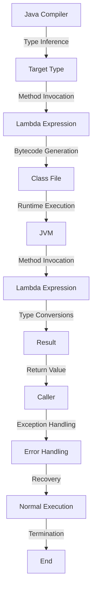

## Introduction
**Lambda expressions** are a fundamental concept in functional programming, allowing developers to define small, single-purpose functions inline within their code. They are a shorthand way to create instances of functional interfaces, which are interfaces that have only one abstract method. In Java, lambda expressions are denoted by the syntax `(params) -> expression`, where `params` is a list of input parameters and `expression` is the code that gets executed when the lambda is invoked. Lambda expressions have become a crucial part of the Java language, enabling developers to write more concise, expressive, and efficient code.

> **Note:** Lambda expressions are often used in conjunction with Java 8's **Stream API**, which provides a functional programming approach to processing data in a declarative way.

Real-world relevance of lambda expressions can be seen in various applications, such as data processing, event handling, and concurrent programming. For instance, lambda expressions can be used to filter, map, and reduce data in a collection, making it easier to perform complex data transformations.

## Core Concepts
- **Functional Interface**: An interface that has only one abstract method, which can be implemented using a lambda expression.
- **Lambda Expression**: A shorthand way to create an instance of a functional interface, denoted by the syntax `(params) -> expression`.
- **Target Type**: The type of the functional interface that the lambda expression is being assigned to.
- **Type Inference**: The process by which the Java compiler infers the types of the input parameters and the return type of the lambda expression.

> **Warning:** When using lambda expressions, it's essential to ensure that the target type is a functional interface; otherwise, the code will not compile.

## How It Works Internally
When the Java compiler encounters a lambda expression, it performs the following steps:

1. **Type Inference**: The compiler infers the types of the input parameters and the return type of the lambda expression based on the target type.
2. **Method Invocation**: The compiler generates a method invocation that calls the lambda expression's `invoke()` method.
3. **Bytecode Generation**: The compiler generates bytecode for the lambda expression, which includes the method invocation and any necessary type conversions.
4. **Runtime Execution**: At runtime, the JVM executes the bytecode, invoking the lambda expression's `invoke()` method and passing in the required arguments.

> **Tip:** To improve performance, the JVM can inline lambda expressions, eliminating the need for method invocation and type conversions.

## Code Examples
### Example 1: Basic Lambda Expression
```java
// Define a functional interface
interface Printer {
    void print(String message);
}

public class Main {
    public static void main(String[] args) {
        // Create a lambda expression that implements the Printer interface
        Printer printer = (message) -> System.out.println(message);
        printer.print("Hello, World!"); // Output: Hello, World!
    }
}
```
### Example 2: Using Lambda Expressions with Streams
```java
import java.util.Arrays;
import java.util.List;
import java.util.stream.Collectors;

public class Main {
    public static void main(String[] args) {
        // Create a list of numbers
        List<Integer> numbers = Arrays.asList(1, 2, 3, 4, 5);

        // Use a lambda expression to filter out even numbers
        List<Integer> oddNumbers = numbers.stream()
                .filter((number) -> number % 2 != 0)
                .collect(Collectors.toList());

        System.out.println(oddNumbers); // Output: [1, 3, 5]
    }
}
```
### Example 3: Advanced Lambda Expression with Exception Handling
```java
import java.util.function.Function;

public class Main {
    public static void main(String[] args) {
        // Define a functional interface that throws an exception
        Function<String, Integer> parser = (input) -> {
            try {
                return Integer.parseInt(input);
            } catch (NumberFormatException e) {
                throw new RuntimeException("Invalid input", e);
            }
        };

        // Use the lambda expression to parse a string
        try {
            int result = parser.apply("123");
            System.out.println(result); // Output: 123
        } catch (RuntimeException e) {
            System.out.println(e.getMessage()); // Output: Invalid input
        }
    }
}
```
## Visual Diagram

The diagram illustrates the internal workings of lambda expressions, from type inference to runtime execution.

## Comparison
| Approach | Time Complexity | Space Complexity | Pros | Cons | Best For |
|----------|----------------|-----------------|------|------|----------|
| Lambda Expression | O(1) | O(1) | Concise, expressive, efficient | Limited to functional interfaces | Data processing, event handling |
| Anonymous Class | O(1) | O(n) | More flexible than lambda expressions | Verbose, less efficient | Complex logic, multiple methods |
| Method Reference | O(1) | O(1) | Concise, expressive, efficient | Limited to existing methods | Data processing, event handling |
| Functional Interface | O(1) | O(1) | Defines a contract for lambda expressions | Limited to single-method interfaces | Data processing, event handling |

## Real-world Use Cases
1. **Data Processing**: Google's **Guava** library uses lambda expressions to process data in a concise and efficient manner.
2. **Event Handling**: **Android** uses lambda expressions to handle events, such as button clicks and network requests.
3. **Concurrent Programming**: **Java 8's** **Parallel Streams** API uses lambda expressions to process data in parallel, improving performance and scalability.

## Common Pitfalls
1. **Incorrect Target Type**: Using a lambda expression with an incorrect target type can lead to compilation errors.
```java
// Incorrect target type
Object printer = (message) -> System.out.println(message);
```
```java
// Correct target type
Printer printer = (message) -> System.out.println(message);
```
2. **Unnecessary Type Conversions**: Using unnecessary type conversions can lead to performance issues and code complexity.
```java
// Unnecessary type conversion
Integer result = (Integer) parser.apply("123");
```
```java
// Necessary type conversion
int result = parser.apply("123");
```
3. **Lack of Exception Handling**: Failing to handle exceptions in lambda expressions can lead to runtime errors and crashes.
```java
// Lack of exception handling
Function<String, Integer> parser = (input) -> Integer.parseInt(input);
```
```java
// Exception handling
Function<String, Integer> parser = (input) -> {
    try {
        return Integer.parseInt(input);
    } catch (NumberFormatException e) {
        throw new RuntimeException("Invalid input", e);
    }
};
```
4. **Overuse of Lambda Expressions**: Overusing lambda expressions can lead to code complexity and maintainability issues.
```java
// Overuse of lambda expressions
List<Integer> numbers = Arrays.asList(1, 2, 3, 4, 5);
numbers.stream()
        .filter((number) -> number % 2 != 0)
        .map((number) -> number * 2)
        .forEach((number) -> System.out.println(number));
```
```java
// Balanced use of lambda expressions
List<Integer> numbers = Arrays.asList(1, 2, 3, 4, 5);
numbers.stream()
        .filter(number -> number % 2 != 0)
        .mapToInt(number -> number * 2)
        .forEach(System.out::println);
```
## Interview Tips
1. **Define a Lambda Expression**: Be prepared to define a lambda expression and explain its syntax and semantics.
```java
// Define a lambda expression
Printer printer = (message) -> System.out.println(message);
```
2. **Explain Type Inference**: Be prepared to explain how type inference works in lambda expressions.
```java
// Explain type inference
Function<String, Integer> parser = (input) -> Integer.parseInt(input);
```
3. **Discuss Exception Handling**: Be prepared to discuss exception handling in lambda expressions.
```java
// Discuss exception handling
Function<String, Integer> parser = (input) -> {
    try {
        return Integer.parseInt(input);
    } catch (NumberFormatException e) {
        throw new RuntimeException("Invalid input", e);
    }
};
```
## Key Takeaways
* Lambda expressions are a shorthand way to create instances of functional interfaces.
* Type inference is used to determine the types of the input parameters and the return type of the lambda expression.
* Lambda expressions can be used to improve code conciseness, expressiveness, and efficiency.
* Exception handling is crucial in lambda expressions to prevent runtime errors and crashes.
* Overusing lambda expressions can lead to code complexity and maintainability issues.
* Balanced use of lambda expressions can improve code readability and maintainability.
* Lambda expressions are commonly used in data processing, event handling, and concurrent programming.
* Time complexity of lambda expressions is O(1), and space complexity is O(1).