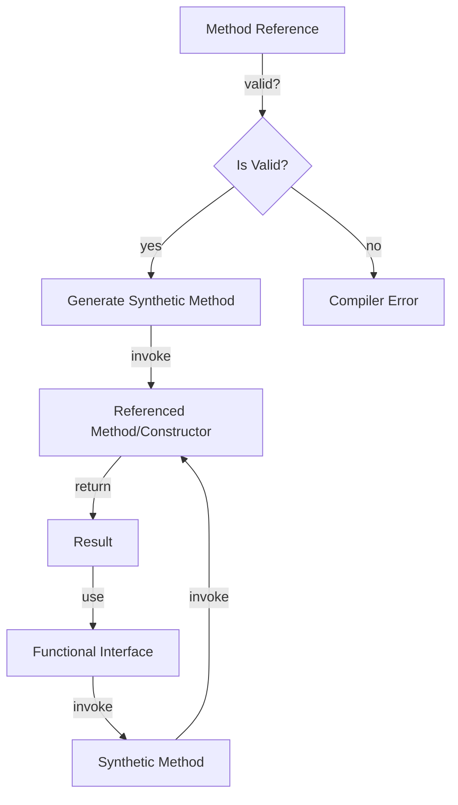

## Introduction
**Method References** are a concise way to implement functional interfaces in Java. They were introduced in Java 8 as part of the lambda expression feature. Method references allow you to reference existing methods or constructors of objects, which can then be used as instances of functional interfaces. This feature is essential in Java programming, as it enables developers to write more expressive and concise code. In real-world applications, method references are used extensively in data processing, event handling, and API design.

> **Note:** Method references are denoted by the `::` operator, which is read as "double colon." This operator is used to separate the object or class name from the method name.

## Core Concepts
A **method reference** is an expression that refers to a specific method or constructor of an object or class. There are three types of method references:
* **Reference to a static method**: `Class::staticMethod`
* **Reference to an instance method of an object of an arbitrary type**: `Class::instanceMethod`
* **Reference to an instance method of an existing object**: `obj::instanceMethod`
* **Reference to a constructor**: `Class::new`

> **Tip:** When using method references, it's essential to ensure that the method or constructor being referenced matches the functional interface's abstract method.

## How It Works Internally
When the Java compiler encounters a method reference, it generates a synthetic method that invokes the referenced method or constructor. This synthetic method is then used to implement the functional interface.

Here's a step-by-step breakdown of how method references work internally:
1. The Java compiler checks if the method reference is valid, i.e., the referenced method or constructor exists and matches the functional interface's abstract method.
2. If the method reference is valid, the compiler generates a synthetic method that invokes the referenced method or constructor.
3. The synthetic method is then used to implement the functional interface.
4. When the functional interface is invoked, the synthetic method is called, which in turn invokes the referenced method or constructor.

> **Warning:** When using method references, be aware of the potential for **NullPointerExceptions** if the referenced object is null.

## Code Examples
### Example 1: Reference to a Static Method
```java
import java.util.function.BiFunction;

public class Main {
    public static void main(String[] args) {
        BiFunction<Integer, Integer, Integer> adder = Math::max;
        System.out.println(adder.apply(10, 20)); // prints 20
    }
}
```
In this example, we use the `Math::max` method reference to implement the `BiFunction` interface.

### Example 2: Reference to an Instance Method of an Object
```java
import java.util.function.Consumer;

public class Main {
    public static void main(String[] args) {
        Consumer<String> printer = System.out::println;
        printer.accept("Hello, World!"); // prints "Hello, World!"
    }
}
```
In this example, we use the `System.out::println` method reference to implement the `Consumer` interface.

### Example 3: Reference to a Constructor
```java
import java.util.function.Supplier;

public class Main {
    public static void main(String[] args) {
        Supplier<String> stringSupplier = String::new;
        System.out.println(stringSupplier.get()); // prints an empty string
    }
}
```
In this example, we use the `String::new` constructor reference to implement the `Supplier` interface.

## Visual Diagram

This diagram illustrates the internal workings of method references in Java. The process starts with the method reference, which is then validated by the compiler. If the method reference is valid, a synthetic method is generated, which invokes the referenced method or constructor. The result of the invocation is then used to implement the functional interface.

## Comparison
| Approach | Time Complexity | Space Complexity | Pros | Cons | Best For |
| --- | --- | --- | --- | --- | --- |
| Method References | O(1) | O(1) | Concise code, improved readability | Limited to functional interfaces | Data processing, event handling |
| Lambda Expressions | O(1) | O(1) | Flexible, can be used with any interface | Verbose code, harder to read | Complex logic, API design |
| Anonymous Classes | O(1) | O(1) | Can be used with any interface, flexible | Verbose code, harder to read | Legacy code, compatibility issues |
| Normal Methods | O(1) | O(1) | Easy to read, understand, and maintain | Not concise, not flexible | Simple logic, helper methods |

## Real-world Use Cases
1. **Data Processing**: Method references are used extensively in data processing pipelines to perform operations such as filtering, mapping, and reducing.
2. **Event Handling**: Method references are used in event handling to handle events such as button clicks, keyboard input, and network requests.
3. **API Design**: Method references are used in API design to implement functional interfaces, which improves code readability and maintainability.

## Common Pitfalls
1. **NullPointerExceptions**: When using method references, be aware of the potential for NullPointerExceptions if the referenced object is null.
2. **Invalid Method References**: Ensure that the method reference is valid, i.e., the referenced method or constructor exists and matches the functional interface's abstract method.
3. **Type Inference**: Be aware of type inference issues when using method references, as the compiler may not always be able to infer the correct type.
4. **Code Readability**: Method references can make code harder to read if not used carefully, so ensure that the code is well-documented and easy to understand.

## Interview Tips
1. **What is a method reference in Java?**: A method reference is an expression that refers to a specific method or constructor of an object or class.
2. **How do method references work internally?**: Method references work by generating a synthetic method that invokes the referenced method or constructor.
3. **What are the benefits of using method references?**: Method references improve code readability, conciseness, and maintainability.

> **Interview:** Be prepared to explain the differences between method references, lambda expressions, and anonymous classes, as well as the benefits and drawbacks of each approach.

## Key Takeaways
* Method references are a concise way to implement functional interfaces in Java.
* There are three types of method references: reference to a static method, reference to an instance method of an object, and reference to a constructor.
* Method references work by generating a synthetic method that invokes the referenced method or constructor.
* Method references improve code readability, conciseness, and maintainability.
* Be aware of potential pitfalls such as NullPointerExceptions, invalid method references, and type inference issues.
* Use method references carefully to ensure code readability and maintainability.
* Method references are used extensively in data processing, event handling, and API design.
* The time and space complexity of method references is O(1).