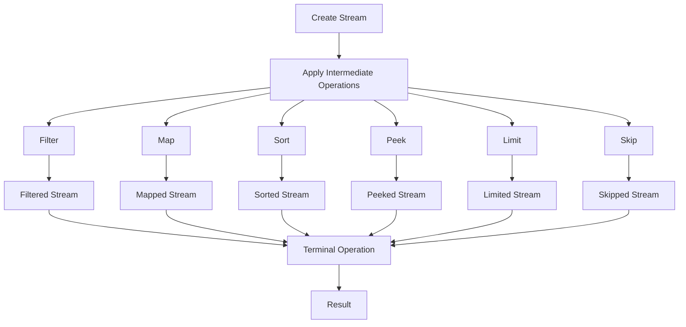

## Introduction
Java Streams are a powerful feature introduced in Java 8, allowing developers to process data in a declarative way. **Stream Intermediate Operations** are a crucial part of this API, enabling the transformation and filtering of data. These operations are called "intermediate" because they do not produce a result but instead return a new Stream that can be further processed. In this section, we will delve into the world of Stream Intermediate Operations, exploring their purpose, real-world relevance, and why every engineer needs to understand them.

Stream Intermediate Operations are essential in data processing pipelines, as they allow developers to extract, transform, and filter data. For instance, when working with large datasets, you might want to filter out irrelevant data, map values to new formats, or remove duplicates. These operations make it possible to perform such tasks efficiently and concisely. Real-world examples include data processing in big data systems, data analysis in scientific research, and data transformation in web applications.

> **Note:** Stream Intermediate Operations are lazy, meaning they only execute when a terminal operation is invoked. This laziness allows for more efficient processing of data, as intermediate operations can be combined and optimized before execution.

## Core Concepts
Stream Intermediate Operations can be broadly categorized into several types:

* **Filtering Operations**: `filter()`, `distinct()`
* **Mapping Operations**: `map()`, `flatMap()`
* **Sorting Operations**: `sorted()`
* **Peeking Operations**: `peek()`
* **Limiting Operations**: `limit()`, `skip()`

Each of these operations has a specific purpose and is used to transform or filter data in a particular way.

* **Filtering Operations**: These operations are used to remove elements from a Stream that do not match a certain condition. `filter()` takes a predicate as an argument and returns a new Stream containing only the elements that satisfy the predicate. `distinct()` removes duplicate elements from a Stream.
* **Mapping Operations**: These operations are used to transform elements in a Stream. `map()` takes a function as an argument and applies it to each element in the Stream, returning a new Stream containing the transformed elements. `flatMap()` is similar to `map()`, but it takes a function that returns a Stream and flattens the resulting Streams into a single Stream.
* **Sorting Operations**: These operations are used to sort elements in a Stream. `sorted()` takes a comparator as an argument and returns a new Stream containing the sorted elements.
* **Peeking Operations**: These operations are used to perform an action on each element in a Stream without modifying the Stream. `peek()` takes a consumer as an argument and applies it to each element in the Stream.
* **Limiting Operations**: These operations are used to limit the number of elements in a Stream. `limit()` takes an integer as an argument and returns a new Stream containing at most the specified number of elements. `skip()` takes an integer as an argument and returns a new Stream containing all elements except the first specified number of elements.

> **Warning:** When using Stream Intermediate Operations, be aware that they can throw exceptions if the underlying data is not valid. For example, using `distinct()` on a Stream that contains null elements can throw a `NullPointerException`.

## How It Works Internally
Stream Intermediate Operations work by creating a new Stream that wraps the original Stream. Each intermediate operation returns a new Stream that can be further processed. When a terminal operation is invoked, the Stream is executed, and the intermediate operations are applied in the order they were specified.

Here's a step-by-step breakdown of how Stream Intermediate Operations work:

1. Create a new Stream using a source, such as a collection or an array.
2. Apply intermediate operations to the Stream, such as filtering, mapping, or sorting.
3. Each intermediate operation returns a new Stream that wraps the original Stream.
4. When a terminal operation is invoked, the Stream is executed, and the intermediate operations are applied in the order they were specified.
5. The resulting Stream is returned, containing the transformed or filtered data.

> **Tip:** To improve performance, it's essential to use Stream Intermediate Operations efficiently. For example, using `filter()` before `map()` can reduce the number of elements that need to be transformed.

## Code Examples
### Example 1: Basic Filtering
```java
import java.util.List;
import java.util.stream.Collectors;

public class StreamIntermediateExample {
    public static void main(String[] args) {
        List<Integer> numbers = List.of(1, 2, 3, 4, 5, 6);
        List<Integer> evenNumbers = numbers.stream()
                .filter(n -> n % 2 == 0)
                .collect(Collectors.toList());
        System.out.println(evenNumbers); // [2, 4, 6]
    }
}
```
This example demonstrates the use of `filter()` to remove odd numbers from a Stream.

### Example 2: Mapping and Sorting
```java
import java.util.List;
import java.util.stream.Collectors;

public class StreamIntermediateExample {
    public static void main(String[] args) {
        List<String> names = List.of("John", "Alice", "Bob", "Eve");
        List<String> sortedNames = names.stream()
                .map(String::toUpperCase)
                .sorted()
                .collect(Collectors.toList());
        System.out.println(sortedNames); // [ALICE, BOB, EVE, JOHN]
    }
}
```
This example demonstrates the use of `map()` to transform strings to uppercase and `sorted()` to sort the resulting Stream.

### Example 3: Flat Mapping and Limiting
```java
import java.util.List;
import java.util.stream.Collectors;

public class StreamIntermediateExample {
    public static void main(String[] args) {
        List<List<Integer>> numbers = List.of(
                List.of(1, 2, 3),
                List.of(4, 5, 6),
                List.of(7, 8, 9)
        );
        List<Integer> flattenedNumbers = numbers.stream()
                .flatMap(List::stream)
                .limit(5)
                .collect(Collectors.toList());
        System.out.println(flattenedNumbers); // [1, 2, 3, 4, 5]
    }
}
```
This example demonstrates the use of `flatMap()` to flatten a Stream of lists and `limit()` to limit the resulting Stream to 5 elements.

## Visual Diagram

This diagram illustrates the flow of Stream Intermediate Operations, from creating a Stream to applying terminal operations.

> **Interview:** What is the difference between `map()` and `flatMap()`? Answer: `map()` applies a function to each element in a Stream, returning a new Stream containing the transformed elements. `flatMap()` applies a function that returns a Stream to each element in a Stream, flattening the resulting Streams into a single Stream.

## Comparison
| Operation | Time Complexity | Space Complexity | Pros | Cons | Best For |
| --- | --- | --- | --- | --- | --- |
| `filter()` | O(n) | O(1) | Efficient filtering, lazy evaluation | May throw exceptions if predicate is null | Filtering large datasets |
| `map()` | O(n) | O(1) | Efficient transformation, lazy evaluation | May throw exceptions if function is null | Transforming large datasets |
| `flatMap()` | O(n) | O(1) | Efficient flattening, lazy evaluation | May throw exceptions if function is null | Flattening nested datasets |
| `sorted()` | O(n log n) | O(n) | Stable sorting, lazy evaluation | May throw exceptions if comparator is null | Sorting large datasets |
| `peek()` | O(n) | O(1) | Efficient peeking, lazy evaluation | May throw exceptions if consumer is null | Peeking at elements in a Stream |
| `limit()` | O(n) | O(1) | Efficient limiting, lazy evaluation | May throw exceptions if limit is negative | Limiting large datasets |
| `skip()` | O(n) | O(1) | Efficient skipping, lazy evaluation | May throw exceptions if skip is negative | Skipping elements in a Stream |

## Real-world Use Cases
1. **Data Processing**: Stream Intermediate Operations can be used to process large datasets, filtering out irrelevant data, transforming values, and sorting results.
2. **Data Analysis**: Stream Intermediate Operations can be used to analyze large datasets, applying filters, mappings, and sorting to extract insights.
3. **Web Applications**: Stream Intermediate Operations can be used to process user input, filtering out invalid data, transforming values, and sorting results for display.

> **Tip:** When working with large datasets, it's essential to use Stream Intermediate Operations efficiently. For example, using `filter()` before `map()` can reduce the number of elements that need to be transformed.

## Common Pitfalls
1. **Null Pointer Exceptions**: Stream Intermediate Operations may throw `NullPointerExceptions` if the underlying data is not valid. For example, using `distinct()` on a Stream that contains null elements can throw a `NullPointerException`.
2. **Infinite Loops**: Stream Intermediate Operations may cause infinite loops if not used correctly. For example, using `flatMap()` with a function that returns a Stream that contains the original element can cause an infinite loop.
3. **Performance Issues**: Stream Intermediate Operations may cause performance issues if not used efficiently. For example, using `sorted()` on a large dataset can be slow if not used with a efficient sorting algorithm.

> **Warning:** When using Stream Intermediate Operations, be aware of the potential pitfalls, such as null pointer exceptions, infinite loops, and performance issues.

## Interview Tips
1. **What is the difference between `map()` and `flatMap()`?**: Answer: `map()` applies a function to each element in a Stream, returning a new Stream containing the transformed elements. `flatMap()` applies a function that returns a Stream to each element in a Stream, flattening the resulting Streams into a single Stream.
2. **How do you use `filter()` to remove null elements from a Stream?**: Answer: Use `filter(Objects::nonNull)` to remove null elements from a Stream.
3. **What is the time complexity of `sorted()`?**: Answer: The time complexity of `sorted()` is O(n log n), where n is the number of elements in the Stream.

## Key Takeaways
* Stream Intermediate Operations are used to transform and filter data in a Stream.
* `filter()` is used to remove elements from a Stream that do not match a certain condition.
* `map()` is used to transform elements in a Stream.
* `flatMap()` is used to flatten a Stream of Streams into a single Stream.
* `sorted()` is used to sort elements in a Stream.
* `peek()` is used to perform an action on each element in a Stream without modifying the Stream.
* `limit()` is used to limit the number of elements in a Stream.
* `skip()` is used to skip a specified number of elements in a Stream.
* Stream Intermediate Operations are lazy, meaning they only execute when a terminal operation is invoked.
* Stream Intermediate Operations can be used to process large datasets, filtering out irrelevant data, transforming values, and sorting results.