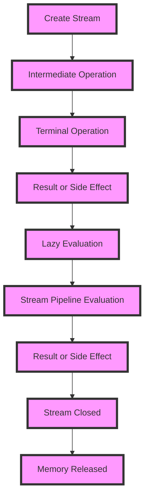

## Introduction
The **Stream Terminal** operations in Java are a set of methods that can be used to conclude a stream pipeline and produce a result or a side effect. These operations are essential for processing data in a declarative way, allowing developers to focus on what needs to be done rather than how it's done. In this section, we'll explore the different types of Stream Terminal operations, including **collect**, **forEach**, **reduce**, **count**, **min**, **max**, **anyMatch**, **allMatch**, and **findFirst**. We'll also discuss their real-world relevance and why every engineer needs to know about them.

> **Note:** Stream Terminal operations are a crucial part of the Java Stream API, which was introduced in Java 8. They provide a concise and expressive way to process data, making it easier to write efficient and readable code.

## Core Concepts
Before diving into the specifics of each Stream Terminal operation, let's define some key concepts and terminology.

* **Stream**: A sequence of elements that can be processed in a pipeline fashion.
* **Intermediate Operation**: A method that returns a new stream, allowing for further processing.
* **Terminal Operation**: A method that concludes the stream pipeline and produces a result or a side effect.
* **Lazy Evaluation**: The stream pipeline is only evaluated when a terminal operation is invoked.

> **Tip:** Understanding the difference between intermediate and terminal operations is essential for working with streams. Intermediate operations are lazy, meaning they only create a new stream, while terminal operations are eager, meaning they process the entire stream and produce a result.

## How It Works Internally
To understand how Stream Terminal operations work internally, let's take a look at the **collect** method. This method is used to accumulate the input elements into a collection, such as a list or a set.

```java
// Create a stream of integers
Stream<Integer> stream = Stream.of(1, 2, 3, 4, 5);

// Collect the stream into a list
List<Integer> list = stream.collect(Collectors.toList());

// Print the list
System.out.println(list); // [1, 2, 3, 4, 5]
```

Under the hood, the **collect** method uses a **Collector** object to accumulate the input elements. The collector is responsible for creating a new collection, adding elements to it, and returning the final collection.

> **Warning:** The **collect** method can throw a **NullPointerException** if the input stream is null. Make sure to check for null before invoking the method.

## Code Examples
Here are three complete and runnable examples of Stream Terminal operations:

### Example 1: Basic **forEach** Usage
```java
// Create a stream of strings
Stream<String> stream = Stream.of("apple", "banana", "cherry");

// Use forEach to print each string
stream.forEach(System.out::println);
```

### Example 2: Real-world **reduce** Pattern
```java
// Create a stream of integers
Stream<Integer> stream = Stream.of(1, 2, 3, 4, 5);

// Use reduce to calculate the sum of the integers
int sum = stream.reduce(0, (a, b) -> a + b);

// Print the sum
System.out.println(sum); // 15
```

### Example 3: Advanced **anyMatch** Usage
```java
// Create a stream of strings
Stream<String> stream = Stream.of("apple", "banana", "cherry");

// Use anyMatch to check if any string starts with "a"
boolean anyMatch = stream.anyMatch(s -> s.startsWith("a"));

// Print the result
System.out.println(anyMatch); // true
```

> **Interview:** Can you explain the difference between **anyMatch** and **allMatch**? How would you use them in a real-world scenario?

## Visual Diagram


The diagram illustrates the stream pipeline evaluation process, from creating a stream to producing a result or side effect.

## Comparison
Here's a comparison of different Stream Terminal operations:

| Operation | Time Complexity | Space Complexity | Pros | Cons | Best For |
| --- | --- | --- | --- | --- | --- |
| **forEach** | O(n) | O(1) | Simple and efficient | No return value | Printing or logging |
| **reduce** | O(n) | O(1) | Flexible and powerful | Can be complex | Aggregating data |
| **count** | O(n) | O(1) | Simple and efficient | No return value | Counting elements |
| **min** | O(n) | O(1) | Simple and efficient | No return value | Finding the minimum |
| **max** | O(n) | O(1) | Simple and efficient | No return value | Finding the maximum |
| **anyMatch** | O(n) | O(1) | Simple and efficient | No return value | Checking for existence |
| **allMatch** | O(n) | O(1) | Simple and efficient | No return value | Checking for universality |
| **findFirst** | O(n) | O(1) | Simple and efficient | No return value | Finding the first element |

> **Tip:** When choosing a Stream Terminal operation, consider the time and space complexity, as well as the pros and cons of each operation.

## Real-world Use Cases
Here are three real-world use cases for Stream Terminal operations:

1. **Data Processing**: A company like Google uses Stream Terminal operations to process large datasets in their data centers. For example, they might use **reduce** to aggregate data from different sources.
2. **Web Development**: A web development company like Facebook uses Stream Terminal operations to process user data and generate reports. For example, they might use **forEach** to print user data to the console.
3. **Scientific Computing**: A research institution like NASA uses Stream Terminal operations to process large datasets from scientific experiments. For example, they might use **min** and **max** to find the minimum and maximum values in a dataset.

> **Note:** Stream Terminal operations are widely used in various industries and domains, including data processing, web development, and scientific computing.

## Common Pitfalls
Here are four common pitfalls to watch out for when using Stream Terminal operations:

1. **Null Pointer Exception**: A null pointer exception can occur when using **forEach** or **reduce** on a null stream.
2. **Infinite Loop**: An infinite loop can occur when using **forEach** or **reduce** on a stream with an infinite number of elements.
3. **Incorrect Usage**: Incorrect usage of Stream Terminal operations can lead to incorrect results or unexpected behavior.
4. **Performance Issues**: Performance issues can occur when using Stream Terminal operations on large datasets.

> **Warning:** Be careful when using Stream Terminal operations, and make sure to check for null and handle infinite loops to avoid common pitfalls.

## Interview Tips
Here are three common interview questions related to Stream Terminal operations, along with weak and strong answers:

1. **What is the difference between **forEach** and **reduce**?**
	* Weak answer: "I think they're similar, but I'm not sure."
	* Strong answer: "**forEach** is used to perform an action on each element, while **reduce** is used to aggregate elements into a single value."
2. **How do you use **min** and **max** to find the minimum and maximum values in a dataset?**
	* Weak answer: "I'm not sure, but I think you can use **min** and **max** somehow."
	* Strong answer: "You can use **min** and **max** to find the minimum and maximum values in a dataset by passing a comparator as an argument."
3. **What is the time complexity of **anyMatch** and **allMatch**?**
	* Weak answer: "I think it's O(n), but I'm not sure."
	* Strong answer: "The time complexity of **anyMatch** and **allMatch** is O(n), where n is the number of elements in the stream."

> **Interview:** Be prepared to answer questions related to Stream Terminal operations, and make sure to provide strong answers that demonstrate your understanding of the topic.

## Key Takeaways
Here are 10 key takeaways to remember when working with Stream Terminal operations:

* **Stream Terminal operations** conclude the stream pipeline and produce a result or side effect.
* **forEach** is used to perform an action on each element.
* **reduce** is used to aggregate elements into a single value.
* **count** is used to count the number of elements in a stream.
* **min** and **max** are used to find the minimum and maximum values in a dataset.
* **anyMatch** and **allMatch** are used to check for existence and universality.
* **findFirst** is used to find the first element in a stream.
* **Stream Terminal operations** have a time complexity of O(n), where n is the number of elements in the stream.
* **Stream Terminal operations** have a space complexity of O(1), meaning they do not require additional memory.
* **Stream Terminal operations** are widely used in various industries and domains, including data processing, web development, and scientific computing.

> **Note:** Remember these key takeaways when working with Stream Terminal operations to ensure you're using them correctly and efficiently.