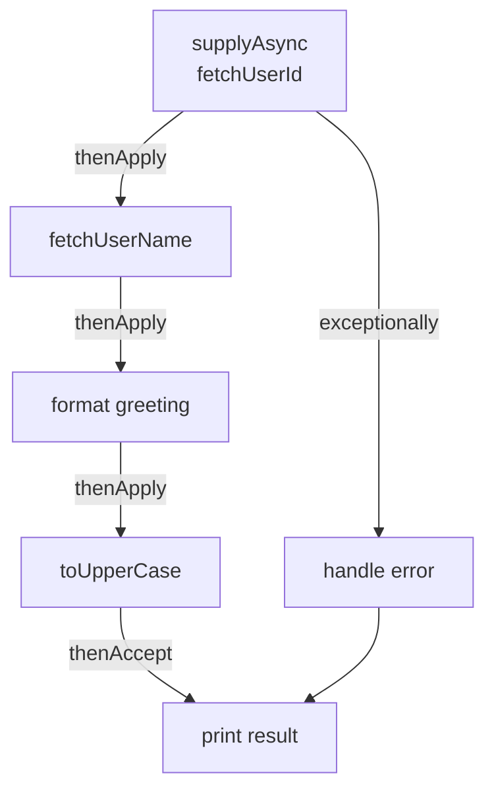

## Introduction

`CompletableFuture<T>` is Java's answer to modern asynchronous programming. Introduced in Java 8, it allows you to write non-blocking, composable async pipelines — similar to JavaScript Promises but with the full power of the Java type system. It implements both `Future<T>` and `CompletionStage<T>`, giving you a rich API for chaining, combining, and error-handling async operations.

> **Note:** Before `CompletableFuture`, async Java code required raw `Thread` management or `Future.get()` which blocks the calling thread. `CompletableFuture` solves both problems.

## Core Concepts

### Creating a CompletableFuture

```java
// Run async task, no return value
CompletableFuture<Void> cf1 = CompletableFuture.runAsync(() -> {
    System.out.println("Running in: " + Thread.currentThread().getName());
});

// Run async task with return value (uses ForkJoinPool.commonPool() by default)
CompletableFuture<String> cf2 = CompletableFuture.supplyAsync(() -> {
    return fetchUserFromDB(42);
});

// Use a custom executor (recommended for production)
ExecutorService executor = Executors.newFixedThreadPool(10);
CompletableFuture<String> cf3 = CompletableFuture.supplyAsync(
    () -> fetchUserFromDB(42), executor
);
```

### Chaining Operations

```java
CompletableFuture<String> pipeline = CompletableFuture
    .supplyAsync(() -> fetchUserId())           // Step 1: get user ID
    .thenApply(id -> fetchUserName(id))         // Step 2: transform result (sync)
    .thenApply(name -> "Hello, " + name + "!") // Step 3: another transform
    .thenApply(String::toUpperCase);            // Step 4: uppercase

// thenApplyAsync runs the function on a different thread
CompletableFuture<String> async = CompletableFuture
    .supplyAsync(() -> fetchUserId())
    .thenApplyAsync(id -> fetchUserName(id), executor);
```

## Execution Flow



## Code Examples

### Example 1: Combining Multiple Futures

```java
// Run two tasks in parallel, combine results
CompletableFuture<String> userFuture = CompletableFuture
    .supplyAsync(() -> fetchUser(1));

CompletableFuture<List<Order>> ordersFuture = CompletableFuture
    .supplyAsync(() -> fetchOrders(1));

// thenCombine: waits for BOTH, then combines
CompletableFuture<UserDashboard> dashboard = userFuture
    .thenCombine(ordersFuture, (user, orders) ->
        new UserDashboard(user, orders)
    );

UserDashboard result = dashboard.get(); // blocks until done
```

### Example 2: allOf — Wait for All

```java
List<CompletableFuture<String>> futures = List.of(
    CompletableFuture.supplyAsync(() -> fetchFromServiceA()),
    CompletableFuture.supplyAsync(() -> fetchFromServiceB()),
    CompletableFuture.supplyAsync(() -> fetchFromServiceC())
);

// Wait for ALL to complete
CompletableFuture<Void> allDone = CompletableFuture.allOf(
    futures.toArray(new CompletableFuture[0])
);

// Collect results after all complete
List<String> results = allDone.thenApply(v ->
    futures.stream()
           .map(CompletableFuture::join)
           .collect(Collectors.toList())
).get();
```

### Example 3: Error Handling

```java
CompletableFuture<String> safe = CompletableFuture
    .supplyAsync(() -> {
        if (Math.random() > 0.5) throw new RuntimeException("Service down!");
        return "data";
    })
    .exceptionally(ex -> {
        System.err.println("Error: " + ex.getMessage());
        return "fallback-data"; // recover with default
    })
    .thenApply(data -> data.toUpperCase());

// handle() — runs whether success or failure
CompletableFuture<String> handled = CompletableFuture
    .supplyAsync(() -> riskyOperation())
    .handle((result, ex) -> {
        if (ex != null) return "default";
        return result;
    });
```

## Comparison Table

| Method | Input | Output | Use When |
|--------|-------|--------|----------|
| `thenApply` | T | U | Transform result synchronously |
| `thenApplyAsync` | T | U | Transform on different thread |
| `thenCompose` | T | CF\<U\> | Chain dependent async calls |
| `thenCombine` | T + U | V | Combine two independent futures |
| `allOf` | CF[] | CF\<Void\> | Wait for all to complete |
| `anyOf` | CF[] | CF\<Object\> | Take first to complete |
| `exceptionally` | Throwable | T | Recover from error |
| `handle` | T, Throwable | U | Handle both success and failure |

## Real-world Use Cases

- **Parallel API calls** — fetch user profile, orders, and recommendations simultaneously
- **Timeout handling** — `orTimeout(5, TimeUnit.SECONDS)` (Java 9+)
- **Microservice aggregation** — call 3 downstream services in parallel, merge results
- **Non-blocking web handlers** — return `CompletableFuture` from Spring MVC controllers

```java
// Spring MVC async endpoint
@GetMapping("/dashboard/{userId}")
public CompletableFuture<DashboardResponse> getDashboard(@PathVariable Long userId) {
    CompletableFuture<User> user = userService.findByIdAsync(userId);
    CompletableFuture<List<Order>> orders = orderService.findByUserAsync(userId);

    return user.thenCombine(orders, DashboardResponse::new)
               .orTimeout(3, TimeUnit.SECONDS)
               .exceptionally(ex -> DashboardResponse.empty());
}
```

## Common Pitfalls & How to Avoid Them

- **Using `ForkJoinPool.commonPool()` for blocking I/O** — always pass a custom `ExecutorService` for I/O-bound tasks to avoid starving the common pool
- **Calling `.get()` on the main thread** — defeats the purpose of async; use `.thenAccept()` or `.join()` only at the boundary
- **Swallowing exceptions** — always add `.exceptionally()` or `.handle()` to every pipeline
- **Not shutting down executors** — always call `executor.shutdown()` in a finally block or use try-with-resources

## Summary / Key Takeaways

- `CompletableFuture` enables composable, non-blocking async pipelines in Java
- Use `supplyAsync` for tasks with results, `runAsync` for fire-and-forget
- Chain with `thenApply` (sync transform), `thenCompose` (async chain), `thenCombine` (parallel merge)
- Always handle errors with `exceptionally` or `handle`
- Use a custom `ExecutorService` for I/O-bound work — never block the common pool

> **Tip:** In Java 21+, consider Virtual Threads (`Thread.ofVirtual()`) for I/O-bound work. They make blocking code as efficient as async code without the complexity of `CompletableFuture` chains.
